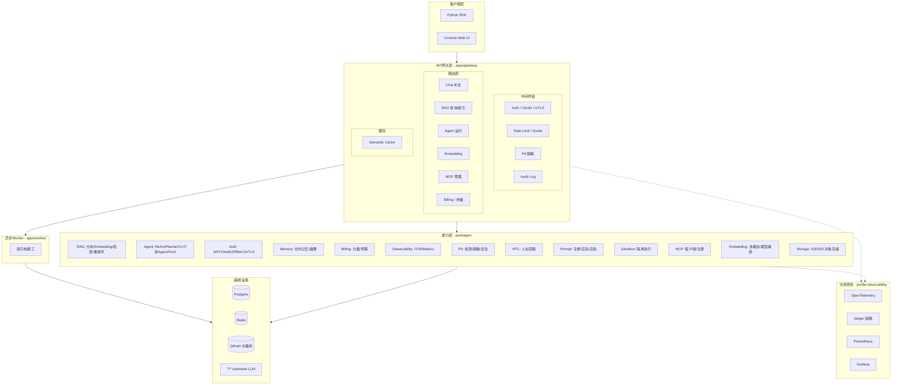

# AI Platform Lab — 系统整体架构图

## 核心流程

| 流程 | 链路 |
|------|------|
| **Chat** | SDK ? Gateway(Auth?RL?PII?Audit?SemCache) ? Provider Router ? Upstream LLM |
| **RAG** | SDK ? Gateway ? Chunker ? Embedding ? Qdrant(hybrid+rerank) ? LLM ? 答案 |
| **Agent** | SDK ? Gateway ? ReAct Loop(LLM?Tool?ACL?HITL?Session) ? 最终响应 |

## 关键架构决策

1. **三ID边界** (ADR-0001): `plan_approval_id` / `execution_id` / `task_id` 永不融合
2. **三层检查点/恢复** (ADR-0002): Plan级 / Orchestrator级 / Long-run级各有独立恢复路径
3. **AppContext单例** (ADR-0003): Gateway用统一容器装配依赖，测试可reset_all
4. **Platform facade**: `packages/` 通过 `PlatformPort` 协议依赖平台，不直接引用 `apps.gateway`
5. **多租户**: Tenant ID + Bearer认证 + 模型白名单 + 工具ACL + 配额/限流
