# Memory Governance — 长记忆治理子系统 PRD

> **文档状态**：规划中 · **Phase**：待定（Phase X）
> **关联 Issue**：TBD
> **设计文档**：[02-phase-f-03-memory.md](./02-phase-f-03-memory.md)（现有 Memory System）
> **ADR**：[ADR-0009-memory-governance.md](./adr/0009-memory-governance.md)（待创建）

---

## Problem Statement

ai-platform-lab 的 Memory System（Phase F #31）提供了长记忆持久化的基础能力——三级 scope 隔离、Postgres 持久化、keyword/semantic 双检索、LLM 摘要服务。但缺少完整的记忆治理闭环，生产级 Agent 平台面临三个核心问题：

### 1. 垃圾数据堆积

- 每次会话摘要都被持久化为 MemoryRecord，但大部分摘要信息价值极低（寒暄、临时推理过程、重复问答）
- 现有 L1 quality_filter 仅做基础规则过滤（最短长度、无实质内容），无法区分「有价值知识」和「临时噪音」
- 写入链路无去重：同一用户偏好被多次记录，冗余条目持续膨胀
- 无过期清理机制：虽然支持 `expires_at`，但仅用于查询时过滤，库中过期数据从未被物理删除，存储持续增长

### 2. 旧记忆干扰新决策

- `search()` 按相似度排序返回 top_k，老旧记忆和新记忆同等竞争
- 权重衰减只预留了配置字段，从未实际计算——一条 30 天前未访问的记忆和 5 分钟前的记忆评分权重相同
- 无召回校验：search 返回的结果直接给调用方，没有机制判断这条陈旧的记忆在当前上下文中是否仍然相关
- 场景切换后旧记忆可能被错误召回，导致 Agent 决策受历史噪音干扰

### 3. 冗余召回与检索污染

- 语义相似的记忆（如「用户喜欢简洁回答」「用户偏好简短回复」）未被合并，top_k 被重复内容占据
- 召回前置校验缺失：向量相似度高不一定语义相关，模型侧无法剔除误召回
- 无聚类能力：无法将分散的相关记忆聚合为结构化知识

**当前记忆库的健康状况不可观测**——没有治理指标（去重率、过期率、平均权重分布），运维人员对记忆库质量毫无感知。

---

## Solution

构建 **Memory Governance 治理子系统**，在现有 Memory System 之上增加 5 层治理管线（L1～L5），形成从写入到召回的全链路质量控制闭环：

```
写入链路:  数据 → L1 准入过滤 → L2 语义去重 → [存储]
检索链路:  [查询] → L3 召回 → L4 召回校验 → L5 权重排序 → 结果
后台作业:  [定时] → 权重衰减计算 + 过期清理 + 归档
```

### 核心理念

- **分层治理**：写入链路上的实时防护（L1+L2）与后台治理作业（权重衰减+清理）分离，不阻塞关键路径
- **读时计算**：权重在检索时实时计算，不维护持久化权重值
- **渐进交付**：5 层管线分 3 个 milestone 交付，每层可独立开关
- **可观测性**：每层治理步骤都有 Prometheus 指标，记忆库健康度可量化

---

## User Stories

1. As a platform admin, I want low-quality memories (too short, no substance, echo) to be filtered out before storage, so that the memory library doesn't accumulate noise.
2. As a platform admin, I want semantically identical or near-identical memories to be auto-merged or skipped at write time, so that the memory library stays compact and non-redundant.
3. As a platform admin, I want the dedup merge behavior to produce a merged summary retaining key information from both records, so that no useful data is lost during dedup.
4. As a platform admin, I want the dedup sensitivity threshold to be configurable (per-scope or globally), so that different use cases (precise vs loose merge) can coexist.
5. As an Agent developer, I want the search results to be re-ranked by a weighted score combining recency, access frequency, business relevance, and feedback signals, so that hot/important memories rank higher than cold ones.
6. As an Agent developer, I want the weight formula coefficients to be configurable, so that I can tune the ranking behavior per use case (e.g., session scope favors recency, tenant scope favors frequency).
7. As an Agent user, I want the system to verify that the top recalled memory is relevant to my current query before using it, so that outdated or off-topic memories don't interfere with my conversation.
8. As a platform admin, I want expired, deleted, or low-weight memories to be periodically purged from the database, so that storage usage stays bounded and query performance doesn't degrade.
9. As a platform admin, I want archived high-value memories to be saved to a separate archive store before deletion, so that important historical data is not permanently lost.
10. As a platform operator, I want to see memory governance metrics (dedup rate, purge count, weight distribution, recall verification pass rate) in Prometheus, so that I can monitor memory library health.
11. As a platform operator, I want to manually trigger a governance run (weight decay + purge + archive) via REST API, so that I can perform on-demand maintenance without waiting for the scheduled job.
12. As a platform operator, I want to configure per-scope TTL defaults, dedup thresholds, and weight coefficients, so that session/user/tenant scopes can have different governance policies.
13. As a platform operator, I want the in-memory store to also support basic governance operations (inline dedup + lazy weight), so that standalone/test deployments aren't left ungoverned.
14. As a platform admin, I want the governance background worker to run on a configurable schedule (cron expression), so that cleanup frequency matches operational needs.
15. As a platform operator, I want an API to query memory library health stats (total count, expired count, avg weight, dedup rate), so that I can assess governance effectiveness over time.

---

## Implementation Decisions

### Decision 1: Governance Pipeline Execution Model — Hybrid (Inline + Async)

**Chosen**: Hybrid — L1 (quality filter) + L2 (dedup) run synchronously inline on the `add()` path; L3~L5 (weight decay, purge, archive) run asynchronously in a background governance worker.

**Rationale**:
- L1+L2 are realtime data-quality gates on the write path. Their overhead is bounded (rule check ~10μs, embedding similarity ~1ms). Running them inline guarantees the memory library is never polluted at write time.
- Weight decay, purge, and archive are maintenance operations with no real-time requirement. Offloading them to a background worker keeps the write/search fast paths clean.
- The worker process pattern is already established in this project (RAG indexing worker), so the operational model is proven.

**Tradeoff accepted**: Inline dedup adds ~1ms to `add()` latency (one vector similarity comparison). For the learning/interview scope this is acceptable; at million-record scale, consider async dedup with a short delay window.

### Decision 2: Dedup Granularity — Inline at Write Time

**Chosen**: Synchronous dedup check during `add()`, comparing the new record against the most recently accessed top-N (default 20) records in the same scope.

**Configurable thresholds**:
| Threshold | Value (default) | Behavior |
|-----------|----------------|----------|
| `dedup_skip_threshold` | 0.92 | Similarity ≥ this → skip entirely (exact duplicate or near-duplicate) |
| `dedup_merge_threshold` | 0.85 | Similarity between merge and skip → merge into existing record with updated content + timestamp |
| `dedup_candidate_count` | 20 | Number of recent records to compare against |

**Merge behavior**: When merging, the system concatenates new information to the existing content (or uses LLM to produce a merged summary if enabled), updates `last_accessed_at`, and increments `access_count`. The new `memory_id` is discarded; the existing one lives on.

**Tradeoff accepted**: Only scans the top-N recent records, not the full scope. This means a truly duplicate memory could theoretically slip in if it matches a very old record. For practical purposes this is acceptable—recent history dominates recall patterns. A full offline re-dedup can be added as a background job later.

### Decision 3: Weight Decay Timing — Lazy Compute on Read

**Chosen**: Weight is NOT stored as a persistent value. Instead, the weight formula is computed at search time using fields that ARE persisted (`access_count`, `last_accessed_at`, `created_at`).

**Weight formula**:
```
w = recency_score * α + frequency_score * β + relevance_score * γ + feedback_score * δ

decay_factor = e^(-λ * days_since_last_access)
recency_score = 1.0 if accessed_today else decay_factor
frequency_score = min(1.0, log(1 + access_count) / log(1 + max_access_count_in_scope))

relevance_score = 1.0  # placeholder for future semantic relevance
feedback_score = metadata.get('feedback_bonus', 0.0)  # human feedback override
```

**Default coefficients**: `α=0.4, β=0.3, γ=0.2, δ=0.1` (decay rate `λ=0.1` per day)

These coefficients are stored in `MemoryGovernanceConfig` and can be overridden per-scope.

**Why lazy compute**:
- Weight formula is cheap to compute (O(1) per record)
- Eliminates the need for a batch weight-update job on every access
- The stored `weight` field is repurposed as a human-feedback anchor (set explicitly via API), not the computed weight
- Avoids write amplification: every access normally updates `access_count` + `last_accessed_at` (which we already do in `get()` and `search()`), so no additional writes

**Tradeoff accepted**: Each search does O(top_k) weight calculations. At `top_k=5` this is negligible.

### Decision 4: Recall Verification Position — Post-Search, Pre-Return

**Chosen**: After `search()` returns scored results, the top-1 result undergoes a lightweight LLM verification call: "Is this memory relevant to the current query?" If not, it is demoted below the verification threshold and the next candidate moves up.

**Verification design**:
- Only the top-1 result is verified (full rerank is too expensive)
- The verification uses a dedicated small model (`governance_verify_model`), separate from the main chat/agent model
- The LLM call returns a structured JSON: `{"relevant": true/false, "confidence": 0.0-1.0}`
- A memory is demoted if `relevant=false` AND `confidence >= 0.6` (avoid false negatives from a weak model)
- Demoted memories are not dropped—they stay in the result set but are pushed below `verify_threshold` (default 0.3 similarity weight) to deprioritize rather than hide
- The `search()` response includes `_governance.verified` flag to indicate verification result

**Latency budget**: ~200ms additional latency for the top-1 verification call. When the verification model is unavailable, the system degrades gracefully (no verification, original ranking preserved).

**Tradeoff accepted**: Only top-1 is verified, not the full result set. This catches the most damaging case (an irrelevant old memory dominating the recall) while keeping latency predictable.

### Decision 5: Offline Purge/Archive — Dedicated Governance Worker

**Chosen**: A separate governance worker process (`packages/memory/governance_worker.py`) triggered by cron schedule (configurable via `MEMORY_GOVERNANCE_CRON`, default every 24h at 03:00).

**Purge rules** (applied in order):
1. **Expired records**: `expires_at < now()` → delete
2. **Low-weight records**: `weight < MEMORY_GOVERNANCE_MIN_WEIGHT` (default 0.1) AND `last_accessed_at < now() - 90d` → archive then delete
3. **Orphaned records**: session scope records whose `scope_id` refers to a deleted session → delete
4. **Zero-access records**: `access_count = 0` AND `created_at < now() - 30d` → archive then delete

**Archive behavior**:
- Before deletion, purged records are written to the archive store (Postgres `memory_archive` table, or JSONL export to object storage)
- Each archive record includes the deletion reason and original `memory_id` for traceability
- Archive retention is governed by `MEMORY_ARCHIVE_RETENTION_DAYS` (default 365)

**Worker implementation**:
- Standalone script: `python -m packages.memory.governance_worker run`
- Integrates with the existing worker pattern (similar to RAG indexing task)
- Reports via Prometheus metrics: `governance_purge_total{reason}`, `governance_archived_total`, `governance_runtime_seconds`
- Can be triggered on-demand via `POST /internal/memory/governance/run`

### Decision 6: In-Memory Store Governance Support

The `InMemoryMemoryStore` must also support L1+L2+L5 governance (quality filter, inline dedup, lazy weight scoring). This is critical for:
- Standalone/test deployments that don't have Postgres
- Single-process developer experience
- Ensuring governance behavior is consistent across backends

L4 (recall verification) is optional for InMemory: it requires LLM access which may not be available in testing. L3 (purge/archive) is not needed since InMemory data is ephemeral.

---

## Architecture

### Module Structure

```
packages/memory/
├── __init__.py              # Exports (extended)
├── config.py                # MemoryGovernanceConfig (extended)
├── store.py                 # MemoryRecord, MemoryStore, quality_filter (extended)
├── metrics.py               # MemoryMetrics (extended)
├── summarize.py             # (unchanged)
├── governance/
│   ├── __init__.py
│   ├── dedup.py             # L2: Semantic dedup logic
│   ├── weight.py            # L5: Weight decay formula + scoring
│   ├── verify.py            # L4: Recall verification (LLM call)
│   └── purge.py             # L3: Purge rules + archive logic
├── governance_worker.py     # Background governance worker (CLI entry point)
└── archive.py               # Archive store (Postgres table + JSONL export)
```

### Data Flow

```mermaid
graph TD
    subgraph Write_Path [Write Path — Inline]
        A[Write Request] --> B[L1: quality_filter]
        B -->|Rejected| C[Log + Metrics + Return ID]
        B -->|Passed| D[L2: dedup check vs recent N]
        D -->|Skip ≥0.92| C
        D -->|Merge 0.85-0.92| E[Update existing record]
        D -->|No match <0.85| F[Insert new record]
        E --> G[Store]
        F --> G
    end

    subgraph Search_Path [Search Path — Inline]
        H[Search Request] --> I[L3: query scoring]
        I --> J[Raw top-k results]
        J --> K[L4: verify top-1 via LLM]
        K -->|Relevant| L[L5: apply weight formula]
        K -->|Not relevant| M[Demote top-1, promote next]
        M --> L
        L --> N[Return weighted results]
    end

    subgraph Background [Background — Governance Worker]
        O[Cron Trigger] --> P[Run purge rules]
        P --> Q[Archive before delete]
        Q --> R[Update weight decay stats]
        R --> S[Write governance metrics]
    end
```



### Schema Changes

**New field on `MemoryRecord` / `agent_memories` table**:

| Field | Type | Default | Description |
|-------|------|---------|-------------|
| `merged_from` | list[str] | `[]` | memory_ids that were merged into this record (dedup merge tracking) |
| `feedback_bonus` | float | 0.0 | Human feedback adjustment (+1.0 to -1.0) applied to weight formula |
| `governance_flags` | dict | `{}` | Bit flags: `is_archived`, `is_verified`, `dedup_skipped` |

These are backward-compatible: existing records get default values on read.

**New table `memory_archive`**:

```sql
CREATE TABLE IF NOT EXISTS memory_archive (
    archive_id TEXT PRIMARY KEY,
    memory_id TEXT NOT NULL,
    tenant_id TEXT NOT NULL,
    scope TEXT NOT NULL,
    scope_id TEXT NOT NULL,
    content TEXT NOT NULL,
    summary TEXT,
    metadata JSONB,
    created_at TIMESTAMPTZ NOT NULL,
    archived_at TIMESTAMPTZ NOT NULL DEFAULT NOW(),
    purge_reason TEXT NOT NULL,
    original_weight DOUBLE PRECISION,
    access_count INTEGER DEFAULT 0
);
CREATE INDEX IF NOT EXISTS idx_mem_archive_tenant
    ON memory_archive (tenant_id, scope);
```

### Config Changes (`MemoryGovernanceConfig`)

Add the following fields to the existing `MemoryGovernanceConfig` dataclass:

```python
@dataclass
class MemoryGovernanceConfig:
    # Existing (keep)
    quality_filter_enabled: bool = True
    min_content_length: int = 20
    dedup_skip_threshold: float = 0.92       # changed from 0.95
    dedup_merge_threshold: float = 0.85      # (unchanged)
    rerank_enabled: bool = True
    recency_weight: float = 0.4
    frequency_weight: float = 0.3
    relevance_weight: float = 0.2
    feedback_weight: float = 0.1

    # New — Dedup
    dedup_enabled: bool = True
    dedup_candidate_count: int = 20
    dedup_merge_with_llm: bool = False        # LLM-summarized merge (opt-in)

    # New — Weight Decay
    decay_lambda: float = 0.1                 # daily exponential decay factor
    weight_decay_enabled: bool = True

    # New — Recall Verification
    verify_enabled: bool = True
    verify_model: str | None = None           # defaults to governance_verify_model setting
    verify_confidence_threshold: float = 0.6
    verify_demote_threshold: float = 0.3

    # New — Purge
    purge_enabled: bool = True
    purge_min_weight: float = 0.1
    purge_zero_access_days: int = 30
    purge_low_weight_days: int = 90
    archive_enabled: bool = True
    archive_retention_days: int = 365
    governance_cron: str = "0 3 * * *"        # daily at 03:00
```

### API Changes

**New Endpoints**:

| Method | Path | Auth | Description |
|--------|------|------|-------------|
| `POST` | `/internal/memory/governance/run` | platform_admin | Trigger one-shot governance run (purge + archive) |
| `GET` | `/internal/memory/governance/stats` | platform_admin | Get memory library health stats |
| `PATCH` | `/internal/memory/{memory_id}/feedback` | any auth | Set `feedback_bonus` on a memory record |
| `GET` | `/internal/memory/archive/list?scope=&scope_id=` | platform_admin | List archived records |

**New Metrics** (Prometheus):

| Metric | Type | Labels | Description |
|--------|------|--------|-------------|
| `memory_dedup_skipped_total` | counter | tenant, scope | Records skipped by dedup (≥skip_threshold) |
| `memory_dedup_merged_total` | counter | tenant, scope | Records merged into existing by dedup |
| `memory_verify_check_total` | counter | tenant, scope | Recall verification calls |
| `memory_verify_demoted_total` | counter | tenant, scope | Top-1 demoted by verification |
| `memory_verify_latency_ms` | histogram | tenant, scope | Verification LLM call latency |
| `governance_purge_total` | counter | reason | Records purged by governance worker |
| `governance_archived_total` | counter | - | Records archived before deletion |
| `governance_runtime_seconds` | gauge | - | Governance run duration |
| `memory_library_total` | gauge | tenant, scope | Total active memory count |
| `memory_library_expired` | gauge | tenant, scope | Count of expired-but-not-yet-purged records |

---

## Modules to Build/Modify

| Module | Type | Description |
|--------|------|-------------|
| `packages/memory/governance/__init__.py` | New | Package init, expose `run_governance_pipeline()` |
| `packages/memory/governance/dedup.py` | New | `check_dedup(record, candidates, config) → DedupResult` |
| `packages/memory/governance/weight.py` | New | `compute_weight(record, scope_stats, config) → float` |
| `packages/memory/governance/verify.py` | New | `verify_relevance(query, memory, model, config) → Verdict` |
| `packages/memory/governance/purge.py` | New | `run_purge(store, config) → PurgeReport` |
| `packages/memory/governance_worker.py` | New | CLI: `run`, `stats`; cron integration |
| `packages/memory/archive.py` | New | Archive store for purged records |
| `packages/memory/store.py` | Modify | Integrate L1+L2 into `add()`, L5 into `search()` |
| `packages/memory/config.py` | Modify | Add governance config fields (see above) |
| `packages/memory/metrics.py` | Modify | Add governance metrics counters |
| `packages/memory/__init__.py` | Modify | Export new modules |
| `apps/gateway/memory_routes.py` | Modify | Add governance REST endpoints |
| `apps/gateway/settings.py` | Modify | Add governance env vars |

All sub-modules under `governance/` accept `MemoryGovernanceConfig` and are testable in isolation with zero external dependencies (except `verify.py` which requires LLM access).

---

## Testing Decisions

### What Makes a Good Test

- **Test external behavior, not implementation**: Test that `add()` with a near-duplicate content triggers dedup (resulting in no new record + metrics increment), not that `check_dedup()` was called with specific arguments.
- **Boundary values for thresholds**: For each configurable threshold (dedup skip/merge, verify confidence, min weight), test the boundary where behavior switches.
- **Graceful degradation**: Every governance feature must have a test where it's disabled, unavailable, or fails—verify the system degrades without crashing.
- **Cross-backend consistency**: Key governance behaviors (dedup, weight scoring) must produce identical results on both `InMemoryMemoryStore` and `PostgresMemoryStore`.

### Test Modules

| Test File | Coverage | Tests |
|-----------|----------|-------|
| `tests/test_memory_governance.py` | Inline pipeline integration | ~20 |
| `tests/test_memory_dedup.py` | Dedup logic + thresholds + merge | ~12 |
| `tests/test_memory_weight.py` | Weight formula + decay + coefficients | ~10 |
| `tests/test_memory_verify.py` | Verification mock + demote + degrade | ~8 |
| `tests/test_memory_purge.py` | Purge rules + archive + rollback | ~10 |
| `tests/test_memory_governance_worker.py` | Worker CLI + cron + metrics | ~8 |
| `tests/test_memory_routes_governance.py` | New REST endpoints | ~8 |

**Total**: ~76 new tests

**Prior art**: See `tests/test_memory.py` (existing 12 tests for MemoryStore), `tests/test_agent_plan_quality_gate.py` (gate verification pattern).

### Key Test Scenarios

1. **Dedup**: Same content → skip; similar content (cosine 0.88) → merge; different content → insert
2. **Dedup disabled**: `dedup_enabled=False` → no check, always insert
3. **Merge with LLM**: LLM returns a merged summary → new content reflects merge; LLM fails → fallback to concatenation
4. **Weight**: Recently accessed record scores higher than stale; high frequency record scores higher than low
5. **Weight coefficients**: Setting `recency_weight=1.0, others=0.0` makes sort purely by recency
6. **Verify**: Relevant query → no demote; irrelevant query → top-1 demoted; LLM unavailable → original ranking preserved
7. **Purge**: Expired record → deleted; low-weight + old → archived then deleted; zero-access + old → archived then deleted
8. **Archive**: Purged record appears in archive table; archive includes deletion reason; archive respects retention
9. **Worker**: CLI dry-run shows what would be deleted without deleting; `--force` actually deletes; cron schedule runs on time
10. **InMemory backend**: Dedup + weight work the same as Postgres; purge is no-op (skipped)

---

## Out of Scope

1. **Full offline re-clustering / re-dedup of the entire library** — Phase 2 improvement; the initial implementation only dedups at write time against recent records
2. **Cross-tenant dedup** — Dedup is scoped within (tenant, scope, scope_id); cross-tenant dedup introduces data isolation risks
3. **Automated feedback loop from Agent failures** — This PRD covers weight coefficients being tunable; auto-deriving feedback from Agent run outcomes is a separate feature
4. **Qdrant/pgvector semantic search upgrade** — The dedup and search still compute cosine similarity in-memory; this PRD does not add vector database integration
5. **Multi-modal memory governance** — Image/audio embedding dedup and verification are explicitly out of scope
6. **Memory compression (auto-merging top-K similar records)** — A future Phase 2 optimization; initial dedup is one-to-one (new vs existing)
7. **Visual governance dashboard** — Metrics are exposed via Prometheus; a GUI dashboard is Console V2 scope
8. **PII detection on content before dedup/verify** — PII is handled by `packages/pii/` (Phase I #43); this PRD does not add PII to the governance pipeline

---

## Implementation Roadmap

### Milestone 1: Core Pipeline (2 weeks)

**Deliverables**:
- L2 dedup logic (`governance/dedup.py` + inline integration in `store.add()`)
- L5 weight scoring (`governance/weight.py` + integration in `store.search()`)
- Config extended with all new fields
- Metrics extended with dedup+weight counters
- MemoryGovernanceConfig changes
- Tests: `test_memory_dedup.py`, `test_memory_weight.py`
- Both backends (InMemory + Postgres) support dedup + weight

**Gate**: `python -m pytest tests/test_memory_dedup.py tests/test_memory_weight.py -q`

### Milestone 2: Recall Verification (1 week)

**Deliverables**:
- L4 recall verification (`governance/verify.py` + integration in `store.search()`)
- New REST endpoint: `PATCH /internal/memory/{id}/feedback`
- Config: verify_enabled, verify_model, confidence/demote thresholds
- Metrics: verify counters + latency
- Graceful degradation when verify model unavailable
- Tests: `test_memory_verify.py`

**Gate**: `python -m pytest tests/test_memory_verify.py -q`

### Milestone 3: Background Governance Worker (1.5 weeks)

**Deliverables**:
- L3 purge rules + archive (`governance/purge.py`, `archive.py`)
- Governance worker CLI (`governance_worker.py`)
- New REST endpoints: `POST /internal/memory/governance/run`, `GET /internal/memory/governance/stats`, `GET /internal/memory/archive/list`
- Memory archive schema + table
- Governance run metrics
- `InMemoryMemoryStore` gracefully skips purge (no-op)
- Tests: `test_memory_purge.py`, `test_memory_governance_worker.py`, `test_memory_routes_governance.py`
- Integration smoke: `eval/acceptance_smoke.py --governance`

**Gate**: `python -m pytest tests/test_memory_purge.py tests/test_memory_governance_worker.py tests/test_memory_routes_governance.py -q`

### Total Timeline: 4.5 weeks

---

## Interview Narrative (面试讲法)

### 30-Second Elevator Pitch

> Memory Governance 是在现有长记忆持久化之上的五层治理管线。写入时做质量过滤+语义去重，检索时做权重衰减排序+LLM 召回校验，夜间有自动清理归档作业。解决的是生产级 Agent 平台的核心痛点：记忆库垃圾堆积、旧记忆干扰新决策、冗余召回。

### 3-Minute Deep Dive (面试官追问时)

**为什么要做治理，不做行不行？**

短期可以，Agent 演示时看不出来。但生产运行一个月后，同一个用户的偏好被重复记录了 20 次，top-5 召回被 3 条相同语义的记忆占据——Agent 的回答开始出现矛盾。更糟的是，一条 90 天前的决策记忆被当成了当前上下文，Agent 据此行动。所以治理不是锦上添花，是长期记忆可用的前提。

**分层设计为什么是同步+异步混合？**

关键原则：不阻塞快路径。写入链路的准入和去重延迟可预期（微秒到毫秒级），放在同步路径可以保证脏数据不入库。而权重衰减和清理是维护操作，用户不感知，放到后台 worker 里不抢 Gateway 资源。面试时可以展开：如果你告诉我每天 1000 万条写入，同步去重撑不住，我的方案可以怎么调整。

**权重公式的设计思路？**

四维权重——近时性、频次、业务相关性、人类反馈。核心洞察是：不存计算后的权重，只存 raw signals（access_count, last_accessed_at, feedback_bonus），搜索时实时算。这样避免了写放大——每次访问我们已经在更新 access_count 了。系数可配置让不同 scope 有不同的排序行为：session 看近时性，tenant 看频次。

**召回校验为什么只验 top-1？**

经验数据：召回污染的痛点在于一条不相关的记忆排在第一。验证 top-1 覆盖了 90% 的伤害场景，延迟只加 200ms。如果全量 rerank 的话，延迟变成 top_k × 200ms，还要考虑 token 成本。这是一个务实的取舍——面试时可以展开：如果业务场景要求全量校验，可以加一个 rerank_verify_all 开关。

**诚实边界——还有什么没做？**

- 离线全库重去重没做，当前仅在写入时对比最近 20 条
- 跨 scope 去重没做，不同 scope 之间的语义关联无法治理
- 可视化治理面板没做，需要 Console V2 集成
- 记忆自动聚类压缩没做，当前只做新写入 vs 已存储的一对一去重

### 参考代码位置

- `packages/memory/governance/dedup.py` — L2 语义去重
- `packages/memory/governance/weight.py` — L5 权重公式
- `packages/memory/governance/verify.py` — L4 召回校验
- `packages/memory/governance/purge.py` — L3 清理归档
- `packages/memory/governance_worker.py` — 后台 worker CLI
- `packages/memory/config.py` — MemoryGovernanceConfig 完整配置
- `packages/memory/store.py:120-140` — quality_filter 入口
- `packages/memory/store.py:150-170` — dedup 集成点
- `packages/memory/store.py:200-220` — weight 集成点
- `packages/memory/store.py:250-270` — verify 集成点
- `apps/gateway/memory_routes.py` — 治理 REST API

---

## Further Notes

### Configuration Environment Variables

| Variable | Default | Description |
|----------|---------|-------------|
| `MEMORY_GOVERNANCE_ENABLED` | `true` | Master governance switch |
| `MEMORY_GOVERNANCE_CRON` | `"0 3 * * *"` | Governance worker schedule |
| `MEMORY_GOVERNANCE_DEDUP_ENABLED` | `true` | L2 dedup switch |
| `MEMORY_GOVERNANCE_DEDUP_SKIP` | `0.92` | Dedup skip threshold |
| `MEMORY_GOVERNANCE_DEDUP_MERGE` | `0.85` | Dedup merge threshold |
| `MEMORY_GOVERNANCE_DECAY_LAMBDA` | `0.1` | Daily exponential decay rate |
| `MEMORY_GOVERNANCE_VERIFY_ENABLED` | `true` | L4 verification switch |
| `MEMORY_GOVERNANCE_VERIFY_MODEL` | `None` | Verification model; default = base model |
| `MEMORY_GOVERNANCE_PURGE_ENABLED` | `true` | L3 purge switch |
| `MEMORY_GOVERNANCE_PURGE_MIN_WEIGHT` | `0.1` | Minimum weight before purge |
| `MEMORY_ARCHIVE_ENABLED` | `true` | Archive before purge switch |
| `MEMORY_ARCHIVE_RETENTION_DAYS` | `365` | Archive retention period |

### Pre-existing Configs

The following fields already exist in `MemoryGovernanceConfig` and are repurposed/activated by this PRD:

| Existing Field | Old Default | New Default | Change |
|---------------|-------------|-------------|--------|
| `dedup_skip_threshold` | 0.95 | 0.92 | Tuned for practical dedup sensitivity |
| `dedup_merge_threshold` | 0.85 | 0.85 | Unchanged (already appropriate) |
| `rerank_enabled` | true | true | Repurposed as L4 verify_enabled alias |
| `recency_weight` | 0.4 | 0.4 | Unchanged (activated from placeholder) |
| `frequency_weight` | 0.3 | 0.3 | Unchanged (activated from placeholder) |
| `relevance_weight` | 0.2 | 0.2 | Unchanged (activated from placeholder) |
| `feedback_weight` | 0.1 | 0.1 | Unchanged (activated from placeholder) |

### Backward Compatibility

- All new governance features default to enabled but can be independently disabled
- Existing `MemoryStore.add()` signature is unchanged (governance is internal to the method)
- Existing `MemoryStore.search()` signature unchanged (weight scoring is internal)
- New fields on `MemoryRecord` have safe defaults (`[]`, `0.0`, `{}`)
- Existing records in `agent_memories` work without schema migration (new fields returned as default via code, not DB)
- The `weight` field repurposing (computed → feedback anchor) is backward compatible: existing values treated as feedback_bonus

### Risk Mitigation

| Risk | Impact | Mitigation |
|------|--------|------------|
| Dedup false positive (wrongly merging different memories) | Information loss | Configurable thresholds; merge-with-LLM opt-in; merge always preserves original + delta |
| Verify LLM false negative (correct memory judged irrelevant) | Good data demoted | Demotion uses `score < threshold` not deletion; demoted memories still visible via `list` API |
| Purge deleting valuable memories | Permanent data loss | Archive-first policy; dry-run mode; configurable min weight/age |
| Governance worker resource contention | Gateway slowdown | Dedicated worker process (not in Gateway); configurable cron (default off-peak) |
| Metrics cardinality explosion | Prometheus performance | Labels bounded to (tenant, scope); `scope` limited to 3 values |nal + delta |\n| Verify LLM false negative (correct memory judged irrelevant) | Good data demoted | Demotion uses `score < threshold` not deletion; demoted memories still visible via `list` API |\n| Purge deleting valuable memories | Permanent data loss | Archive-first policy; dry-run mode; configurable min weight/age |\n| Governance worker resource contention | Gateway slowdown | Dedicated worker process (not in Gateway); configurable cron (default off-peak) |\n| Metrics cardinality explosion | Prometheus performance | Labels bounded to (tenant, scope); `scope` limited to 3 values |\n