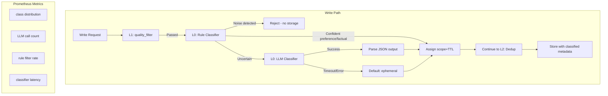

# Memory Classification — 记忆分类分层子系统 PRD

> **文档状态**：规划中 · **Phase**：X.5（Phase X 后续增强）
> **父 PRD**：[02-phase-x-memory-governance.md](./02-phase-x-memory-governance.md)
> **关联 Issue**：TBD
> **前置**：Phase X（L1~L5 治理管线已交付）

---

## Problem Statement

Phase X Memory Governance 解决了记忆库的「存得好」和「查得准」问题——质量过滤、语义去重、权重排序、召回校验、定期清理。但它解决不了一个更前置的问题：**存什么？**

### 核心缺失

当前写入链路把所有会话摘要一视同仁：

```
Agent 每 N 轮摘要 → quality_filter(规则) → dedup(相似度) → 存储
```

写入路径上没有任何逻辑判断「这条记忆是什么类型」、「它值不值得长期保存」、「它该放哪个 scope」。结果是：

1. **临时推理过程混入长期记忆** — Agent 的中间思考、试错记录被持久化为 user 级记忆，干扰后续决策
2. **噪音占用存储空间** — 寒暄、重复确认、无信息量的对话摘要占据 agent_memories 表空间
3. **scope 错配降低检索质量** — session 级临时状态被误标为 user 级，导致跨会话召回污染
4. **无法差异化治理** — 偏好类记忆和事实类记忆使用相同的 TTL 和权重策略，实际上偏好应衰减更慢

### 根因

scope（session/user/tenant）由调用方在写入时硬编码，没有基于内容语义的自动判类。quality_filter 只做规则检查，不区分内容价值。

---

## Solution

在现有写入路径中插入 **L0 记忆分类器**，每条写入的记忆经过双轨分类（规则 + LLM），产出 4 类标签，决定存储层级和策略。

### 写入链路变化

```
                    ┌─→ 规则分类器(微秒) ─→ noise? ─→ 拦截不入库
数据 → quality_filter ─┤
                    └─→ LLM 分类器(~100ms) ─→ preference/factual/ephemeral ─→ scope + TTL 决策 → 存储 + dedup
```

### 四类标签

| 标签 | 含义 | 示例 | 目标 scope | 默认 TTL | 治理策略 |
|------|------|------|-----------|---------|---------|
| `preference` | 用户偏好/习惯 | "用户喜欢简洁回答" | user | 不过期 | 高权重、慢衰减、长留存 |
| `factual` | 事实知识/决策 | "项目的 Python 版本是 3.11" | user | 不过期 | 中权重、正常衰减 |
| `ephemeral` | 临时状态/上下文 | "当前在处理 Issue #221" | session | 24h | 低权重、快速衰减、优先 purge |
| `noise` | 无价值/寒暄/重复 | "好的"、"明白了" | — | 不入库 | quality_filter 级别拦截 |

### 核心流程

```
1. 数据通过 quality_filter（现有 L1）
2. 规则分类器快速检查：关键词/正则 → 判定 noise → 拦截
3. LLM 分类器：判断 preference/factual/ephemeral，输出 JSON
4. Memory Class Router：
   - preference → scope=user, expires_at=None, weight_bonus=+0.2
   - factual → scope=user, expires_at=None
   - ephemeral → scope=session, expires_at=24h, weight_penalty=-0.1
   - noise → 返回 memory_id 但不入库（同 quality_filter 模式）
5. 进入现有 L2 dedup → L3 存储流程
```

---

## User Stories

1. As an Agent user, I want my temporary conversation context (e.g., "we are debugging issue #221") to not persist into the next session, so that stale context doesn't pollute future interactions.

2. As an Agent user, I want my explicit preferences ("I prefer concise answers") to be stored in long-term memory automatically, so that the system remembers them across sessions without manual intervention.

3. As an Agent user, I want factual information I provided ("our server runs Python 3.11") to be correctly classified as knowledge rather than preference, so that memory search works accurately.

4. As a platform admin, I want noise content (greetings, acknowledgments, filler) to be filtered out before any storage layer, so that memory library stays clean.

5. As a platform admin, I want the classification to have a fast rule-based path that handles obvious noise without LLM calls, so that the cost and latency of the write path stay bounded.

6. As a platform admin, I want ephemeral memories to have a shorter TTL (24h) and preferential purge treatment, so that the memory library doesn't accumulate stale session context.

7. As a platform operator, I want to see memory classification metrics (class distribution, LLM call count, rule filter rate) in Prometheus, so that I can monitor classification effectiveness and cost.

8. As a platform operator, I want the LLM classifier to have a timeout (default 100ms) and graceful degradation — if LLM is unavailable, fall back to a safe default classification (ephemeral), so that the write path never blocks.

9. As a platform operator, I want the ability to override a memory's classification via API after the fact, so that misclassified memories can be corrected without re-running the classifier.

10. As a platform maintainer, I want the rule classifier to be configurable (keyword lists, patterns) without code changes, so that noise patterns can be tuned based on observed data.

11. As a platform maintainer, I want the class labels to be extensible (adding new classes doesn't require schema migration), so that future classification needs can be accommodated.

12. As an Agent developer, I want the classification prompt to be customizable via the prompt registry, so that different use cases can tune the classification criteria.

13. As a platform admin, I want the L0 classifier to be independently disableable, so that if classification quality is poor, the system falls back to the existing scope-as-specified behavior.

---

## Implementation Decisions

### Decision 1: Classification Timing — Synchronous Write-Time

**Chosen**: Classification runs synchronously during `add()`, before dedup and storage.

**Rationale**: Classification results determine `scope` and `expires_at`, which are set at record creation. Running after storage would require updating the record's scope/TTL after the fact, introducing a window where the record is in the wrong tier and complicating the data model.

**Latency budget**: Rule classifier < 1ms. LLM classifier targets 100ms with a 200ms hard timeout. On timeout, default to `ephemeral` (session scope, 24h TTL). This ensures the write path never stalls.

**Tradeoff accepted**: Write latency increases by ~100ms for non-noise records. For the learning/interview scope this is acceptable. At high write volumes, consider async classification with a short buffer window.

### Decision 2: Dual-Track Classification (Rule + LLM)

**Chosen**: Two-stage pipeline — rule classifier first, LLM classifier second.

**Stage 1 — Rule Classifier** (no dependencies, microsecond latency):
- Regex/keyword patterns for obvious noise: greetings ("hi", "hello", "好的"), acknowledgments ("明白了", "got it"), single-word responses, very short content (< 5 chars)
- Pattern-based factual detection: sentences containing "是...的", "运行在", "版本为" etc.
- Configurable via YAML or dict (no code change needed)
- If rule classifier confidently identifies `noise` or `preference`, skip LLM call entirely

**Stage 2 — LLM Classifier** (requires LLM access, ~100ms):
- Called only when rule classifier returns `uncertain`
- Uses the same `forward_with_model_router` pattern as verify.py
- Returns structured JSON: `{"class": "preference"|"factual"|"ephemeral", "confidence": 0.0-1.0, "reason": "..."}`
- Uses `gpt-4o-mini` by default (or `governance_classifier_model` config)
- Timeout 200ms; on timeout → default `ephemeral`

**Metrics**:
- `memory_classified_total{class,source}` — counter, source = rule | llm
- `memory_classified_noise_blocked` — counter
- `memory_classifier_latency_ms` — histogram
- `memory_classifier_llm_calls` — counter

### Decision 3: Classification Output → Storage Mapping

| LLM Output | scope | expires_at | metadata tag | weight adjustment |
|------------|-------|-----------|-------------|-------------------|
| preference | user | None | class=preference | +0.2 (via feedback_bonus) |
| factual | user | None | class=factual | 0 (baseline) |
| ephemeral | session | now() + 24h | class=ephemeral | -0.1 |
| noise | — | — | — | reject (not stored) |

**The `expires_at` for `ephemeral` class is enforced by the existing purge worker** (Phase X L3). The weight adjustment feeds into the existing L5 weight formula via the `feedback_bonus` metadata field.

### Decision 4: Auto-Promotion/Demotion — Phase 2

**Chosen**: Not in this PRD. Phase 1 does write-time classification only. A session memory that is frequently accessed could theoretically be promoted to user scope in a future enhancement, but this requires cross-scope data movement and is deferred.

### Decision 5: Classification Override API

An admin API endpoint to re-classify an existing memory:
```
PATCH /internal/memory/{memory_id}/classify
Body: {"class": "preference"|"factual"|"ephemeral"}
Effect: Updates metadata["class"], adjusts scope/expires_at if needed
```
This provides a manual correction path for misclassifications.

---

## Architecture

### Module Changes

| Module | Change Type | Description |
|--------|------------|-------------|
| `packages/memory/classifier/__init__.py` | New | Package init, expose `run_classifier()` |
| `packages/memory/classifier/rules.py` | New | Rule-based classifier (keywords, patterns) |
| `packages/memory/classifier/llm.py` | New | LLM-based classifier (prompt + structured output) |
| `packages/memory/classifier/config.py` | New | ClassifierConfig: patterns, thresholds, model |
| `packages/memory/store.py` | Modify | Integrate L0 classifier into both stores' `add()` |
| `packages/memory/config.py` | Modify | Add L0 classifier config fields |
| `packages/memory/metrics.py` | Modify | Add classifier metrics counters |
| `apps/gateway/memory_routes.py` | Modify | Add classification override endpoint |
| `packages/memory/__init__.py` | Modify | Export classifier modules |

### Data Flow



### Schema Changes

**New metadata fields on MemoryRecord** (stored in existing `metadata` dict, no schema migration):

| Field | Type | Example | Description |
|-------|------|---------|-------------|
| `metadata.class` | str | `"preference"` | Classification label |
| `metadata.class_confidence` | float | `0.92` | LLM confidence score |
| `metadata.class_source` | str | `"llm"`, `"rule"`, `"default"` | How classification was determined |
| `metadata.class_reason` | str | `"user stated preference for conciseness"` | LLM or rule reason |
| `metadata.classified_at` | float | timestamp | When classification ran |

### Config Changes

Add to `MemoryGovernanceConfig`:

```python
# L0: Classifier
classifier_enabled: bool = True
classifier_llm_model: str | None = None     # default = governance_classifier_model
classifier_timeout_ms: int = 200
classifier_rule_enabled: bool = True
classifier_llm_fallback_class: str = "ephemeral"  # safe default on timeout/error
```

New environment variables:
- `MEMORY_CLASSIFIER_ENABLED` (default `true`)
- `MEMORY_CLASSIFIER_MODEL` (default `gpt-4o-mini`)
- `MEMORY_CLASSIFIER_TIMEOUT_MS` (default `200`)

### ClassifierConfig

```python
@dataclass
class RulePatterns:
    noise_keywords: list[str] = field(default_factory=lambda: [
        "好的", "明白了", "got it", "hello", "hi", "嗯", "ok",
        "谢谢", "thanks", "是的", "对", "嗯嗯",
    ])
    noise_max_length: int = 15             # content ≤ this → noise
    preference_indicators: list[str] = field(default_factory=lambda: [
        "喜欢", "偏好", "prefer", "希望", "习惯",
        "不要", "别", "请", "always", "never",
    ])
    factual_indicators: list[str] = field(default_factory=lambda: [
        "是", "运行在", "版本", "version", "部署在",
        "使用", "用的是", "地址", "端口", "端口号",
    ])
    rule_confidence_threshold: float = 0.8  # rule result must exceed this
```

### Metrics

| Metric | Type | Labels | Description |
|--------|------|--------|-------------|
| `memory_classified_total` | counter | class, source | Memories classified by rule/llm/default |
| `memory_classifier_latency_ms` | histogram | source | Classifier latency by source |
| `memory_classifier_llm_calls` | counter | — | Total LLM classifier invocations |
| `memory_classifier_llm_errors` | counter | — | LLM classifier failures |
| `memory_classifier_rule_matched` | counter | pattern | Rule match count by pattern category |

---

## Modules to Build/Modify

### New modules

| Module | Responsibility |
|--------|---------------|
| `classifier/__init__.py` | `run_classifier(content, config) → ClassResult` — orchestrates rule + LLM |
| `classifier/config.py` | `RulePatterns` dataclass + `ClassifierConfig` |
| `classifier/rules.py` | `rule_classify(content, patterns) → ClassResult | None` — returns None if uncertain |
| `classifier/llm.py` | `llm_classify(content, config) → ClassResult` — LLM call + timeout + fallback |

All modules accept `MemoryGovernanceConfig` and are testable in isolation with no external dependencies (except `llm.py` which requires LLM). `rules.py` is a pure function — zero dependencies.

### Modified modules

| Module | Change |
|--------|--------|
| `store.py` | Insert L0 classifier call in both stores' `add()`, before dedup; apply classification to record fields |
| `config.py` | Add L0 classifier config fields |
| `metrics.py` | Add classifier metrics counters + prometheus_text output |
| `__init__.py` | Export classifier modules and ClassResult |
| `memory_routes.py` | Add `PATCH /{memory_id}/classify` override endpoint |

---

## Testing Decisions

### What Makes a Good Test

- **Test external behavior**: Test that `add()` with preference content produces a MemoryRecord with `scope=user` and `metadata.class="preference"`, not that `rule_classify()` was called with specific arguments.
- **Boundaries**: For each classification category (noise/preference/factual/ephemeral), test representative content at the boundary.
- **Graceful degradation**: LLM timeout → default ephemeral; LLM unavailable → default ephemeral; classifier disabled → legacy behavior (no classification metadata).
- **Rule vs LLM**: Test that rule classifier catches obvious noise without LLM call; test that rule classifier returns None for ambiguous content, triggering LLM path.

### Test Modules

| Test File | Coverage | Tests |
|-----------|----------|-------|
| `tests/test_memory_classifier_rules.py` | Rule patterns + boundaries + config | ~15 |
| `tests/test_memory_classifier_llm.py` | LLM mock + timeout + parse + degrade | ~10 |
| `tests/test_memory_classifier.py` | Integration: classifier in add() pipeline | ~15 |
| `tests/test_memory_routes_classifier.py` | Classification override API | ~6 |

**Total**: ~46 new tests

**Prior art**: See `tests/test_memory_verify.py` (LLM mock pattern), `tests/test_memory_dedup.py` (pipeline integration).

### Key Test Scenarios

1. **Rule noise**: "好的" → classified noise, not stored
2. **Rule preference**: "我喜欢简洁回答" → preference via rule match
3. **Rule uncertain**: "我们在调试 issue" → no rule match → LLM path
4. **LLM preference**: LLM returns `{"class": "preference"}` → scope=user, no TTL
5. **LLM factual**: LLM returns `{"class": "factual"}` → scope=user, no TTL
6. **LLM ephemeral**: LLM returns `{"class": "ephemeral"}` → scope=session, TTL=24h
7. **LLM noise**: LLM returns `{"class": "noise"}` → rejected (not stored)
8. **LLM timeout**: >200ms → default ephemeral, metric recorded
9. **LLM parse error**: invalid JSON → default ephemeral, metric recorded
10. **Classifier disabled**: `classifier_enabled=False` → legacy behavior, no metadata
11. **Rule + LLM combined**: rule returns None → LLM called → correct class applied
12. **Override API**: `PATCH /classify` changes class → scope/TTL adjusted
13. **Rule config change**: Adding a new keyword to patterns → rule catches it without code change
14. **Metrics**: Class distribution, LLM calls, latency all recorded

---

## Out of Scope

1. **Auto-promotion/demotion across scopes** — Session→user promotion based on access frequency is Phase 2
2. **Multi-modal content classification** — Images, audio excluded from classification scope
3. **Classification-based feedback loop** — Using downstream task outcomes (e.g., Agent success/failure) to tune classifier weights
4. **Custom classifier models** — Fine-tuned classification models; this PRD uses rule + generic LLM
5. **Cross-tenant classification patterns** — Tenant-specific classification vocabularies
6. **Real-time classifier quality monitoring** — Dashboards or alerting on classification drift
7. **User-facing classification feedback** — UI to let users confirm/reject classification

---

## Implementation Roadmap

### Milestone 1: Rule Classifier + Integration (1 week)

**Deliverables**:
- `classifier/rules.py` — rule-based classification with configurable patterns
- `classifier/config.py` — RulePatterns dataclass
- Rule integration into both stores' `add()` — noise interception
- Config + metrics for rule classifier
- Tests: `test_memory_classifier_rules.py`

**Gate**: `python -m pytest tests/test_memory_classifier_rules.py -q`

### Milestone 2: LLM Classifier + Dual Pipeline (1 week)

**Deliverables**:
- `classifier/llm.py` — LLM classifier with timeout + graceful degradation
- `classifier/__init__.py` — `run_classifier()` orchestrating rule → LLM
- Full integration into both stores' `add()` — scope/TTL assignment
- Classification override API endpoint
- Tests: `test_memory_classifier_llm.py`, `test_memory_classifier.py`

**Gate**: `python -m pytest tests/test_memory_classifier_llm.py tests/test_memory_classifier.py -q`

### Milestone 3: Override API + Metrics + E2E (0.5 week)

**Deliverables**:
- `PATCH /{memory_id}/classify` endpoint
- All classifier metrics in Prometheus output
- Smoke: `python eval/governance_smoke.py` covers classification
- Tests: `test_memory_routes_classifier.py`

**Gate**: Full test suite + smoke

### Total Timeline: 2.5 weeks

---

## Interview Narrative

### 30-Second Pitch

> Memory Classification 是 Phase X 记忆治理的前置增强——在写入时用规则+LLM 双轨分类器判断每条记忆的类型（偏好/事实/临时/噪音），自动决定存储层级、TTL 和权重策略。解决的是「存什么」的问题——不让临时状态混入长期记忆，不让噪音占用存储，不让偏好和事实用相同的衰减策略。

### Key Technical Points

- **双轨设计**：规则分类器零延迟捕捉明显噪音，节省 LLM 成本；LLM 分类器处理模糊内容，保证分类质量
- **200ms 超时保护**：LLM 不可用或超时自动降级为 ephemeral，写路径永不阻塞
- **与 Phase X 无缝衔接**：分类结果直接写入 metadata，L5 权重公式自动读取 `class` 决定衰减行为
- **override API**：分类错了不慌，管理端可以手动修正

### 诚实边界

- 规则模式需要持续维护（新噪音模式需要添加关键词）
- LLM 分类增加写入成本（每次非噪音写入一次 LLM 调用）
- 不做跨 scope 自动晋升/降级
- 分类质量监控需要人工观察 metrics

---

## Further Notes

### Performance Budget

| Path | Latency | LLM Calls | Notes |
|------|---------|-----------|-------|
| Rule noise match | < 1ms | 0 | Obvious noise, no LLM |
| Rule confident preference | < 1ms | 0 | Clear indicators matched |
| Rule uncertain → LLM | ~100ms | 1 | Normal path for substantive content |
| LLM timeout | ~200ms | 1 (failed) | Falls back to ephemeral |
| Classifier disabled | 0ms | 0 | Legacy behavior |

### Backward Compatibility

- `classifier_enabled=False` (default `true`) → bypasses all classification, legacy `add()` behavior
- Existing records have no `metadata.class` → L5 weight formula treats absent class as `factual` (neutral)
- Classification override doesn't require schema migration (all data in metadata dict)

### Prompt Design (LLM Classifier)

System prompt (from registry: `memory_classify`):

```
你是一个记忆分类助手。判断以下记忆内容属于哪个类别。

类别说明：
- preference: 用户的偏好、习惯、风格要求（如"我喜欢简洁回答"）
- factual: 事实性信息、知识、决策记录（如"服务运行在 Python 3.11"）
- ephemeral: 临时状态、上下文、会话中的过程信息（如"我们在调试 Issue #221"）
- noise: 无信息量的寒暄、重复、确认（如"好的"、"明白了"）

输出 JSON：{"class": "...", "confidence": 0.0~1.0, "reason": "..."}
```

### Risk Mitigation

| Risk | Impact | Mitigation |
|------|--------|------------|
| LLM misclassifies preference as ephemeral | Preference lost after TTL | Override API for correction; metrics monitor classification distribution |
| Rule false positive (good memory classified as noise) | Data loss | Rule thresholds set conservatively; uncertain cases go to LLM |
| LLM latency spikes | Write path delay | 200ms hard timeout; classifier disabled as master switch |
| Classification cost high | Token spend | Rule classifier catches ~30% of writes (noise + clear patterns), reducing LLM calls |