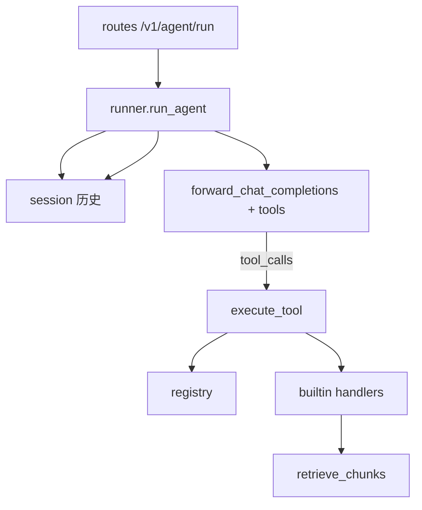
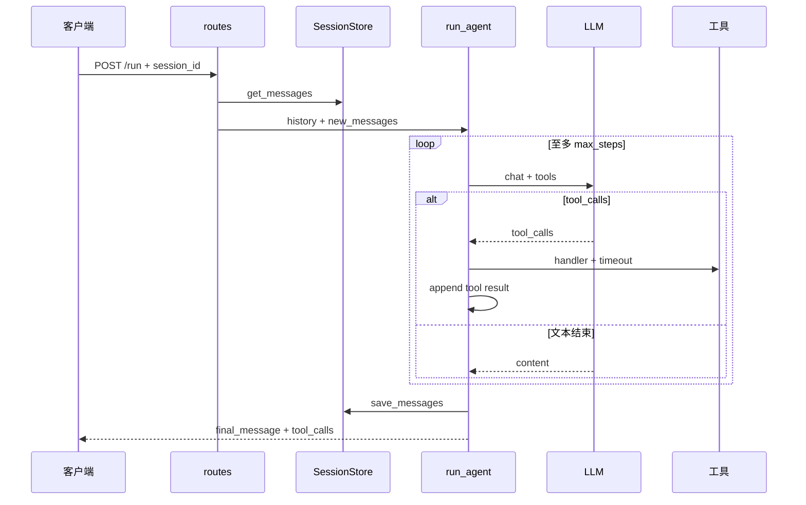

# Agent 运行时：构建思路与代码导读（第 4 周）

> API 与演示见 [week4-agent-runtime.md](./week4-agent-runtime.md)。

---

## 1. 与手册的对应

| 手册要求 | 实现 |
|----------|------|
| 工具抽象 name/description/schema/handler | `ToolDefinition` + `ToolRegistry` |
| calc / get_kb_snippet / httpbin_delay | `packages/agent/tools/builtin.py` |
| `POST /v1/agent/run` | `apps/gateway/agent/routes.py` |
| max_steps / timeout / retries | `config/agent.yaml` + `Settings` |
| 租户工具白名单 | `tenants.yaml` → `TenantRecord.allowed_tools` |
| 会话状态 | `SessionStore` 内存 |

---

## 2. 构建思路

- **循环**：每步调用 LLM（带 `tools`）；若返回 `tool_calls` 则执行工具、追加 `role=tool` 消息，再进入下一步。  
- **终止**：`finish_reason` 非 tool_calls 且有 `content` → `final_message`。  
- **配额**：进入 `run_agent` 前 `try_consume` 一次（与 RAG 问答类似）。

---

## 3. 使用链路

---

## 4. 代码导读

### `packages/agent/tools/base.py`

- `ToolDefinition`：`openai_tool_spec()` 转为 OpenAI tools 数组项。

### `packages/agent/registry.py`

- `list_for_tenant(allowed_tools)`：空元组 = 全部工具。  
- `is_allowed`：执行前二次校验 → `AGENT_TOOL_FORBIDDEN`。

### `packages/agent/runner.py`

- `_execute_tool`：`asyncio.wait_for` 超时；重试 `tool_max_retries`；失败写入 `ToolCallRecord` 不抛异常（除 FORBIDDEN）。  
- `run_agent`：主循环；超限 `AGENT_MAX_STEPS`。

### `packages/agent/session.py`

- Key：`(tenant_id, session_id)`；存完整 OpenAI 风格 messages（含 assistant/tool）。

### `apps/gateway/agent/routes.py`

- 校验 `tenant_id` 与头一致；`kb_id` 注入 system 提示。

---

## 5. 错误码

| code | HTTP |
|------|------|
| `AGENT_TOOL_FORBIDDEN` | 403 |
| `AGENT_MAX_STEPS` | 422 |
| `AGENT_UPSTREAM_ERROR` | 503 |
| `QUOTA_EXCEEDED` | 429 |

---

## 6. 10 条自测

| # | 输入 | 预期 |
|---|------|------|
| 1 | admin + calc 计算 | 200，`tool_calls` 含 calc success |
| 2 | admin + get_kb_snippet | 200，result 含 snippets |
| 3 | 同 session 第二轮追问 | final_message 引用上文 |
| 4 | httpbin_delay + 超时 3s | tool_calls[].failed + error 含超时 |
| 5 | demo-a 正常问答 | 200，无 httpbin 工具 |
| 6 | demo-b 要求查知识库 | 模型无 get_kb_snippet 工具 |
| 7 | 无 LLM_API_KEY | 503 |
| 8 | 无配额 | 429 |
| 9 | 超 max_steps（可调为 1 测） | 422 AGENT_MAX_STEPS |
| 10 | 响应含 trace_id | 与头 X-Request-Id 可对照 |

---

## 7. 读代码顺序

`registry.py` → `builtin.py` → `session.py` → `runner.py` → `routes.py` → `tenants.yaml`

---

*文档版本：v1*
