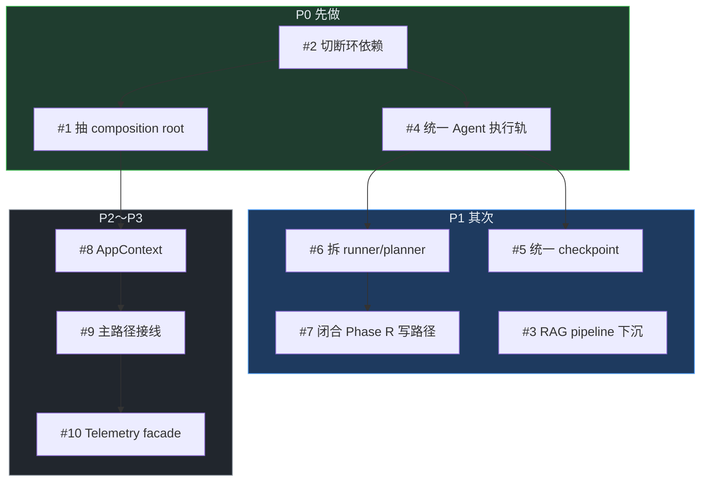
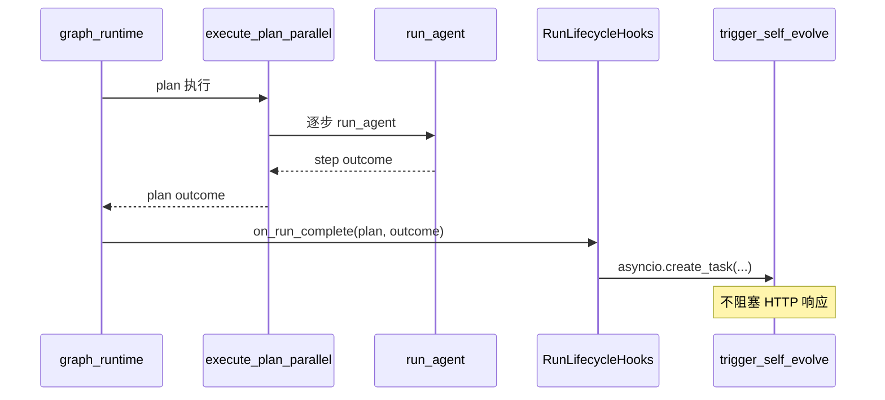

# 架构加深 Todo — Deep Module 重构清单

> 来源：全仓库架构探索（improve-codebase-architecture Skill，Step 1～2）  
> **目标**：把「浅模块 + 环依赖 + 双轨实现」收成 **小接口、大实现** 的 deep module，并在边界写测试。  
> **原则**：In-process / Local-substitutable / Ports&Adapters / Mock 四类依赖（见 Skill REFERENCE.md）  
> **用法**：按优先级从上到下做；每项完成后勾选验收，再进入「接口设计 → GitHub Issue RFC → 实现」。

| 状态 | 含义 |
|------|------|
| ⬜ | 未开始 |
| 🔄 | 进行中（RFC 或实现中） |
| ✅ | 已完成（Issue 关闭 + 边界测试绿） |

**当前进度**：3 / 10（#1 ✅ [#156](https://github.com/xingyun0812/ai-platform-lab/issues/156) · #2 ✅ · #3 ✅ [#152](https://github.com/xingyun0812/ai-platform-lab/issues/152) · #7 [#146](https://github.com/xingyun0812/ai-platform-lab/issues/146) ✅）

---

## 优先级总览

| # | 标题 | 优先级 | 状态 | 预估 |
|---|------|--------|------|------|
| [1](#1-gateway-单体-create_app) | Gateway 单体 `create_app()` | P0 | ✅ [#156](https://github.com/xingyun0812/ai-platform-lab/issues/156) | 5～7d |
| [2](#2-packages--gateway-反向依赖) | packages ↔ gateway 反向依赖 | P0 | ✅ Phase 1 [#145](https://github.com/xingyun0812/ai-platform-lab/issues/145) | 5～8d |
| [3](#3-rag-索引-gatewayworker-队列缝) | RAG 索引 gateway/worker 队列缝 | P1 | ✅ [#152](https://github.com/xingyun0812/ai-platform-lab/issues/152) | 3～5d |
| [4](#4-agent-planner-轨-vs-orchestrator-轨) | Agent Planner vs Orchestrator 双轨 | P0 | 🔄 [#162](https://github.com/xingyun0812/ai-platform-lab/issues/162) | 7～10d |
| [5](#5-三套-checkpointresume-语义) | 三套 Checkpoint/Resume 语义 | P1 | ⬜ | 4～6d |
| [6](#6-runnerpy--plannerpy-浅接口深实现) | runner + planner 浅接口深实现 | P1 | ⬜ | 5～7d |
| [7](#7-phase-r-深存储--浅集成) | Phase R 深存储 / 浅集成 | P1 | ✅ [#146](https://github.com/xingyun0812/ai-platform-lab/issues/146) | 3～5d |
| [8](#8-initget-单例泛滥) | init/get 单例泛滥 | P2 | ⬜ | 4～6d |
| [9](#9-internal-api-vs-主路径双轨) | /internal API vs 主路径双轨 | P2 | ⬜ | 5～8d |
| [10](#10-observability-指标碎片化) | Observability 指标碎片化 | P3 | ⬜ | 2～4d |

---

## 1. Gateway 单体 `create_app()`

**状态**：✅ · **优先级**：P0 · **RFC**：[#156](https://github.com/xingyun0812/ai-platform-lab/issues/156) · tag `arch-platform-156-phase1`

### 问题

- `apps/gateway/main.py` ~642 行：20+ 条件 `init_*`、27 个 router、`/v1/chat/completions` 内联 ~170 行
- 无 FastAPI `lifespan`；测试路由 ≈ 拉起全平台
- `long_run_routes` / `harness_routes` 存在但未 mount

### 涉及模块

`apps/gateway/main.py` · `settings.py` · 各 `*_routes.py`

### 依赖类别

Config/YAML · 进程内全局单例 · 同进程直调

### 目标 deep module

**PlatformApp** 或 **GatewayCompositionRoot**：对外 1～3 个入口（`create_app()` / `wire_dependencies()` / `mount_routers()`），隐藏 Phase 初始化顺序。

### 验收清单

| 切片 | 内容 |
|------|------|
| PR-1 | ✅ composition + router_registry + chat/core/middleware 拆分；mount long_run/harness |
| PR-2 | ✅ FastAPI lifespan |
| PR-3 | ✅ 文档收尾 + 集成测 |

- [x] `create_app()` ≤200 行（编排 only，~31 行）
- [x] 显式 `lifespan` — `apps/gateway/lifespan.py` + `gateway_lifespan`
- [x] `/v1/chat/completions` 抽到 `apps/gateway/chat_routes.py`
- [x] 漏挂 router（long_run/harness）已 mount
- [x] ≥1 个 HTTP 集成测：`tests/test_gateway_create_app.py`
- [x] GitHub Issue RFC 已创建并链接 → [#156](https://github.com/xingyun0812/ai-platform-lab/issues/156)

### 测试影响

- 新增：gateway 边界 HTTP 测试
- 可删：依赖全量 init 的脆弱 route 测试（若有）

---

## 2. packages ↔ gateway 反向依赖

**状态**：✅ Phase 2 · **优先级**：P0 · **RFC**：[#145](https://github.com/xingyun0812/ai-platform-lab/issues/145) · [#150](https://github.com/xingyun0812/ai-platform-lab/issues/150)

### 选定方案（C+A 混合）

| 阶段 | 内容 |
|------|------|
| **Phase 1** | ✅ `packages/platform` 门面 + PR-3 零 `apps.*` import；`TenantRecord`/`load_tenants`/`REPO_ROOT` 已迁 packages |
| **Phase 2** | ✅ `packages/router` + `packages/llm`；`PlatformSettings` 扩展；gateway re-export |

### 问题

- ~35 个 `packages/*` 文件 `import apps.gateway.*`
- `Settings` / `model_router` / `tenants` 成为 domain 层无法脱离的枢纽
- 单测 mock 点与真实符号不一致

### 涉及模块

`apps/gateway/settings.py` · `model_router.py` · `tenants.py`  
`packages/rag/*` · `packages/billing/*` · `packages/agent/planner.py` · `packages/tasks/queue.py` 等

### 依赖类别

Config/YAML · 架构倒置（library → app）

### 目标 deep module

**PlatformSettings 端口**（`packages/contracts` 或 `packages/platform/config.py`）+ **LlmGateway 端口**（forward chat/embed），gateway 只提供 adapter。

### 验收清单

- [x] `packages/*` 零 import `apps.gateway`（CI grep 门禁）
- [x] `forward_with_model_router` 迁至 `packages/router` 或 `packages/llm`
- [x] Settings 拆：domain 可读配置 vs HTTP 专属配置
- [x] planner/runner 测试不再 `sys.modules` stub gateway
- [x] GitHub Issue RFC 已创建并链接 → [#145](https://github.com/xingyun0812/ai-platform-lab/issues/145)

### 测试影响

- 新增：ports 的 in-memory adapter 测试
- 删/合并：packages 内对 gateway 的 patch 测试

---

## 3. RAG 索引 gateway/worker 队列缝

**状态**：✅ · **优先级**：P1 · **RFC**：[#152](https://github.com/xingyun0812/ai-platform-lab/issues/152)

### 问题

- 队列在 `packages/tasks`，执行体在 `apps/gateway/rag/pipeline.py`
- worker 反向依赖 gateway pipeline
- 无 index + worker 端到端测试

### 涉及模块

`apps/gateway/rag/routes.py` · `pipeline.py` · `task_store.py`  
`packages/tasks/queue.py` · `apps/worker/main.py`

### 依赖类别

跨进程 Redis 队列 · 共享 task_store 单例

### 目标 deep module

**IndexPipeline**（`packages/rag/indexing/`）：`enqueue` / `run_task` / `resolve_version` 同一 package；gateway/worker 只做 transport。

### 验收清单

| 切片 | 内容 |
|------|------|
| PR-1 | ✅ `run_index_task` + `task_store` → packages；worker 改 import |
| PR-2 | ✅ 版本解析 + paths 下沉；platform_adapter 零 gateway.rag 依赖 |
| PR-3 | ✅ E2E lifecycle + CI grep |

- [x] `run_index_task` 下沉至 packages
- [x] worker 不 import `apps.gateway.rag.*`（CI grep）
- [x] 端到端测试：mock 队列 + index 任务 lifecycle
- [x] `tests/` 覆盖 worker 入口 import 约束
- [x] GitHub Issue RFC 已创建并链接 → [#152](https://github.com/xingyun0812/ai-platform-lab/issues/152)

---

## 4. Agent Planner 轨 vs Orchestrator 轨

**状态**：🔄 · **优先级**：P0 · **RFC**：[#162](https://github.com/xingyun0812/ai-platform-lab/issues/162)

### 问题

- 两套 DAG 遍历：`planner.py` vs `orchestrator/engine.py` + 复制环的 `checkpoint_engine.py`
- `plan_workflow.py` 桥未接通（`type=agent` 无 executor）
- `graph_runtime.py` 只走 planner

### 涉及模块

`packages/agent/planner.py` · `plan_workflow.py` · `graph_runtime.py`  
`packages/agent/orchestrator/engine.py` · `checkpoint_engine.py` · `nodes.py`

### 依赖类别

结构性重复 · 未完成抽象桥接

### 目标 deep module

**统一 ExecutionEngine**：Plan DAG 是一种 Workflow；或 Orchestrator 委托 Plan executor。

### 验收清单

| 切片 | 内容 |
|------|------|
| PR-1 | `plan_to_orchestrator_workflow` + `plan_step` executor + 集成测 |
| PR-2 | `ExecutionEngine` facade + graph_runtime opt-in |
| PR-3 | checkpoint/engine 遍历环 DRY |
| PR-4 | graph_runtime 单一入口 + E2E + tag `arch-platform-162-phase4` |

- [ ] 单一执行入口（graph_runtime 只调一个 engine）
- [ ] `plan_to_workflow` 生成的节点可执行（补 agent executor 或改节点类型）
- [ ] 删除或合并 `checkpoint_engine` 与 `engine` 的重复遍历环
- [ ] 至少 1 条 plan→workflow→execute 集成测试
- [ ] GitHub Issue RFC 已创建并链接 → [#162](https://github.com/xingyun0812/ai-platform-lab/issues/162)

---

## 5. 三套 Checkpoint/Resume 语义

**状态**：⬜ · **优先级**：P1 · **依赖**：#4 建议先推进

### 问题

- `long_horizon`（Plan step）vs `graph_checkpoint`（Workflow node）vs HITL/plan_approval
- `long_run_routes` resume 不触发 plan 续跑
- planner 执行路径不写 step state

### 涉及模块

`packages/agent/long_horizon.py` · `graph_checkpoint.py` · `graph_state.py`  
`apps/gateway/agent/long_run_routes.py` · `planner.py`

### 依赖类别

并行持久化模型 · 生命周期未闭合

### 目标 deep module

**ExecutionHandle**：分层但统一 resume 协议；API resume 必须调用 plan executor。

### 验收清单

- [ ] 文档化三种 checkpoint 的层级关系（或合并为两种）
- [ ] `execute_plan_parallel` 层末自动 `update_step_states`
- [ ] `POST .../resume` 接线到 `execute_plan_parallel(long_run_task_id=...)`
- [ ] 端到端：create → checkpoint → resume 完成 plan（无手动 test 填 state）
- [ ] GitHub Issue RFC 已创建并链接

---

## 6. runner.py + planner.py 浅接口深实现

**状态**：⬜ · **优先级**：P1 · **依赖**：#4 建议先推进

### 问题

- `runner.py` ~904 行单函数 `run_agent` 聚合 ReAct + HITL + billing + memory
- `planner.py` ~868 行；serial/parallel executor 重复 HITL/replan
- 无 `test_runner.py`

### 涉及模块

`packages/agent/runner.py` · `planner.py` · `context_budget.py` · `hitl.py` 等

### 依赖类别

同进程直调 · 横向切面混写

### 目标 deep module

- **ReActLoop**（LLM ↔ tools）
- **PlanExecutor**（serial/parallel 共享 `PlanExecutionContext`）
- **runner** / **planner** 仅 wiring

### 验收清单

- [ ] `runner.py` 300 行以内（或明确 facade 文件）
- [ ] HITL/replan 逻辑只写一处
- [ ] `tests/test_runner_boundary.py`（或等价）覆盖主路径契约
- [ ] planner 测试不因 HITL 改动需改两套 executor
- [ ] GitHub Issue RFC 已创建并链接

---

## 7. Phase R 深存储 / 浅集成

**状态**：✅ · **优先级**：P1 · **关联**：[issues-backlog-phase-r.md](./issues-backlog-phase-r.md) · [#146](https://github.com/xingyun0812/ai-platform-lab/issues/146) · tag `arch-self-evolve-146-complete`

### 问题（总述）

- `experience_store` / `long_horizon` store 抽象较深，**生产写路径未闭合**
- R1 模块（reflect / store / retrieve / patch）单测与 smoke 绿，**主路径未接线**
- `issues-backlog-phase-r.md` 将 R1 标 ✅，但下列四条实现缺口仍 open

### R1 实现缺口（扫描明细）

| # | 缺口 | 现状 | 目标 |
|---|------|------|------|
| 7a | **`trigger_self_evolve` 未挂 production run 结束** | 全库仅 `tests/`、`eval/self_evolve_smoke.py` 调用；`graph_runtime` / `execute_plan_*` / `run_agent` 返回前无 hook | Plan 执行完成或 `run_agent` 返回前 `asyncio.create_task(trigger_self_evolve(...))`（fire-and-forget，异常隔离） |
| 7b | **Strategy patch 无 REST** | 仅有 Python 级 `approve_strategy_patch()` / `reject_strategy_patch()`；`phase-r-self-evolving-agent.md` §4 路由为「建议后续」 | `GET/POST /internal/agent/strategy-patches/*`（list / approve / reject），与 HITL 控制台或 ops 脚本对接 |
| 7c | **approve 不生效到 Planner** | `approve_strategy_patch` 注释「仅入库，不直接改 planner.py」；`planner.generate_plan` 只读 experience，不读 approved patch | approved patch 注入 `generate_plan`（如合并到 plan_prompt / tool_selection），**仍不静默改代码** |
| 7d | **Patch store 仅内存** | `StrategyPatchStore` 进程内 dict；`experience_store` 已有 Postgres + 内存降级，不对称 | patch 持久化 Postgres（或复用 experience 表族），与 experience 同租户/同 lifecycle |

### 建议挂点（7a）

优先顺序：

1. `packages/agent/graph_runtime.py` — plan 模式成功/失败后
2. `packages/agent/planner.py` — `execute_plan_parallel` / `execute_plan_with_agent` 最终 return 前（含 long_run checkpoint 边界）
3. `packages/agent/runner.py` — 纯 ReAct（无 plan）路径的 `run_agent` return 前（可选，与 1/2 二选一或都挂）

### 涉及模块

`packages/agent/experience_store.py` · `self_evolve.py` · `planner.py` · `graph_runtime.py` · `runner.py` · `apps/gateway/agent_routes.py`（7b REST）

### 依赖类别

Inbound-only coupling（深模块 + 浅 wiring）

### 目标 deep module

**RunLifecycleHooks**：plan/run 完成边界统一 `store_experience` + optional `self_evolve` + step 更新；**StrategyPatchStore** 与 **ExperienceStore** 同构（Postgres + 降级）。

### 验收清单

**7a — 写路径接线**

- [x] `graph_runtime` 在 plan/react/resume 终态调用 `finalize_agent_run_result`
- [x] `asyncio.create_task(trigger_self_evolve(...))`，主路径不因 self_evolve 失败而报错
- [x] production 路径有调用点（`graph_runtime.py`）；`runner` / `planner` 直调路径留待 #145 后
- [x] 1 条 gateway 级 E2E：REST approve → plan 注入（`tests/test_self_evolve_e2e.py`）

**7b — HITL REST**

- [x] `GET /internal/agent/strategy-patches` — 列出 pending/approved/rejected
- [x] `POST .../strategy-patches/{id}/approve` · `POST .../reject` — 委托 `approve_strategy_patch` / `reject_strategy_patch`
- [x] 路由单测或 gateway 集成测 ≥2（`tests/test_strategy_patch_routes.py` 5 用例）

**7c — approved → Planner**

- [x] `generate_plan` 读取 tenant 下 **approved** patch（`list_approved` / `format_approved_strategy_context`）
- [x] patch 内容注入 plan context（`【已审批策略】` 块；runtime only，不改源码）
- [x] 单测：approve 后 `generate_plan` 可观测 patch 字段（`tests/test_planner_strategy_patch.py`）

**7d — 持久化对称**

- [ ] `StrategyPatchStore` Postgres 实现（或 `strategy_patches` 表 + repository）
- [ ] 与 `experience_store` 一致：有 `DATABASE_URL` 走 PG，否则内存降级
- [ ] 重启后 pending patch 仍可 list/approve

**端到端**

- [ ] 同类任务第 2 次 plan 可观测到经验注入（非仅 smoke）
- [ ] 1 条 E2E：run → store → retrieve → plan
- [x] patch propose → REST approve → plan 注入（`tests/test_self_evolve_e2e.py`）
- [ ] 策略 patch 仍走 HITL（不破坏 R1 约束：不自动改源码）
- [ ] 更新 `issues-backlog-phase-r.md` 遗留项
- [x] GitHub Issue RFC 已创建并链接 → [#146](https://github.com/xingyun0812/ai-platform-lab/issues/146)

---

## 8. init/get 单例泛滥

**状态**：⬜ · **优先级**：P2 · **依赖**：#1 #2 后更易做

### 问题

- 15+ `init_*` / `get_*` 模式；`get_registry()` 命名冲突
- `feedback/api.py` store 为 None 时静默 InMemory
- 测试需逐模块 reset

### 涉及模块

`packages/memory` · `feedback` · `hitl` · `semantic_cache` · `embedding` · `pii` · `storage` 等  
`apps/gateway/main.py` 初始化段

### 依赖类别

进程内全局状态 · feature-flag 门控

### 目标 deep module

**AppContext** / **ServiceRegistry**：构造期注入，测试用 `AppContext.test()` 一次性替换。

### 验收清单

- [ ] 文档化 AppContext 字段与生命周期
- [ ] main.py init 段改为 `ctx = build_context(settings); ctx.wire()`
- [ ] feedback 不再静默 fallback（与 gateway 门控一致）
- [ ] 解决 prompt/embedding `get_registry` 命名冲突
- [ ] GitHub Issue RFC 已创建并链接

---

## 9. /internal API vs 主路径双轨

**状态**：⬜ · **优先级**：P2 · **依赖**：#2 #8

### 问题

- PII、semantic cache（仅 chat）、embedding service、storage、OAuth2 middleware 等与 RAG/chat 主路径未统一
- 包级有测，gateway 路由级零覆盖

### 涉及模块

`pii_routes` · `semantic_cache` · `embedding_routes` · `storage_routes` · `auth/middleware`  
`rag/query_service.py` · `main.py` chat handler

### 依赖类别

Feature flag 与 runtime wiring 脱节

### 目标 deep module

**RequestPipeline** middleware 链：auth → PII → cache → handler → billing → audit（可配置启用）。

### 验收清单

- [ ] 文本 RAG embed 默认走 embedding service（与 multimodal 一致）
- [ ] semantic cache 覆盖 RAG query（或文档明确不做）
- [ ] PII process 接入 chat/RAG 入口（或 flag 默认 off 写清）
- [ ] OAuth2Middleware 接线或删除 dead code
- [ ] ≥2 条主路径集成测（chat + rag query）
- [ ] GitHub Issue RFC 已创建并链接

---

## 10. Observability 指标碎片化

**状态**：⬜ · **优先级**：P3

### 问题

- memory / semantic_cache / rag / canary 各自 counter
- `main.py` `/metrics` 手工 try/append

### 涉及模块

`packages/observability/metrics.py` · 各 `*/metrics.py` · `apps/gateway/main.py`

### 依赖类别

横切关注点分散

### 目标 deep module

**TelemetryRegistry.prometheus_text()** 统一聚合；新模块 register collector 即可。

### 验收清单

- [ ] `/metrics` 不再在 main.py 堆 try/append
- [ ] 新增模块指标只需 register，不改 main
- [ ] 1 个测试断言 `/metrics` 含关键 metric 名
- [ ] GitHub Issue RFC 已创建并链接

---

## 每项标准工作流（Skill Step 4～7）

对上面每一项，按顺序做：

1. **Frame** — 写清约束与依赖类别（本文件「问题 / 目标 deep module」已草稿）
2. **Design ×3** — 并行出 3+ 种不同接口方案（最小接口 / 最灵活 / 默认路径最优）
3. **Pick** — 选定或 hybrid
4. **Issue** — `gh issue create` 填 RFC 模板（Problem / Proposed Interface / Dependency Strategy / Testing Strategy）
5. **Implement** — 小 PR 切片，边界测试先行
6. **勾选** — 回本文件更新状态 ✅

---

## 相关文档

| 文档 | 用途 |
|------|------|
| [architecture.md](./architecture.md) | 现状分层与数据流 |
| [roadmap.md](./roadmap.md) | 已知限制 |
| [issues-backlog-phase-r.md](./issues-backlog-phase-r.md) | Phase R 与 #7 重叠 |
| [phase-*-build-and-code-guide.md](./phase-a-build-and-code-guide.md) | 各 Phase 代码导读 |
| README「文档与代码导读」 | 总索引 |

---

## 变更日志

| 日期 | 说明 |
|------|------|
| 2026-06-11 | 初版：全仓库架构探索 10 项候选入库 |
| 2026-06-11 | #2 选定 C+A 混合方案，RFC [Issue #145](https://github.com/xingyun0812/ai-platform-lab/issues/145) |
