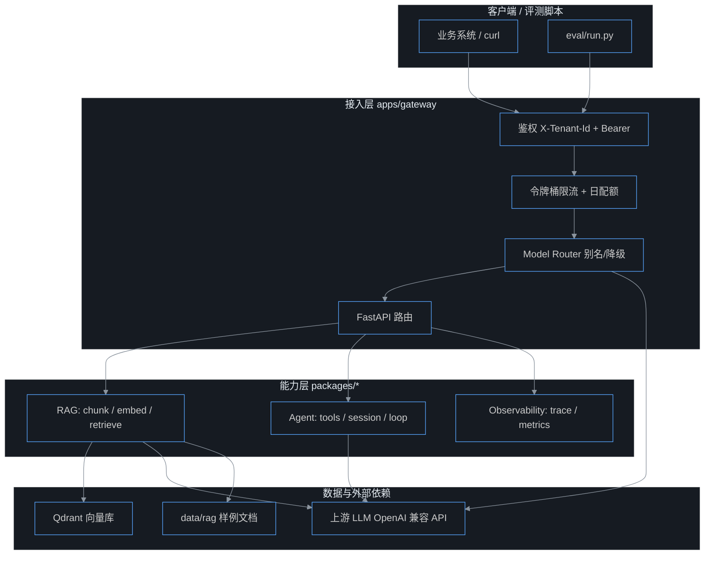
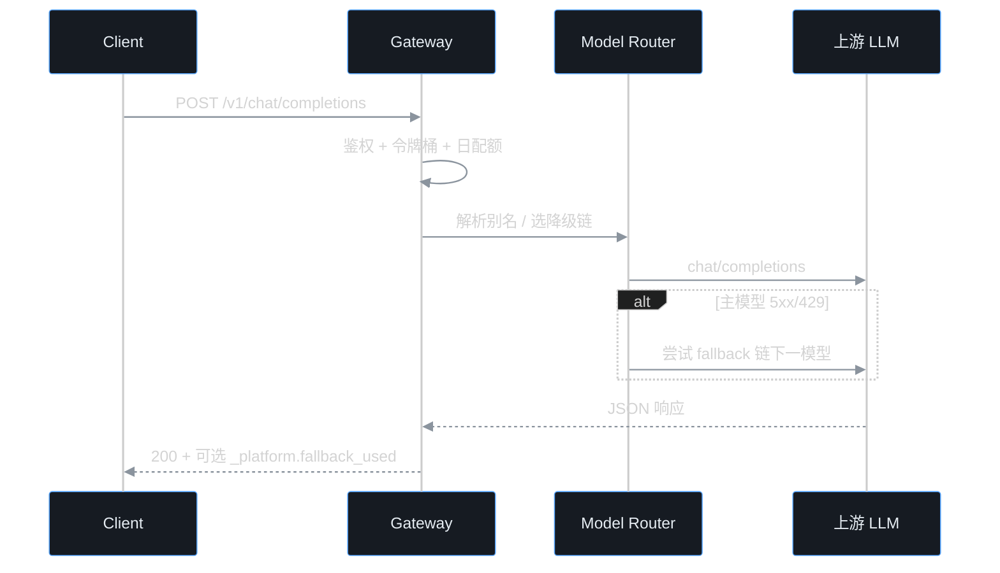
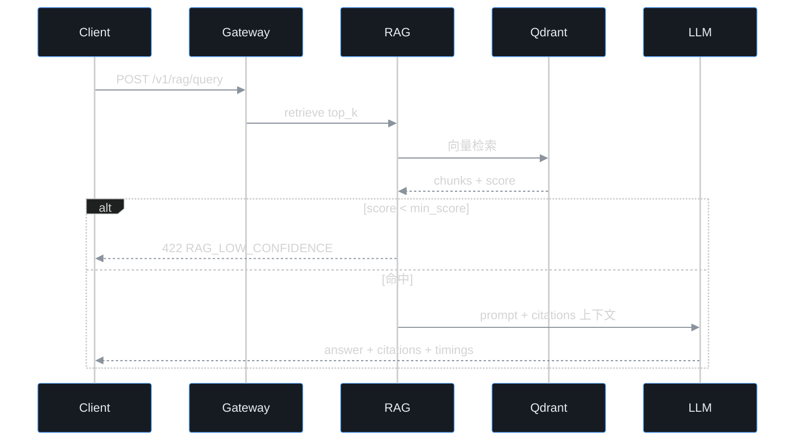
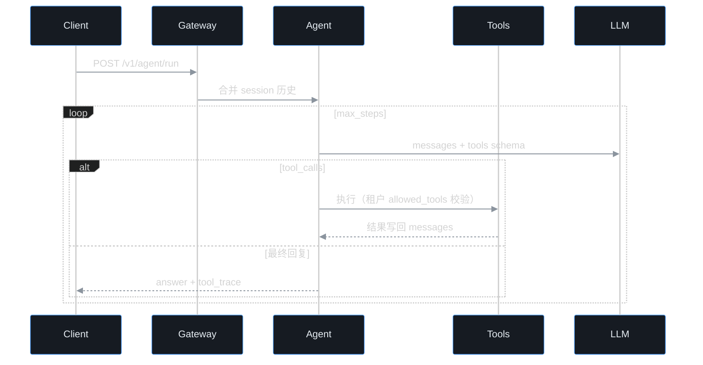
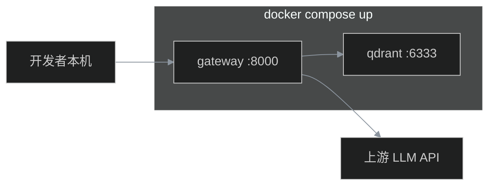

# AI 中台架构总览

与 [AI中台学习执行手册](./AI中台学习执行手册.md) 第 6 周配套。本仓库是 **教学用最小骨架**，不是生产级多区域部署。

---

## 分层架构

---

## 核心数据流

### 1. Chat 补全（第 1 周 + 第 6 周硬化）

### 2. RAG 问答（第 2～3 周）

### 3. Agent 运行时（第 4 周）

---

## 多租户治理矩阵

| 维度 | 配置位置 | 行为 |
|------|----------|------|
| 身份 | `config/tenants.yaml` | `X-Tenant-Id` + Bearer 必须匹配 |
| 模型白名单 | 租户 `allowed_models` | 支持别名（如 `chat-fast`） |
| 默认模型 | 租户 `default_model` | 请求未指定时使用 |
| 工具 ACL | 租户 `allowed_tools` | Agent 工具调用前校验 |
| 日配额 | `daily_request_quota` | 进程内 UTC 日切 |
| 速率 | `rate_limit_rps/burst` | 令牌桶，429 `RATE_LIMIT_EXCEEDED` |
| 模型降级 | `config/models.yaml` | 上游失败按链 fallback |

---

## 部署拓扑（Docker Compose）

本地也可不用 Docker：`uvicorn` 直连本机 Qdrant（`QDRANT_URL=http://127.0.0.1:6333`）。

---

## 相关文档

- [roadmap.md](./roadmap.md) — 已知限制与后续路线
- [week6-hardening.md](./week6-hardening.md) — 第 6 周验收与演示
- [hardening-build-and-code-guide.md](./hardening-build-and-code-guide.md) — 代码导读
