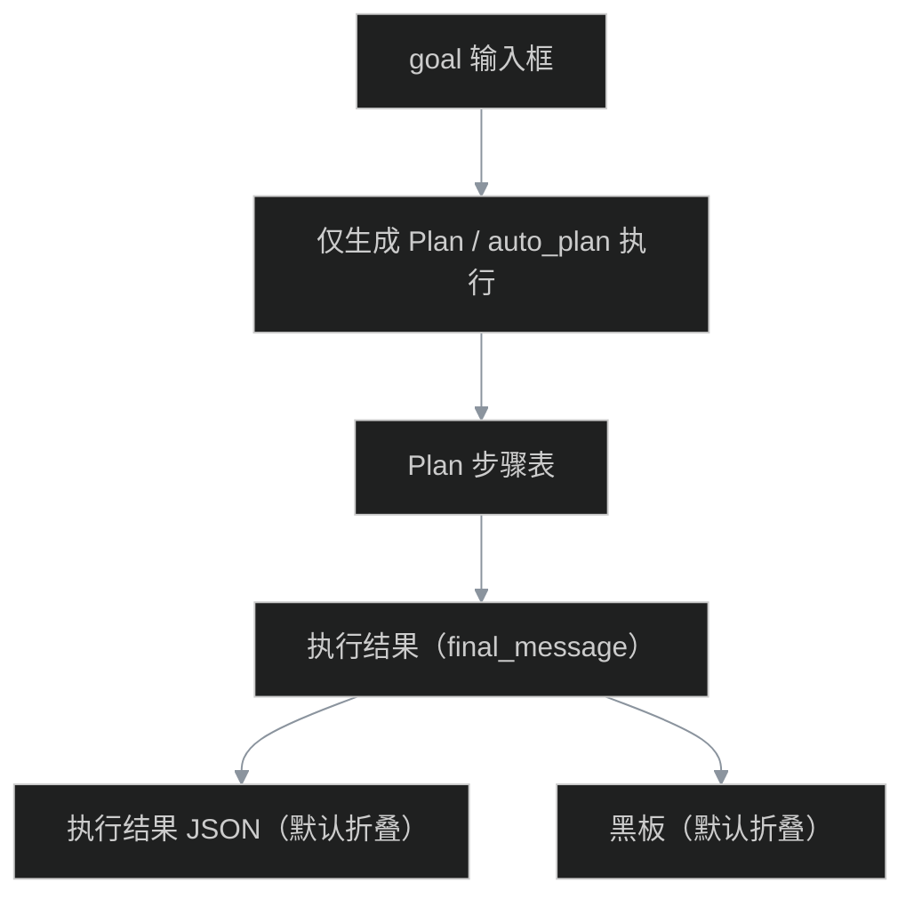

# Console — Agent Task Planner 使用说明

> **页面**：`http://127.0.0.1:8000/console/agents` → **Task Planner 演示** 卡片  
> **前置**：`LLM_API_KEY`、租户 `admin`（或已开放 `web_search` 的租户）

---

## 1. 界面结构



| 区域 | 内容 |
|------|------|
| **Plan 步骤表** | 结构化步骤 + `tool_hint` |
| **执行结果** | 仅展示 API 返回的 `final_message`（Agent 给用户的自然语言答复） |
| **执行结果 JSON** | 完整响应体，**默认折叠**，调试时展开 |
| **黑板** | Multi-Agent 协作条目，默认折叠 |

---

## 2. 真实联网搜索（web_search）

### 2.1 `.env` 配置

```bash
WEB_SEARCH_MODE=ddg          # DuckDuckGo 真实 HTML 检索（本地试用推荐）
# WEB_SEARCH_MODE=http       # 或 POST 到内网搜索 API
# WEB_SEARCH_URL=https://your-search-api/search

LLM_API_KEY=...
MULTI_AGENT_ENABLED=true
```

| 模式 | 说明 |
|------|------|
| `mock` | CI 默认，**假结果** |
| `ddg` | 真实 DuckDuckGo 检索（title/snippet/url） |
| `http` | 自定义搜索服务，失败时 fallback mock |

### 2.2 租户与工具路由

- 使用 **`admin`** 登录（`allowed_tools: []` = 全部工具）
- `demo-a` 默认**没有** `web_search`，仅能 `calc` + `get_kb_snippet`
- 工具路由已配置「天气 / 搜索」关键词 → `web_search`；Plan 的 `tool_hint` 在执行时也会强制暴露

### 2.3 推荐 goal 示例

```text
搜索今天北京昌平的天气，用 web_search 查询，根据搜索结果用中文简要回答
```

成功时：

- **执行结果**卡片：应包含具体气温、天气状况（如「昌平当前 35°C，阴」）
- 展开 JSON：`results[0]` 为 Open-Meteo 实时摘要；`weather` 字段含结构化数值
- `tool_calls` 含 `web_search`，`mode: ddg`

---

## 3. 验证

```bash
# 1. 搜索工具单测
python -m unittest tests.test_tools_web_search -v

# 2. 直连 DuckDuckGo（需网络）
python3 -c "
import asyncio
from packages.agent.tools.web_search import ddg_web_search
async def main():
    for r in await ddg_web_search('北京昌平今天天气', top_k=3, timeout_seconds=15):
        print(r['title'])
asyncio.run(main())
"

# 3. Console：登录 admin → Agents → auto_plan 执行 → 看「执行结果」卡片
```

---

## 4. 相关文档

- [phase-o-web-search.md](./phase-o-web-search.md) — web_search 工具配置
- [demo-walkthrough.md](./demo-walkthrough.md) — 15 分钟 Demo
- [phase-l-console-integration.md](./phase-l-console-integration.md) — Console 挂载
