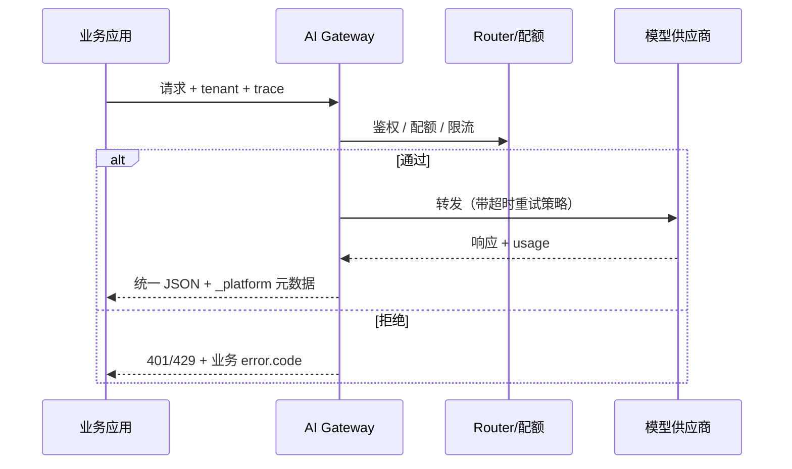
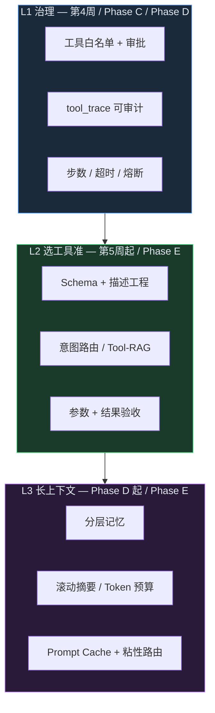
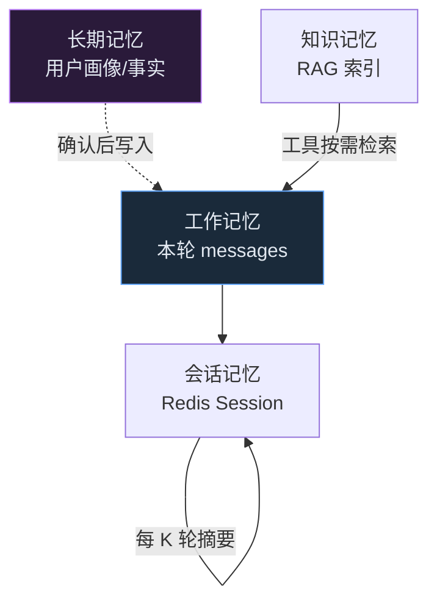

# 大厂 AI 中台：SOP、设计方法、注意事项与踩坑（按周次 / Phase 对照）

> **读者**：已完成或跟做本仓库 [AI中台学习执行手册](./AI中台学习执行手册.md) 的工程师，准备进入/面试 **平台 / 中台** 岗位。  
> **定位**：不是某一家公司的内部文档，而是多家大厂实践的 **共性提炼** + 与本仓库 **周次 / Phase** 的对照表。  
> **原则**：先 **治理与可运维**，再 **效果调参**；SOP 的价值是让「个人经验」变成「组织默认行为」。

---

## 怎么用本文

| 你现在的阶段 | 建议阅读 |
|--------------|----------|
| 刚做完第 1～3 周 | § 第 1～3 周 + 「踩坑速查」 |
| 准备面试平台岗 | 全文 + [roadmap.md](./roadmap.md) 诚实边界 |
| 已做完 Phase B～D | § Phase 各节 + **§ Agent 效果进阶** + 差距表 |
| 专攻 Agent 面试炫技 | **§ Agent 效果进阶**（按 Phase 对照表） |


---

## 跨阶段通用 SOP（大厂几乎都有）

### 1. 需求接入 SOP（谁都能用平台）

| 步骤 | 大厂做法 | 本仓库对应 |
|------|----------|------------|
| 1 | 业务方提 **租户 / 应用 ID**，不是直接拿 API Key | `config/tenants.yaml` |
| 2 | 平台审批：模型白名单、配额、数据域 | Phase C `profile` / `limits` PATCH |
| 3 | 给 **接入文档 + 错误码表 + 沙箱环境** | `docs/week1-gateway.md` 等 |
| 4 | 上线前跑 **冒烟 + eval 门禁** | `eval/acceptance_smoke.py`、CI |

**设计方法**：把「接 API」变成 **工单 + 配置变更**，避免每个业务自己管 Key、自己拼 prompt。

### 2. 变更与发布 SOP

| 类型 | 大厂 SOP 要点 | 踩坑 |
|------|---------------|------|
| 模型升级 | 别名不变、后端换模型；灰度租户 → 全量 | 业务写死模型名，升级一次挂一片 |
| RAG 知识库 | **version bump + 金丝雀 + eval 对比** 再全量 | 直接覆盖索引，无法回滚 |
| Prompt | 版本化文件 + eval 门禁，禁止生产热改 | Prompt 在代码里散落，无法 diff |
| 平台配置 | GitOps / 配置中心 + 审计谁改的 | 手工改 yaml，半夜背锅 |

### 3. 事故与 on-call SOP（SRE）

| 环节 | 内容 |
|------|------|
| 分级 | P0 全站不可用 / P1 单租户 / P2 效果劣化 |
| 止血 | 限流 → 熔断 → 切备用模型 → 关 feature flag |
| 定位 | `trace_id` 贯穿 gateway → RAG → LLM |
| 复盘 | 时间线 + 根因 + **防复发项进 backlog** |

本仓库 Phase D 的熔断、Grafana、告警是 **止血能力** 的缩小版。

---

## 第 0 天：环境与租户模型

### 大厂 SOP

- **租户 ≠ 用户**：租户是 **成本与权限边界**（部门 / 应用 / 客户）；用户是 OIDC 身份。
- **环境隔离**：dev / staging / prod **三套 Key、三套向量库**，禁止 prod Key 进笔记本。
- **数据分级**：L1 公开文档 / L2 内部 / L3 个人信息 —— 决定能否进 RAG、能否出网。

### 设计方法

- 第一天就定 **tenant_id 命名规范**（如 `bu-product-env`），避免半年后无法计费归因。
- **假租户** 也要按真租户建模（配额、模型 ACL），否则后面改造成本指数上升。

### 注意事项

- API Key **永不进 Git**；用 KMS / Vault + 轮换 SOP。
- 向量库选型 **8～12 周内少换**；换库 = 全量重索引 + eval 重跑。

### 踩坑记录

| 坑 | 现象 | 对策 |
|----|------|------|
| 租户即用户 | 一人离职，整部门 Key 失效 | 租户 + 用户双层；Key 绑定应用 |
| 环境混用 | staging 索引写进 prod Qdrant | 环境前缀隔离 collection / kb_id |
| 无成本标签 | 账单出来不知道谁花的 | 请求强制带 `tenant_id` + 落库 |

**本仓库**：`demo-a` / `demo-b` / `admin` + `data_zone`（Phase C）已是缩小模型。

---

## 第 1 周：LLM Gateway

### 大厂在做什么

Gateway 是 **唯一出网 LLM 出口**：鉴权、限流、审计、路由、统一错误体、流式协议适配。

### SOP 设计方法



| SOP 项 | 设计要点 |
|--------|----------|
| 鉴权 | 短期 Bearer / 长期 JWT；**禁止**业务直连供应商 |
| 配额 | 日请求数 + **token 预算** 并存（大厂两者都有） |
| 超时 | 连接超时 ≠ 读超时；流式单独策略 |
| 重试 | 只重试 **幂等** 场景；429 尊重 `Retry-After` |
| 错误体 | HTTP 状态 + `error.code` 分离（业务拒答用 422 等） |

### 注意事项

- **流式**：生产占比高，需单独测试中断、断线重连、首 token 延迟。
- **模型别名**：业务只认 `chat-fast`，平台内部映射真实模型，便于切换。
- **日志**：禁止打全量 prompt/response（合规）；打 hash + 长度 + trace_id。

### 踩坑记录

| 坑 | 现象 | 对策 |
|----|------|------|
| 业务直连 OpenAI | 无法计费、无法审计、Key 泄露 | 网络层 + 代码扫描封 egress |
| 配额只按次 | 长上下文一次打穿预算 | token 预算（Phase B） |
| 重试风暴 | 上游 503，全站重试放大故障 | 熔断 + 抖动退避（Phase D） |
| 错误码混乱 | 客户端无法分支处理 | 统一 `packages/contracts/errors` |

**本仓库**：`apps/gateway/main.py`、`model_router.py`、Phase D 熔断。

---

## 第 2 周：RAG 数据管道

### 大厂 SOP（索引流水线）

| 阶段 | SOP | 产出物 |
|------|-----|--------|
| 接入 | 登记 `kb_id`、数据源、刷新频率、负责人 | 知识库台账 |
| 摄取 | 上传 / 同步对象存储 / DB 导出 | `source_uri` 可追溯 |
| 清洗 | 去重、编码、PII 检测（失败则阻断） | 清洗报告 |
| 切分 | chunk 策略 **按文档类型** 配置化 | version 绑定参数快照 |
| 向量化 | 批量 embed、失败重试、死信队列 | 任务状态机 |
| 发布 | 写入 `version`，旧版保留 N 天 | 可回滚 |

### 设计方法

- **异步一切**：索引禁止同步阻塞 API；Worker 水平扩展。
- **版本优先于覆盖**：永远 `kb_id + version`，不要 in-place 覆盖向量。
- **任务可观测**：`pending/running/success/failed` + 错误信息可给业务查。

### 注意事项

- PDF/表格/图片：**一套 chunk 策略吃不全**，大厂往往分 pipeline。
- Embedding 模型变更 = **新版本全量重算**，需提前公告。
- 删除文档 ≠ 删除向量：要有 **显式 delete_kb_version**。

### 踩坑记录

| 坑 | 现象 | 对策 |
|----|------|------|
| 同步索引 | 大文件上传超时 504 | 队列 + Worker（Phase A） |
| 无版本 | 「昨天答案对今天错」无法查 | version + 检索指定版本 |
| chunk 过大 | 检索分数低、LLM 截断 | 按类型调 chunk；记录 offset |
| 编码问题 | 乱码进库污染检索 | 索引前 UTF-8 校验（本仓库已有） |

**本仓库**：`apps/gateway/rag/pipeline.py`、`packages/tasks/`。

---

## 第 3 周：RAG 服务化 + 质量底线

### 大厂 SOP（在线问答）

| 步骤 | SOP |
|------|-----|
| 1 | 检索（可多路）→ 融合 → rerank |
| 2 | **阈值拒答**（无依据不说） |
| 3 | 拼 prompt（模板版本化） |
| 4 | LLM 生成 + **强制 citations** |
| 5 | 落日志：检索分、片段 id、模型、token |

### 设计方法

- **拒答是功能不是 bug**：合规场景宁可不说，不可幻觉。
- **业务错误码** 与 HTTP 分离：`RAG_NO_EVIDENCE` vs 500。
- **效果迭代** 必须绑 eval，不允许「感觉变好了」上线。

### 注意事项

- `min_score` 与 **向量度量方式**（cosine / inner product）强相关，换模型要重标定。
- 只优化 answer 文本不优化 **citations**，审计仍不合格。
- top_k 过大：延迟涨、噪声多、成本涨。

### 踩坑记录

| 坑 | 现象 | 对策 |
|----|------|------|
| 无拒答 | 胡编法条/金额 | min_score + 空检索拒答 |
| prompt 在生产改 | 无法复盘 | `config/rag_prompt.txt` + Git |
| 只看 BLEU | 与业务「能用」脱节 | baseline.jsonl 业务断言 |
| 忽略延迟 | P95 超 SLO | timings 拆分 retrieve/llm |

**本仓库**：`query_service.py`、`eval/baseline.jsonl`；Phase B hybrid/rerank/金丝雀。

---

## 第 4 周：Agent 运行时

### 大厂 SOP

| 环节 | SOP |
|------|-----|
| 工具注册 | 评审：数据范围、副作用、超时、幂等 |
| 授权 | 租户 **白名单**；高风险工具 **审批**（Phase C 工具市场） |
| 执行 | 最大步数、单工具超时、总超时、人工确认（高风险） |
| 轨迹 | 全量 tool_calls 可审计、可重放（脱敏） |
| 会话 | session 持久化、过期策略、跨实例一致（Redis） |

### 设计方法

- **工具 = 对外 API**：Schema、版本、弃用周期。
- **默认拒绝**：未在白名单的工具一律 403。
- **确定性工具**（calc）与 **网络工具** 分开限流。

### 注意事项

- Agent **不是**「帮用户随便调 HTTP」；每个工具要有 **数据域**。
- 多步循环易 **token 爆炸**：步数上限 + 中间结果截断策略。
- Human-in-the-loop：支付、发邮件、写库类工具大厂几乎都要审批。

### 踩坑记录

| 坑 | 现象 | 对策 |
|----|------|------|
| 工具无超时 | 线程堵死 | `agent_tool_timeout_seconds` |
| 会话内存 | 重启丢上下文 | Redis Session（Phase D） |
| Prompt 注入经工具 | 工具参数带「忽略上文」 | 参数校验 + 内容安全 |
| 轨迹不落库 | 出事无法举证 | tool_trace 写审计 |

**本仓库**：`packages/agent/`、Phase C #14 工具审批、Phase D MCP stub。

进阶（选工具准确性、长上下文、轨迹评测）见 **§ Agent 效果进阶**。

---

## 第 5 周：观测与评测

### 大厂 SOP（质量部门）

| 类型 | SOP |
|------|-----|
| Tracing | 统一 `trace_id`；OTel 导出；采样率按环境配置 |
| Metrics | 黄金指标：QPS、P95、错误率、429 率、token 速率 |
| Logging | 结构化 JSON；**禁止**明文 PII |
| Eval | 发布前跑 baseline；金丝雀期对比 pass_rate |
| Agent 轨迹评测 | 不只看 `final_message`，还看 **该不该调工具、调了啥**（见 § Agent 效果进阶） |
| 压测 | 区分 healthz / RAG / chat 瓶颈 |

### 设计方法

- **评测集 = 合同**：业务方与平台共同维护 JSONL/用例库。
- **对比两次 run** 比单次分数更有说服力（`eval/run.py compare`）。
- 把 eval 接进 **CI**（有 Key 的环境）或 **夜间定时任务**。

### 注意事项

- Trace 采样过低：事故查不全；过高：成本和存储爆。
- 只监控 Gateway 不监控 **Worker 队列积压**，索引故障发现晚。
- Eval 用例过少：上线一次就「虚假安心」。

### 踩坑记录

| 坑 | 现象 | 对策 |
|----|------|------|
| 无 trace 关联 | 用户投诉无法定位 | TraceIdMiddleware + OTel |
| 指标无租户维度 | 不知道谁打挂服务 | `tenant_id` label |
| eval 手工跑 | 回归漏测 | CI + `--min-pass-rate` |
| 压测只打 healthz | 上线 RAG 首日崩 | 分路径压测 |

**本仓库**：`packages/observability/`、Phase B2 observability profile、Phase D Grafana。

---

## 第 6 周：硬化与平台叙事

### 大厂 SOP

| 能力 | SOP |
|------|-----|
| Model Router | 主备切换、权重、熔断、成本/延迟策略 |
| 限流 | 全局 + 租户 + 接口级令牌桶 |
| 降级 | 功能开关；非核心路径可关 |
| 文档 | 15 分钟跑通 + 架构图 + roadmap 诚实边界 |
| 演练 | 定期断上游 / 断 Redis 演练 |

### 踩坑记录

| 坑 | 现象 | 对策 |
|----|------|------|
| 只有 fallback 无熔断 | 上游挂时线程打满 | Phase D circuit breaker |
| README 过时 | 新人无法跑通 | 跟 release 一起更新 |
| 无 roadmap | 面试被问「生产还差啥」答不出 | `docs/roadmap.md` |

**本仓库**：`week6-hardening`、`architecture.md`。

---

## Phase A — 可内测

### 大厂对标：「给兄弟团队试点」

| 能力 | 大厂 SOP | 本仓库 |
|------|----------|--------|
| 状态共享 | Redis 集群；配额/限流/队列一致 | `REDIS_URL` |
| 审计 | 谁、何时、调了啥、多少 token | SQLite + Phase D Postgres |
| CI | lint + 冒烟 + eval 结构校验 | GitHub Actions |
| Worker | 索引与 API 解耦 | `USE_INDEX_WORKER` |

### 注意事项

- 内测仍要 **配额**，否则一个月账单教育全员。
- 审计保留周期与 **合规** 对齐（often 90 天～数年）。

### 踩坑

| 坑 | 对策 |
|----|------|
| 多实例内存配额 | 必须 Redis（#15） |
| Worker 与 API 抢 CPU | 独立 deployment + HPA |

---

## Phase B — 可小流量生产

### 大厂对标：「小流量真钱 / 真用户」

| 波次 | 大厂 SOP 要点 | 踩坑 |
|------|---------------|------|
| B1 计费 | token 落库、日/月预算、超预算硬断 | 只记账不拦截 → 预算形同虚设 |
| B2 密钥 | KMS/Vault；按租户/环境隔离 | Key 在 CMDB 与代码两处真源 |
| B2 混合检索 | 向量+关键词；效果用 eval 证明 | 盲目 hybrid 延迟翻倍收益不明 |
| B2 可观测 | Collector → Jaeger/Tempo + Prometheus | 只装不告警 |
| B3 rerank/金丝雀 | 灰度 + 自动回滚条件 | 手动改 percent 半夜忘回滚 |

### 设计方法

- **计费口径** 提前法务/财务对齐：input/output 是否分价、是否含税。
- 金丝雀：**确定性分桶**（本仓库 `hash(tenant:query)`）便于复现与排障。

**本仓库文档**：[phase-b-small-production.md](./phase-b-small-production.md)、[phase-b2-parallel.md](./phase-b2-parallel.md)、[phase-b3-rerank-canary.md](./phase-b3-rerank-canary.md)

---

## Phase C — 平台化

### 大厂对标：「多 BU、多 region、可自助」

| 波次 | 大厂 SOP | 注意事项 |
|------|----------|----------|
| C1 供应商矩阵 | 多厂商、多单价、路由策略可解释 | 合同到期切换要提前演练 |
| C2 Region | 数据驻留、跨境合规 | 向量与原文 **同 region** |
| C3 自助 | 控制台改配额、看用量、申工具 | 高危操作二次确认 + 审计 |
| C4 工具市场 | 上架评审、租户申请、安全审批 | 工具描述被注入攻击 |

### 踩坑

| 坑 | 现象 | 对策 |
|----|------|------|
| 驻留违规 | 国内租户打到海外 Qdrant | `data_zone` + Region 中间件 |
| 控制台直连 DB | 绕过 Gateway 审计 | 只读 API，写走审批流 |
| 工具审批流于形式 | 高危工具默认全开 | risk_level + admin approve |

**本仓库**：[phase-c-platform.md](./phase-c-platform.md)

---

## Phase D — 运维与治理深化

### 大厂对标：「可 on-call 的生产服务」

| 波次 | 大厂 SOP | 踩坑 |
|------|----------|------|
| D1 多实例/熔断 | HPA、Pod 反亲和、熔断半开 | 只 scale 不共享状态 |
| D1 Grafana/告警 | SLO → 告警 → runbook 链接 | 告警太多无人看 |
| D2 JWT/RBAC | 身份来自 IdP；权限最小化 | 用租户 token 当永久凭证 |
| D2 审计集中化 | SIEM、不可篡改、保留期 | SQLite 单机丢日志 |
| D3 控制台 | 与 API 同源；操作可回放 | UI 与后端两套逻辑 |
| D4 自动回滚 | eval 门禁绑发布流水线 | 回滚无通知 |
| D5 账单 | 成本归因到 tenant/kb/model | 估算价与财务价不一致 |

**本仓库**：[phase-d-ops.md](./phase-d-ops.md)

---

## Agent 效果进阶：选工具准确性 × 长上下文（按 Phase 对照）

> **定位**：第 4 周 + Phase C/D 解决的是 **Agent 治理**（能不能跑、能不能审计）；本节是 **效果炫技** 层——大厂面试/评审常问的「选工具准不准」「上下文怎么撑住」。  
> **原则**：先 **治理（L1）**，再 **选工具准（L2）**，再 **上下文省（L3）**；不要跳过 L1 直接调 prompt。



### 按 Phase 总览（一张表背面试）

| Phase / 周次 | Agent 整体效果 | 选工具准确性 | 长上下文 |
|--------------|----------------|--------------|----------|
| **第 4 周** | ReAct 环、`max_steps`、失败 error 回灌 | 工具注册 + `allowed_tools` 白名单；JSON 参数校验 | 内存 `session` 全量 append |
| **第 5 周** | 轨迹可关联 `trace_id` | eval 可扩 `expect_tools` / `forbid_tools`（规划） | — |
| **第 6 周** | 令牌桶防 Agent 打爆网关 | 网络类工具与 calc 分限流（规划） | 步数上限抑制 token 爆炸 |
| **Phase A** | 审计落库，轨迹可举证 | — | — |
| **Phase B** | 金丝雀 + eval 对比（RAG 为主，Agent 可 shadow） | — | — |
| **Phase C** | 工具市场上架评审、`risk_level` | 工具描述模板、租户申请后才可用 | — |
| **Phase D** ✅ | MCP stub、Redis Session 跨重启 | 工具执行超时/重试、forbidden 硬断 | Session Redis 多实例一致 |
| **Phase E**（规划） | Plan→Act→Reflect、HITL、Shadow Agent | 意图路由、Tool-RAG、结果质量门 | 滚动摘要、Token 预算、分层记忆、Prompt Cache |

远期规划细节：[phase-d-future-evolution.md](./phase-d-future-evolution.md) §6.2 Agent 深化。

---

### 第 4 周 — Agent 运行时（治理基线）

| 炫技点 | 大厂 SOP | 本仓库 |
|--------|----------|--------|
| 工具 = 对外 API | 名称、description、parameters_schema、版本、弃用周期 | `ToolDefinition` + `builtin.py` |
| 默认拒绝 | 未在白名单 → `AGENT_TOOL_FORBIDDEN` | `registry.is_allowed()` |
| 执行护栏 | 单工具超时、重试、总步数 | `agent_tool_timeout_seconds`、`max_steps` |
| 轨迹审计 | 每步 `tool_calls[]` 含 status/latency/attempt | `ToolCallRecord` → 审计 |

**踩坑**：工具>10 仍全量塞进 prompt → 选工具准确率随工具数下降（为 Phase E Tool-RAG 埋伏笔）。

---

### 第 5 周 — 轨迹评测（效果门禁）

大厂不把 Agent 上线门槛设为「回答像人」，而是 **轨迹 + 业务断言** 双门禁。

| SOP 项 | 设计要点 | 本仓库 |
|--------|----------|--------|
| Trajectory Eval | 用例声明 `expect_tools: ["get_kb_snippet"]`，错调即 fail | 可扩 `eval/baseline.jsonl` 字段 |
| Needless Tool Rate | 本可直答却调工具 → 监控项 | 规划 |
| Missing Tool Rate | 该查库却心算 → 监控项 | 规划 |
| Arg Valid Rate | 参数一次过 Schema 比例 | 已有 `AGENT_TOOL_BAD_ARGS` |
| 对比发布 | 新 prompt/工具描述变更跑 `eval/run.py compare` | 已有 RAG compare，Agent 可复用 |

**eval 用例扩展示例（规划字段）**：

```json
{
  "id": "agent-kb-01",
  "tenant_id": "admin",
  "messages": [{"role": "user", "content": "知识库里 RAG 管道是什么？"}],
  "expect_tools": ["get_kb_snippet"],
  "forbid_tools": ["calc"],
  "assert_contains": ["索引", "检索"]
}
```

**大厂周报指标（面试可背）**：Tool Precision@1、Needless Tool Rate、Missing Tool Rate、Arg Valid Rate、token per success task。

---

### 第 6 周 — 硬化（成本与稳定性）

| 关联能力 | 说明 |
|----------|------|
| 步数/token 上限 | `max_steps` + 租户 token 预算（Phase B）防多步爆炸 |
| 熔断 | 上游模型挂时 Agent 环快速失败（Phase D） |
| 确定性短路 | 简单意图不走 Agent（大厂常做，本仓库可 Gateway 规则扩展） |

---

### Phase C — 工具市场（描述工程 + 审批）


| 炫技 SOP | 内容 | 本仓库 |
|----------|------|--------|
| 描述模板 | **When** 用 / **When NOT** 用 / 正例 / 反例 | `catalog` 中 `description` |
| 一名一责 | 禁止 `search_and_email` 式巨型工具 | 内置三工具示范 |
| 风险分级 | `risk_level=high` → 审批 + 未来 HITL | Phase C #14 |
| 注入防护 | 工具描述与参数不被用户 prompt 污染 | 参数校验 + 内容安全（规划 hook） |

---

### Phase D — 会话与生态（长上下文起步）

| 波次 | 长上下文 / 选工具 | 本仓库 |
|------|-------------------|--------|
| D4 Session | Redis 持久化，多实例共享 | `SessionStore` Redis 后端 |
| D4 MCP | 工具从内置 → MCP 描述拉取 | `mcp_stub.py` |
| D4 自动回滚 | kb 金丝雀 eval 门禁 | `canary_guard.py`（RAG；Agent prompt 可类比） |

**现状局限**：Session 仍为 **全量 messages append**，无滚动摘要、无 token 预算分配——属 Phase E。

---

### Phase E — 效果炫技（规划，面试重点）

> 对应 [phase-d-future-evolution.md](./phase-d-future-evolution.md) D4 未做子集 + 下文扩展。Tag 建议：`phase-e-agent-quality`。

#### E1 — 选工具准确性

| 项 | 原理 | SOP |
|----|------|-----|
| **意图路由** | 轻量分类器先判 `kb_query \| calc \| chitchat`，再暴露子集工具 | 两阶段 routing，降低主模型负担 |
| **Tool-RAG** | query embedding 检索 Top-K 相关工具再喂 LLM | 100+ 工具只暴露 Top-5 candidate |
| **约束解码** | 工具名限定 enum，禁止 hallucinate 工具名 | 与 OpenAI strict schema 对齐 |
| **结果质量门** | 工具返回须过 envelope；KB 片段相关性小模型打分 | 低质量触发换工具或重检索 |
| **反思重规划** | 失败分类：timeout→重试、forbidden→终止、low_confidence→换策略 | 反思轮单独 token 上限 |


#### E2 — 长上下文

| 项 | 原理 | SOP |
|----|------|-----|
| **分层记忆** | Working（本轮）/ Session（Redis）/ Long-term（用户事实）/ Knowledge（RAG 外挂） | 长期记忆写入需用户确认 |
| **滚动摘要** | 每 K 轮压成一条 `summary` system 消息 | 摘要用便宜模型 |
| **Tool output 摘要** | 检索结果只留 Top-N 摘要 + `chunk_id` 可追溯 | 工具返回设 `max_tokens` |
| **Token 预算路由** | system 10% / tools 20% / history 40% / RAG 30%，超限先砍 history | budget-aware assembly |
| **Prompt Cache** | 固定 system + tools schema 前缀；同 session 粘性路由提命中率 | schema 变更走金丝雀 |
| **按需 RAG** | 长文档不进 history，只经 `get_kb_snippet` 按需取 | 与第 3 周 RAG 叙事一致 |



#### E3 — Agent 整体效果

| 项 | 说明 |
|----|------|
| **Plan → Act → Reflect** | 高风险任务先出计划 JSON，再逐步执行 |
| **Human-in-the-loop** | 写库/外呼类工具 `pending_approval` → confirm API |
| **Shadow Agent** | 新 prompt/工具链旁路记轨迹，不真执行，对比 diff 后放量 |
| **长任务异步** | `job_id` + webhook，避免 HTTP 长连接 |
| **多 Agent 拆分** | Planner + Worker；超长文档 Map-Reduce |

#### Phase E 建议 Issue 拆分（可选）

| 代号 | 内容 | 依赖 |
|------|------|------|
| E1 | eval `expect_tools` + Agent 轨迹指标 | 第 5 周 eval |
| E2 | Tool-RAG / 意图路由 | Phase C 工具市场 |
| E3 | Session 滚动摘要 + token 预算 | Phase D Redis Session |
| E4 | 结果质量门 + 反思重规划 | E2 |
| E5 | HITL + Shadow Agent | Phase C 审批流 |

---

### Agent 效果 SOP 清单（可直接写进内部 wiki）

| 序号 | 文档名 | 对应 Phase |
|------|--------|------------|
| 1 | 《Agent 工具上架描述模板（When/When NOT）》 | Phase C |
| 2 | 《工具白名单与审批 SOP》 | Phase C / D |
| 3 | 《Agent 轨迹评测用例规范》 | 第 5 周 / Phase E1 |
| 4 | 《选工具质量周报（5 指标）》 | Phase E |
| 5 | 《Session 与分层记忆策略》 | Phase D / E3 |
| 6 | 《Token 预算与上下文压缩 SOP》 | Phase E3 |
| 7 | 《高风险工具 HITL 流程》 | Phase E5 |
| 8 | 《Agent prompt/工具链 Shadow 发布》 | Phase E5 |

---

### 面试 30 秒版（Agent 效果三连）

> 我们做 Agent 不追「步数越多越好」，而是三条线：**选工具准**（路由 + Schema + 验收 + 轨迹评测）、**上下文省**（分层记忆 + 滚动摘要 + 按需 RAG）、**治理稳**（白名单、审批、熔断、审计）。效果用 **Tool Precision@1** 和 **token per success** 衡量，不是只看回答像不像人。

### 与本仓库差距（Agent 专项）

| 大厂标配 | 本仓库 | 你可怎么说 |
|----------|--------|------------|
| Tool-RAG / 意图路由 | ❌ | 「工具>10 时 Phase E 做 Top-K 暴露」 |
| 轨迹评测 expect_tools | ❌（字段可扩） | 「eval 合同化，错调工具即 fail」 |
| 滚动摘要 / token budget | ❌ | 「长上下文靠压缩，不是堆 128k 窗口」 |
| 结果质量门 | 部分（error 回灌） | 「失败分类驱动重规划」 |
| HITL | ❌ | 「Phase C 审批流可延伸到执行前确认」 |
| Prompt Cache | ❌ | 「与 Gateway 粘性路由、schema 稳定联动」 |

---

## 踩坑速查表（面试前 5 分钟）

| 领域 | 一句话坑 | 标准答案方向 |
|------|----------|--------------|
| Gateway | 业务直连模型 | 统一出口 + 计费审计 |
| RAG | 覆盖索引无版本 | version + 金丝雀 + eval |
| RAG | 不拒答 | min_score + 业务错误码 |
| Agent | 工具无治理 | 白名单 + 审批 + 超时 |
| Agent | 选错工具 | Tool-RAG / 意图路由 + 轨迹评测 |
| Agent | 上下文撑不住 | 分层记忆 + 滚动摘要，非堆窗口 |
| Agent | 只评最终答案 | expect_tools + Tool Precision@1 |
| 观测 | 无 trace | trace_id 端到端 |
| 评测 | 感觉上线 | baseline + compare 门禁 |
| 配额 | 只限次数 | + token 预算 |
| 多实例 | 内存计数 | Redis 共享状态 |
| 安全 | Key 进仓库 | Vault/KMS + 轮换 |
| 合规 | 日志打全文 | 脱敏 + 分级 |

---

## 与本仓库差距（面试「诚实边界」模板）

| 大厂标配 | 本仓库状态 | 你可怎么说 |
|----------|------------|------------|
| 全公司 IdP / SSO | JWT 可选 + Bearer | 「接口留了 JWT，生产接 OIDC」 |
| 内容安全 / PII | 未专项 | 「Gateway 可挂 hook，eval 可扩敏感用例」 |
| 真多 region 多集群 | 配置级 region | 「驻留校验有了，多集群是部署层扩展」 |
| 完整 LLMOps UI | `/console` MVP | 「管理面走 API，UI 消费 internal 接口」 |
| 训练/微调 | 非目标 | 「平台专注推理与 RAG，训练另流水线」 |
| SLO / 错误预算 | 告警规则草案 | 「Prometheus 告警 + 后续绑 runbook」 |
| Agent 选工具 / 长上下文 | 治理有，效果层在 Phase E | 见 **§ Agent 效果进阶** 差距表 |

---

## 推荐 SOP 文档清单（大厂内部常见）

若你进厂后要 **建或补** 中台文档，可按周次顺序准备：

| 序号 | 文档名 | 对应阶段 |
|------|--------|----------|
| 1 | 《租户与接入规范》 | 第 0 天 / Phase C |
| 2 | 《Gateway 错误码与限流说明》 | 第 1 周 |
| 3 | 《知识库索引与版本发布 SOP》 | 第 2～3 周 / Phase B3 |
| 4 | 《RAG 拒答与合规策略》 | 第 3 周 |
| 5 | 《Agent 工具上架与审批 SOP》 | 第 4 周 / Phase C4 |
| 5b | 《Agent 轨迹评测与选工具质量周报》 | 第 5 周 / Phase E1 |
| 5c | 《Session 与分层记忆 / Token 预算 SOP》 | Phase D / Phase E3 |
| 6 | 《评测与发布门禁》 | 第 5 周 / Phase D4 |
| 7 | 《on-call 与熔断降级手册》 | 第 6 周 / Phase D1 |
| 8 | 《计费与成本归因说明》 | Phase B / D5 |
| 9 | 《数据驻留与 region 路由》 | Phase C2 |
| 10 | 《事故复盘模板》 | 跨阶段 |

---

## 相关文档

- [AI中台学习执行手册.md](./AI中台学习执行手册.md) — 跟做任务清单  
- [roadmap.md](./roadmap.md) — 已知限制  
- [phase-d-future-evolution.md](./phase-d-future-evolution.md) — 后续演进  
- [architecture.md](./architecture.md) — 架构与数据流  

---

*文档版本：v2 | 与仓库 tag `phase-d-ops` 对齐；§ Agent 效果进阶含 Phase E 规划项。*
