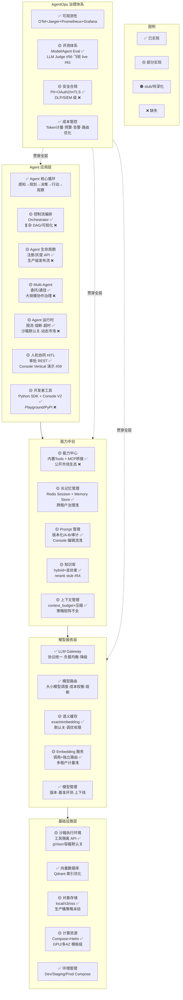

# Gap Analysis — ai-platform-lab vs 目标架构全景

> 对比「Agent 平台架构全景 × AgentOps 治理体系」图，梳理现状与缺口。  
> **更新**：Phase A～K 已交付；本节反映 **2026-06 Phase L Wave1** 基线（~85% 模块覆盖，深度仍待 L1～L3）。

> 图例：✅ 已实现  🟡 部分实现 / opt-in  🟠 stub / 待深化  ❌ 缺失

## 完成度汇总

| 层次 | 完成度 | 强项 | 主要缺口（Phase L 目标） |
|------|--------|------|-------------------------|
| 模型服务层 | ~90% | Gateway、路由、熔断、语义缓存、计费 | Embedding 独立治理、缓存生产调优 |
| 基础设施层 | ~75% | Qdrant、Compose、Helm、对象存储 | 多 AZ/GPU **实际部署验证** |
| 能力中台 | ~85% | RAG 版本化、Prompt A/B、MCP、Memory | **真 Rerank**、增量索引 |
| Agent 应用层 | ~80% | 核心循环、Orchestrator、Multi-Agent、HITL | Vertical 演示链、三率指标 |
| AgentOps 治理 | ~80% | 可观测、成本、PII、分级审计 | **LLM Judge**、反馈飞轮 live、SLO |

**整体**：模块清单 **~88%**；「能讲数字、能演示发版 SOP」约 **~60%**（Phase L 进行中）。

## 与 roadmap 一致性

| 能力 | gap-analysis | roadmap §已知限制 |
|------|--------------|-------------------|
| MCP | 🟡 桥接已有，非市场 | Agent 节一致 |
| HITL | 🟡 REST 已有 | Agent 节一致 |
| 语义缓存 | 🟡 opt-in | 模型服务节一致 |
| PII | 🟡 规则级 | 安全节一致 |
| Rerank | 🟠 stub | RAG 节 #54 |
| 反馈飞轮 | 🟡 代码有、live 无 | 评测节 #61 |

详见 [phase-l-priority-roi.md](./phase-l-priority-roi.md)。
