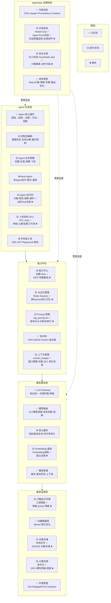

# Gap Analysis — ai-platform-lab vs 目标架构全景

> 对比「Agent 平台架构全景 × AgentOps 治理体系」图，梳理现状与缺口。
> 
> 图例：✅ 已实现  🟡 部分实现  ❌ 缺失

## 完成度汇总

| 层次 | 完成度 | 强项 | 主要缺口 |
|------|--------|------|---------|
| 模型服务层 | ~85% | Gateway、路由、熔断、计费完整 | 语义缓存、Embedding 独立治理 |
| 基础设施层 | ~60% | Qdrant、Compose 环境管理 | 云原生、对象存储、GPU 调度 |
| 能力中台 | ~55% | RAG 完整 | Prompt 管理、长记忆、MCP |
| Agent 应用层 | ~50% | 核心循环、HITL stub | Multi-Agent、控制流编排 |
| AgentOps 治理 | ~65% | 可观测 + 成本管控 | 安全合规深化、在线评测飞轮 |
