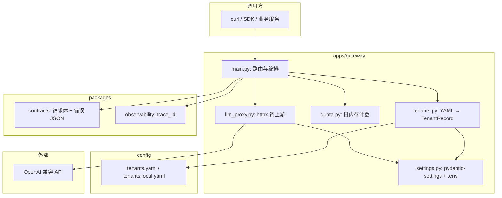
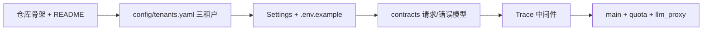
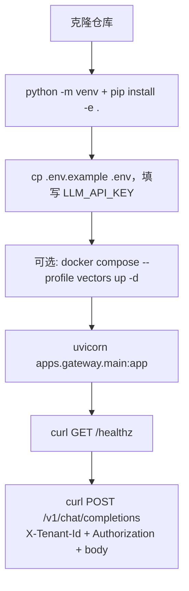
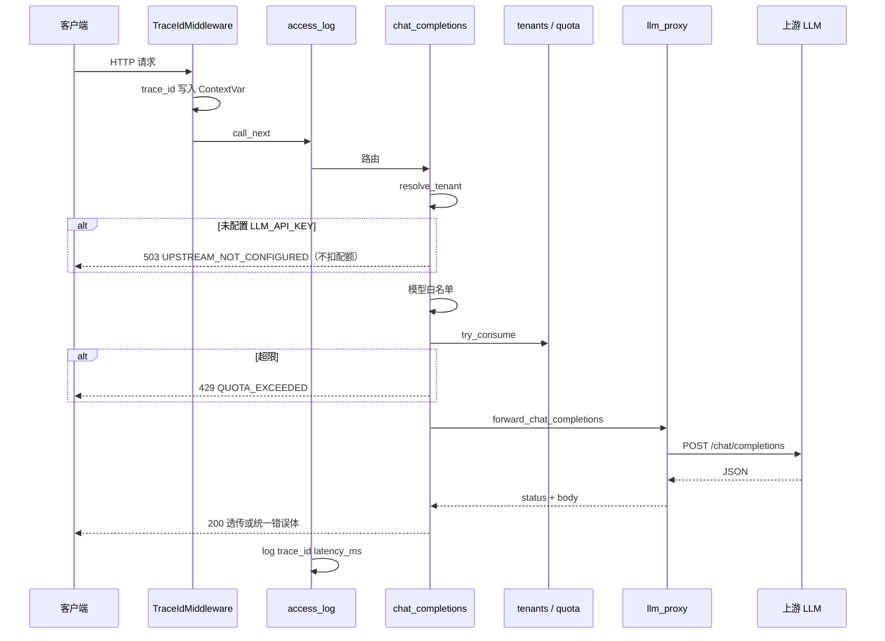
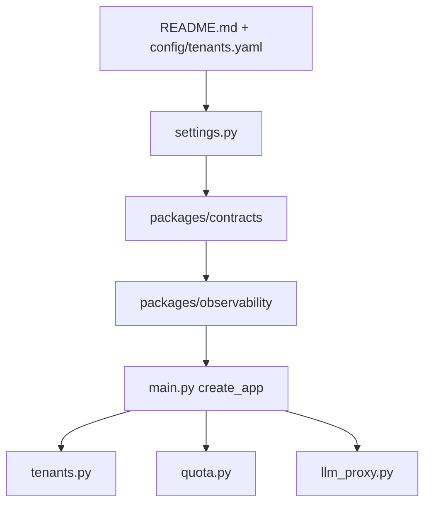

# Gateway 构建思路与代码导读

> 本文档整理自项目搭建与代码讲解，供**自学回顾**或**给他人讲解**使用。  
> 配套学习手册：[AI中台学习执行手册](./AI中台学习执行手册.md)  
> 当前代码范围：**第 1 周 LLM Gateway**（本文）；第 2 周 RAG 见 [rag-build-and-code-guide.md](./rag-build-and-code-guide.md)。

---

## 目录

1. [与学习手册的对应关系](#1-与学习手册的对应关系)
2. [构建思路](#2-构建思路)
3. [使用链路](#3-使用链路)
4. [代码导读（按文件）](#4-代码导读按文件)
5. [错误码与分支决策表](#5-错误码与分支决策表)
6. [10 条自测用例（输入 / 预期）](#6-10-条自测用例输入--预期)
7. [读代码顺序建议](#7-读代码顺序建议)

---

## 1. 与学习手册的对应关系

### 1.1 §0 开始前（第 0 天）在仓库里的落点

| 手册要求 | 仓库实现 |
|----------|----------|
| Python 3.11+、`git` | `pyproject.toml` 中 `requires-python = ">=3.11"` |
| Docker（可选）、向量库二选一 | `docker-compose.yml` 用 **profile `vectors`** 启动 **Qdrant**（Chroma 未纳入 compose） |
| OpenAI 兼容 API 账号 | 根目录 `.env.example` + `LLM_API_KEY` / `LLM_BASE_URL` |
| 目录树 `apps/gateway`、`worker`、`packages/*`、`eval`、`docs` | 与手册一致；额外 `config/` 放租户 YAML |
| 三假租户 `demo-a` / `demo-b` / `admin` | `config/tenants.yaml` |
| 本日交付：README 写明三租户与目标 | `README.md` + 本指南 |

**§0 的定位**：仓库骨架 + 工具链 + 三租户配置 + 说明文档；**不要求**网关业务全部写完。

### 1.2 第 1 周 Gateway 与当前实现

| 手册任务 | 当前状态 |
|----------|----------|
| `GET /healthz` | ✅ |
| `X-Tenant-Id` + `Authorization: Bearer` | ✅ |
| 内存日配额、429 统一错误体 | ✅ |
| 上游超时、有限次重试 | ✅（立即重试，无 sleep 退避） |
| `trace_id`、结构化 access log | ✅ |
| 业务侧不暴露供应商 Key | ✅（上游用服务端 `LLM_API_KEY`） |
| 流式 `stream=true` | ❌ 显式 400 |
| `docs/week1-gateway.md` | ✅ 接口要点；细节见本文 |

---

## 2. 构建思路

### 2.1 原则（来自学习手册）

- **先工程与治理**：租户、配额、观测、统一错误 → 再追求转发与模型效果细节。
- **边界清晰、可测、可运维**：模块单责，配置与代码分离。
- **密钥分层**：调用方只持**租户 Bearer**；网关持**供应商 API Key**。

### 2.2 分层：谁依赖谁

| 模块 | 职责 |
|------|------|
| `packages/contracts` | 固定入参 `ChatCompletionRequest`、出错时 `ErrorBody` 形状 |
| `packages/observability` | 每请求 `trace_id`（`ContextVar`），响应头 `X-Request-Id` |
| `apps/gateway/settings.py` | 单例 `Settings`：`LLM_*`、超时、重试、租户配置路径 |
| `apps/gateway/tenants.py` | 读 YAML → `TenantRecord`，支持 `tenants.local.yaml` 覆盖 |
| `apps/gateway/quota.py` | `(tenant_id, UTC 日期)` 进程内计数；`-1` 不限 |
| `apps/gateway/llm_proxy.py` | **唯一**集中调用上游 `/chat/completions` |
| `apps/gateway/main.py` | **只编排**：鉴权 → 策略检查 → 配额 → 转发 → 统一错误或透传 |

**改规则时动哪里**：租户 → `tenants`；限流 → `quota`；上游策略 → `llm_proxy`；HTTP 顺序 → `main`。

### 2.3 搭建顺序（心智模型）

### 2.4 与「第 0 天目录」的对应

| 路径 | 作用 |
|------|------|
| `apps/gateway/` | 对外 HTTP 入口（当前已实现第 1 周主路径） |
| `apps/worker/` | 第 2 周异步索引占位 |
| `packages/contracts/` | 跨应用复用的请求/错误契约 |
| `packages/observability/` | trace 与后续观测扩展 |
| `config/tenants.yaml` | 三假租户写死配置 |
| `eval/` | 评测 JSONL（第 3/5 周重度使用） |
| `docs/` | 周文档与本导读 |

---

## 3. 使用链路

### 3.1 开发者：从克隆到第一次调用

- **健康检查**：`GET /healthz` 不鉴权。
- **对话**：必须 `X-Tenant-Id` 与 `Authorization: Bearer <yaml 中 token>` 同时正确。

### 3.2 单次 `POST /v1/chat/completions` 进程内顺序

| 步骤 | 行为 | 说明 |
|------|------|------|
| 1 | `TraceIdMiddleware` | 优先 `X-Request-Id`，否则 `uuid4`；响应头回写 |
| 2 | `access_log` | 记录 method、path、status、`latency_ms` |
| 3 | `resolve_tenant` | 缺头 / 未知租户 / token 错 → 401 `UNAUTHORIZED` |
| 4 | `stream=true` | 400 `BAD_REQUEST` |
| 5 | 无 `LLM_API_KEY` | 503 `UPSTREAM_NOT_CONFIGURED`，且在配额**之前** |
| 6 | 模型白名单 | `allowed_models` 非空且不含当前模型 → 403 `MODEL_NOT_ALLOWED` |
| 7 | `try_consume` | `-1` 不限；否则按 UTC 日计数 → 429 `QUOTA_EXCEEDED` |
| 8 | `upstream_payload` | 拼上游 JSON，支持 `extra` 字段透传 |
| 9 | `llm_proxy` | 用**服务端** Key 调上游 |
| 10 | 返回 | 200 透传上游 JSON，或 `UPSTREAM_ERROR` 等 + `trace_id` |

### 3.3 两类响应（给业务方）

- **200**：body 基本为上游 JSON（网关不改写成功体）。
- **4xx/5xx**：统一 `{"error": {"code", "message", "trace_id", "detail?"}}`。

---

## 4. 代码导读（按文件）

### 4.1 `apps/gateway/main.py`

**全局**

- `quota_tracker`：全进程共享的 `DailyQuotaTracker`。
- `_tenants_cache`：`load_tenants()` 只执行一次；改 yaml 需重启。

**工具函数**

- `json_error(...)` → `ErrorBody` + `JSONResponse`，`trace_id` 来自 `get_trace_id()`。
- `parse_bearer` / `resolve_tenant`：双头校验；失败抛 `HTTPException`，路由里 catch 后转成 `UNAUTHORIZED`。

**`create_app()`**

1. `TraceIdMiddleware`
2. `access_log` 中间件（`time.perf_counter` 算延迟）
3. `GET /healthz`
4. `POST /v1/chat/completions` 编排链（见 §3.2）

**注意**

- 未配置 Key 的检查在 `try_consume` **之前** → 不误扣配额。
- 鉴权失败也在扣配额之前。

### 4.2 `apps/gateway/settings.py`

- `REPO_ROOT`：定位仓库根，默认 `config/tenants.yaml`。
- `BaseSettings` + `env_file=(".env",)`。
- `get_settings()` 带 `@lru_cache`，全进程单例。

主要环境变量：`LLM_BASE_URL`、`LLM_API_KEY`、`DEFAULT_MODEL`、`TENANTS_CONFIG_PATH`、`UPSTREAM_TIMEOUT_SECONDS`、`UPSTREAM_MAX_RETRIES`。

### 4.3 `apps/gateway/tenants.py`

- `TenantRecord`：`frozen` 数据类。
- 读 `tenants.yaml`；若存在 `tenants.local.yaml` 则按 `tenant_id` 浅合并。
- `allowed_models` 为空列表 → **不限制模型**（`main` 用 `if tenant.allowed_models and ...` 判断）。

### 4.4 `apps/gateway/quota.py`

- Key：`(tenant_id, UTC日期字符串)`。
- `threading.Lock` 保证单进程内计数正确（多进程各有一份，不共享）。
- `limit < 0`：直接通过，不递增 → `admin` 无限配额。

### 4.5 `apps/gateway/llm_proxy.py`

- URL：`{LLM_BASE_URL.rstrip('/')}/chat/completions`。
- 认证：始终 `settings.llm_api_key`（与租户 Bearer 分离）。
- 重试：最多 `1 + UPSTREAM_MAX_RETRIES` 次；429/5xx 可重试，**无 sleep**。
- 返回三元组：`(http_status, json_body | None, error_text | None)`。

### 4.6 `packages/contracts/schemas.py`

- `ChatCompletionRequest`：`extra = "allow"`，额外字段可进 `upstream_payload`。
- `upstream_payload(default_model)`：`exclude_none=True`，`model` 缺省用默认模型。

### 4.7 `packages/contracts/errors.py`

- `ErrorDetail` / `ErrorBody`：与 `main.json_error` 一致。

### 4.8 `packages/observability/`

- `context.py`：`ContextVar` 存 `trace_id`，异步请求间隔离。
- `middleware.py`：绑定 / 清理 `trace_id`，响应头 `X-Request-Id`。

### 4.9 `apps/worker/main.py`

- 仅占位打印；第 2 周接异步索引 / 评测任务。

### 4.10 `config/tenants.yaml`（三租户）

| tenant_id | daily_request_quota | allowed_models | 含义 |
|-----------|---------------------|----------------|------|
| `demo-a` | 1000 | `gpt-4o-mini` | 成本敏感模拟 |
| `demo-b` | 200 | `gpt-4o-mini` | 限额紧 |
| `admin` | -1 | `[]`（空=不限） | 本机开发自用 |

---

## 5. 错误码与分支决策表

`POST /v1/chat/completions` 在 `main.py` 中的判断顺序（自上而下，先命中先返回）：

| 顺序 | 条件 | HTTP | error.code |
|------|------|------|------------|
| 1 | 缺/错 `X-Tenant-Id` 或 Bearer | 401 | `UNAUTHORIZED` |
| 2 | `stream=true` | 400 | `BAD_REQUEST` |
| 3 | 未配置 `LLM_API_KEY` | 503 | `UPSTREAM_NOT_CONFIGURED` |
| 4 | 模型不在白名单 | 403 | `MODEL_NOT_ALLOWED` |
| 5 | 日配额用尽 | 429 | `QUOTA_EXCEEDED` |
| 6 | 上游网络/配置类失败 | 503 | `UPSTREAM_ERROR` |
| 7 | 上游 body 为空 | 502 | `UPSTREAM_ERROR` |
| 8 | 上游非 2xx | 多为上游 status 或 502 | `UPSTREAM_ERROR` |
| 9 | 成功 | 200 | （无 error 包装，透传上游 JSON） |

---

## 6. 10 条自测用例（输入 / 预期）

假设网关 `http://127.0.0.1:8000`，且 `.env` 中已配置有效 `LLM_API_KEY`（用例 3、9 除外）。

| # | 输入要点 | 预期 |
|---|----------|------|
| 1 | `GET /healthz` | 200，`status: ok` |
| 2 | 无 `X-Tenant-Id` | 401，`UNAUTHORIZED` |
| 3 | 无 `LLM_API_KEY` 启动后 POST 对话 | 503，`UPSTREAM_NOT_CONFIGURED`，配额不增加 |
| 4 | `demo-a` 正确头 + 合法 body | 200，上游风格 JSON |
| 5 | `demo-b` 连续请求超过 200 次/UTC 日 | 429，`QUOTA_EXCEEDED` |
| 6 | `admin` + 任意模型名（白名单为空） | 200（若上游支持该模型） |
| 7 | `demo-a` + 未白名单模型 | 403，`MODEL_NOT_ALLOWED` |
| 8 | `stream: true` | 400，`BAD_REQUEST` |
| 9 | 错误 Bearer、正确 `X-Tenant-Id` | 401，`UNAUTHORIZED` |
| 10 | 成功请求后查响应头 | 含 `X-Request-Id`，与 body 内 `trace_id`（错误时）一致 |

---

## 7. 读代码顺序建议

给别人讲或自己复盘时，建议按此顺序打开文件：

1. 先看 **配置与租户表**，建立「谁谁能调、限额多少」。
2. 再看 **contracts / observability**，理解「长什么样、怎么追踪」。
3. 最后读 **main 编排 + quota + llm_proxy**，对照 §3.2 时序图走一遍。

---

## 附录：相关文档

- [README.md](../README.md) — 安装、启动、curl 示例
- [week1-gateway.md](./week1-gateway.md) — 第 1 周验收要点
- [AI中台学习执行手册](./AI中台学习执行手册.md) — 全 8 周路线  
- [rag-build-and-code-guide.md](./rag-build-and-code-guide.md) — 第 2 周 RAG 构建与代码导读

---

*文档版本：v1 | 对应当前仓库第 0～1 周 Gateway 实现。*
