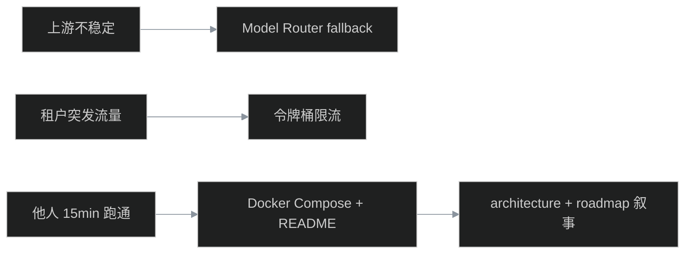
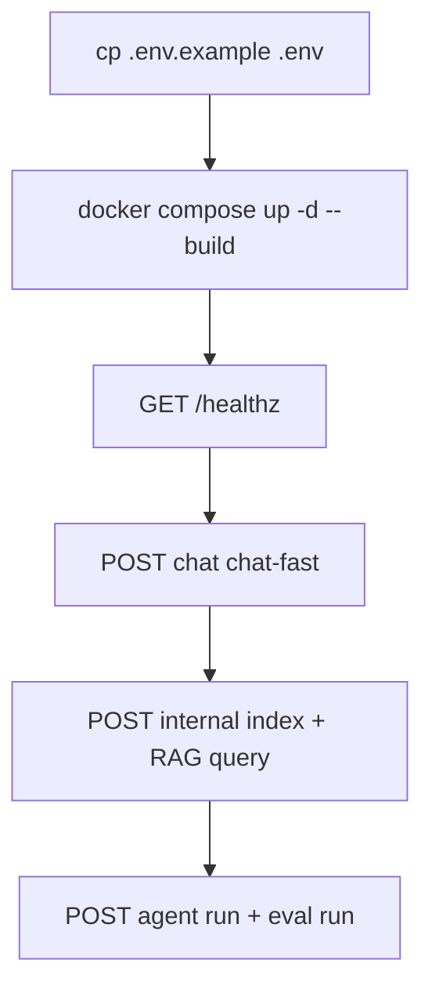
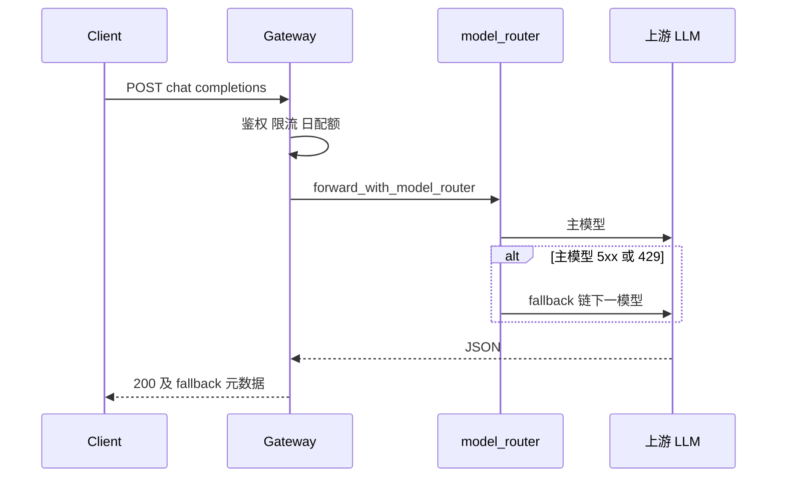
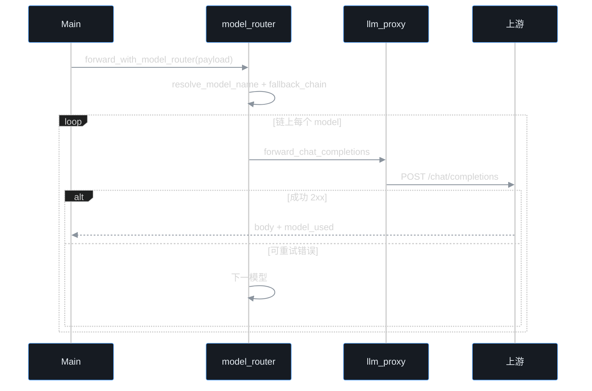

# 第 6 周构建思路与代码导读：硬化

> 操作手册见 [week6-hardening.md](./week6-hardening.md)。架构总览见 [architecture.md](./architecture.md)。

---

## 目录

1. [构建思路](#1-构建思路)
2. [使用链路](#2-使用链路)
3. [代码导读（按文件）](#3-代码导读按文件)
4. [Model Router 流程](#4-model-router-流程)
5. [限流与日配额](#5-限流与日配额)
6. [10 条自测用例](#6-10-条自测用例)
7. [面试口述提纲](#7-面试口述提纲)

---

## 1. 构建思路

### 1.1 为什么要做这三件事

| 痛点 | 方案 | 文件 |
|------|------|------|
| 单模型挂了就全挂 | 别名 + 降级链 | `config/models.yaml`, `model_router.py` |
| 日配额太粗 | 秒级 RPS 限制 | `rate_limit.py`, `tenants.yaml` |
| 环境拼凑成本高 | 默认 Compose 起 gateway+qdrant | `Dockerfile`, `docker-compose.yml` |

---

## 2. 使用链路

### 2.1 15 分钟主路径

### 2.2 Chat 降级时序

---

## 3. 代码导读（按文件）

### 3.1 搭建顺序

1. 读 `config/models.yaml`、`config/tenants.yaml` 新增字段
2. 读 `apps/gateway/model_router.py` — 别名解析与 `forward_with_model_router`
3. 读 `apps/gateway/rate_limit.py` + `request_guards.py`
4. 看 `main.py` / `query_routes.py` / `agent/routes.py` 如何调用 guards
5. `docker compose up -d --build` 验证拓扑

### 3.2 核心文件

| 文件 | 职责 |
|------|------|
| `apps/gateway/model_router.py` | 别名、白名单解析、降级链调用 |
| `apps/gateway/rate_limit.py` | 租户令牌桶 |
| `apps/gateway/request_guards.py` | `check_rate_limit` / `check_model_allowed` |
| `apps/gateway/tenants.py` | 扩展 `default_model`, `rate_limit_*` |
| `apps/gateway/main.py` | Chat 路径集成 router + guards |
| `packages/agent/runner.py` | Agent LLM 调用走 router |
| `apps/gateway/rag/query_service.py` | RAG LLM 调用走 router |
| `Dockerfile` | 网关镜像 |
| `docker-compose.yml` | gateway + qdrant 默认启动 |

**改规则时动哪里**：别名/降级 → `models.yaml`；租户限速 → `tenants.yaml`；HTTP 顺序不变 → 仍在各 `routes` / `main`。

---

## 4. Model Router 流程

`llm_proxy.py` **保持单一职责**：只负责 httpx 调上游；路由策略全部在 `model_router.py`。

---

## 5. 限流与日配额

| 机制 | 粒度 | 错误码 | 用途 |
|------|------|--------|------|
| 日配额 `quota.py` | UTC 日 / 请求次数 | `QUOTA_EXCEEDED` | 租户预算上限 |
| 令牌桶 `rate_limit.py` | 秒级 RPS + burst | `RATE_LIMIT_EXCEEDED` | 防突发打爆 |

两者 **串联**：先令牌桶，再日配额（各路由略有差异，chat 在 consume 前检查桶）。

---

## 6. 10 条自测用例

| # | 输入 | 预期 |
|---|------|------|
| 1 | 无租户头 POST chat | 401 |
| 2 | demo-a + model=chat-fast | 别名解析为 gpt-4o-mini |
| 3 | demo-a + model=gpt-4o | 403 MODEL_NOT_ALLOWED |
| 4 | demo-b 1 秒内 3 次 chat | 第 3 次 429 RATE_LIMIT_EXCEEDED |
| 5 | admin 无 model | 用 settings.default_model |
| 6 | 无 LLM_API_KEY | 503 UPSTREAM_NOT_CONFIGURED |
| 7 | `resolve_model_name("chat-strong")` | gpt-4o |
| 8 | fallback 链 gpt-4o 全失败 | UPSTREAM_ERROR + models_tried |
| 9 | `docker compose up` 后 healthz | 200 ok |
| 10 | `acceptance_smoke.py` | failed=0 |

---

## 7. 面试口述提纲

1. **分层**：接入层 gateway → 能力层 packages → Qdrant/LLM（architecture.md 图）
2. **租户**：demo-a 别名 + 工具白名单；demo-b 低配额+低 RPS
3. **RAG**：版本化 kb + min_score 拒答 + citations
4. **Agent**：allowed_tools + session + tool_trace
5. **评测**：baseline.jsonl + run/compare
6. **限制**：roadmap.md 主动说 token 计费、多实例、审计未做
