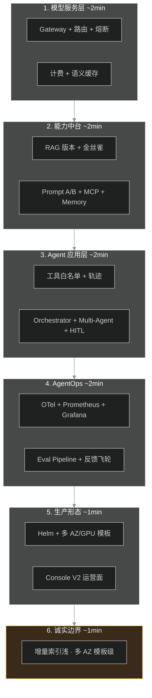

# 面试叙事手册（10～15 分钟）

> **用途**：技术面试、架构评审、内部分享的统一口述稿。  
> **配套**：[demo-walkthrough.md](./demo-walkthrough.md)（动手演示）、[roadmap.md](./roadmap.md) §已知限制（诚实边界）。

---

## 一句话定位

这是一个 **从模型网关到生产基础设施的完整 AI 平台参考实现**：按 Phase A～K 渐进交付模块，Phase L 把「已有但偏 stub」的能力做深，形成 **可演示、可讲 SOP、可回归** 的面试故事。

---

## 10 分钟分层讲法



### 第 1 层：模型服务（~2 分钟）

**讲什么**：多租户 Gateway 统一 OpenAI 兼容协议；模型别名路由到不同上游；熔断 + fallback；按 token 落库与日/月预算。

**亮点**：
- 三租户 YAML 演示隔离（模型、工具 ACL、配额分层）
- `SEMANTIC_CACHE_ENABLED` 降本（exact 模式可无 LLM Key 演示命中）

**关键词**：`apps/gateway/model_router.py`、`packages/billing/`、`packages/semantic_cache/`

---

### 第 2 层：能力中台（~2 分钟）

**讲什么**：RAG 不是「调个向量库」，而是 **可版本化、可金丝雀、可 eval 对比** 的数据管道。

**SOP 故事**（大厂对齐）：
1. 索引 `kb_id + version`
2. 开金丝雀 `canary_percent`
3. `eval/run.py compare` 看 pass_rate
4. 达标全量 / 不达标回滚 `canary_percent=0`

**诚实说**：真 Rerank API（#54）、LLM Judge（#56）、金丝雀自动回滚（#57）已在 Phase L 落地；增量索引（#55）仍偏全量重建。

**关键词**：`packages/rag/`、`config/rag.yaml`、`eval/run.py`

---

### 第 3 层：Agent 应用（~2 分钟）

**讲什么**：Agent 不是裸调 LLM，而是 **网关 enforce 工具白名单 + 全链路审计**。

**亮点**：
- MCP 工具桥接（config 注册 → `mcp_{server}_{tool}`）
- destructive 工具 → HITL `202 pending_approval`
- Orchestrator workflow + Multi-Agent 委托 + **Vertical 演示链**（#59 `agent-vertical-rag` + HITL）

**关键词**：`packages/agent/`、`packages/hitl/`、`packages/orchestrator/`

---

### 第 4 层：AgentOps（~2 分钟）

**讲什么**：可观测 + 可回归 + 可改进。

**亮点**：
- OTel trace、Prometheus `/metrics`、Grafana dashboard
- `baseline.jsonl` + CI 门禁（RAG + Agent 双 gate）
- 反馈飞轮：**live 已验**（#61 `feedback_loop_demo --live`）

**关键词**：`packages/observability/`、`eval/pipeline.py`、`packages/feedback/`

---

### 第 5 层：生产形态（~1 分钟）

**讲什么**：不是只能 `docker compose up`。

- Helm Chart、`values-multi-az.yaml`、`values-gpu.yaml`
- 对象存储抽象 local/s3/oss
- Console V2：http://127.0.0.1:8000/console/

**诚实说**：多 AZ/GPU 是 **模板级**，未在真实集群压测。

---

### 第 6 层：诚实边界（~1 分钟，主动说）

引用 [roadmap.md](./roadmap.md) §已知限制，核心三点：

1. **模块齐、深度不足**：增量索引、细粒度 RBAC、生产级 DLP
2. **opt-in 默认关**：沙箱、OAuth2、语义缓存、Memory Store
3. **非商业产品**：无发票、单进程开发默认；多 AZ/GPU 为 Helm 模板级

---

## 15 分钟演示路线（Console + curl）

| 分钟 | 动作 | 话术 |
|------|------|------|
| 0～2 | `./eval/platform_demo.sh --no-llm` | 自动化冒烟，Console API 全 200 |
| 2～4 | 登录 Console Dashboard | 运营面，非业务 App |
| 4～7 | RAG 索引 v1 + 查询 | version 可回放 |
| 7～11 | v2 + 金丝雀 + eval compare | SOP 核心（需 Key） |
| 11～13 | Audit / Agent vertical / 反馈飞轮 | 治理 + 闭环 |
| 13～15 | `python eval/sdk_smoke.py` | SDK 三接口 + 诚实边界 |

详见 [demo-walkthrough.md](./demo-walkthrough.md)。

---

## 高频 Q&A

### Q1：和 Dify / LiteLLM / Langfuse 比？

| 维度 | 本仓库 |
|------|--------|
| 定位 | **全栈参考实现**（网关 + RAG + Agent + Ops），非 SaaS |
| vs LiteLLM | 多了 RAG、Agent、租户治理、Console |
| vs Dify | 更偏 **平台工程/infra**，UI 是 Console 非工作流画布 |
| vs Langfuse | 内置 eval pipeline + 反馈飞轮，观测是一层不是全部 |

### Q2：为什么单进程 Gateway？

学习仓库优先 **可读懂**；Helm 已支持 K8s 水平扩展，Redis 共享配额。面试主动说边界。

### Q3：Rerank 为什么曾经是 stub？

Phase A～K 先打通链路；Phase L #54 已接真 provider，可用 `eval compare` 对比 stub vs api。

### Q4：测试怎么保证质量？

484+ 单测、无外部依赖可跑；live eval 需 Key；CI 跑 lint + acceptance_smoke + RAG/Agent gate。

### Q7：反馈飞轮怎么演示？

```bash
python eval/feedback_loop_demo.py --mock   # CI
python eval/feedback_loop_demo.py --live   # Gateway + admin token
```

live 路径：点踩 → `cycle` → `suggestion_id`（experiment 需先 apply suggestion）。

### Q5：Multi-Agent 和 Orchestrator 区别？

- **Orchestrator**：显式 workflow 步骤（DAG 式编排）
- **Multi-Agent**：Agent 间委托/通信，偏运行时协作

### Q6：HITL 怎么工作的？

destructive 工具调用返回 `202` + `approval_id`；审批后带 `approval_id` resume `/v1/agent/run`。

---

## 演示前检查清单

> **Live 验证**（2026-06-23）：`feedback_loop_demo --live` ✅ · `agent_vertical_smoke` 6/6 ✅ · `platform_demo --no-llm` / `--with-llm` ✅

> 环境细节：[local-llm-setup.md](./local-llm-setup.md)

```bash
# 无 Key 最小路径
uvicorn apps.gateway.main:app --host 127.0.0.1 --port 8000
./eval/platform_demo.sh --no-llm   # 含 sdk smoke（skip 三接口）

# 有 Key 完整路径（Chat + Agent；RAG 需 embedding 另配）
# .env: LLM_BASE_URL=http://10.212.129.94:8090/v1
export LLM_API_KEY=sk-your-key-here
docker compose up -d qdrant redis postgres
./eval/platform_demo.sh --with-llm
python eval/sdk_smoke.py
```

| 检查项 | 期望 |
|--------|------|
| `/console/` | 200，React 非旧 stub |
| `admin` 登录 | Dashboard 有指标 |
| `platform_demo --no-llm` | exit 0 |
| `sdk_smoke`（无 Key） | exit 0，chat/rag/agent skipped |
| `platform_demo --with-llm` | exit 0（chat/agent；RAG 可能 LOW_CONFIDENCE） |
| `feedback_loop_demo --live` | `passed` + suggestion_id |
| `agent_vertical_smoke` | 6/6（无 Key 时 live vertical skip 不判失败） |

---

## 相关文档

| 文档 | 用途 |
|------|------|
| [local-llm-setup.md](./local-llm-setup.md) | 内网 LLM 网关 + 三模型 + `.env` |
| [enterprise-ai-platform-sop.md](./enterprise-ai-platform-sop.md) | 大厂 SOP 对照 |
| [architecture.md](./architecture.md) | 架构全景 |
| [phase-l-priority-roi.md](./phase-l-priority-roi.md) | 下一步 ROI |
| [PROJECT_STATUS.md](./PROJECT_STATUS.md) | 一页纸状态 |
