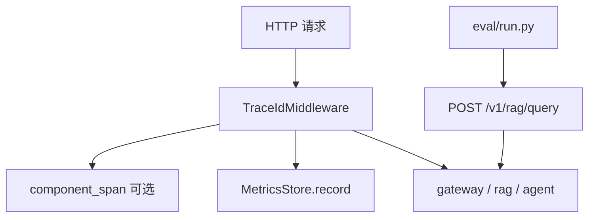

# 观测与评测：构建思路与代码导读（第 5 周）

> 操作手册见 [week5-observability-eval.md](./week5-observability-eval.md)。

---

## 1. 与手册的对应

| 手册要求 | 实现 |
|----------|------|
| LangSmith / LangFuse / OTel 三选一 | **OpenTelemetry** |
| trace_id 与外部 tracing 关联 | W3C `traceparent` + span 属性 `app.trace_id` |
| Metrics QPS / P95 / tenant | `MetricsStore` + `GET /metrics` |
| `eval/run.py` | `eval/run.py run` |
| run_id 与两次 diff | JSON 报告 + `compare` 子命令 |
| 压测 50 并发 | `eval/load_smoke.py` |

---

## 2. 构建思路

- **Tracing 可选**：`OTEL_ENABLED=false` 时不影响主路径（零开销分支）。
- **Metrics 默认开**：轻量内存聚合，适合本机实验。
- **Eval 站外脚本**：通过 HTTP 调网关，不 import 应用内部（黑盒回归）。

---

## 3. 代码导读

### `packages/observability/otel.py`

- `init_otel`：注册 `TracerProvider`，可选 `ConsoleSpanExporter`
- `extract_trace_context_from_headers`：W3C 传播
- `component_span`：子路径打点（rag / agent / chat）

### `packages/observability/metrics.py`

- 按 `(path, tenant, status)` 计数
- 按 `(path, tenant)` 保留延迟样本算 P95

### `packages/observability/middleware.py`

- 合并原 trace_id 逻辑 + OTel 根 span + 指标写入

### `eval/run.py`

- `evaluate_case`：`hit` 看 200 + 关键词；`refuse` 看 422 + error.code
- `save_report` → `eval/runs/{run_id}.json`
- `compare_reports`：通过率差 + flipped 用例

### `eval/load_smoke.py`

- `asyncio.gather` 并发 N 次请求

---

## 4. 10 条自测

| # | 操作 | 预期 |
|---|------|------|
| 1 | `curl /metrics` | 200，`http_requests_total` 行 |
| 2 | `OTEL_ENABLED=true` 调 `/healthz` | 控制台有 span |
| 3 | `eval/run.py run`（已索引） | 生成 json，pass_rate>0 |
| 4 | `compare` 两次报告 | 输出 pass_rate_delta |
| 5 | 改坏 prompt 再 run | pass_rate 下降 |
| 6 | `load_smoke.py` 50 healthz | 无异常，多数 200 |
| 7 | rag 请求后看 metrics | rag path 计数增加 |
| 8 | 带 `traceparent` 请求 | OTel 上下文关联 |
| 9 | `METRICS_ENABLED=false` | `/metrics` 503 |
| 10 | 响应头 `X-Request-Id` | 与日志 trace_id 一致 |

---

## 5. 读代码顺序

`observability.yaml` → `otel.py` → `metrics.py` → `middleware.py` → `main.py` `/metrics` → `eval/run.py`

---

*文档版本：v1*
