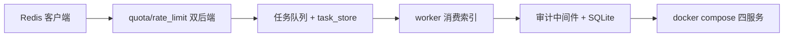
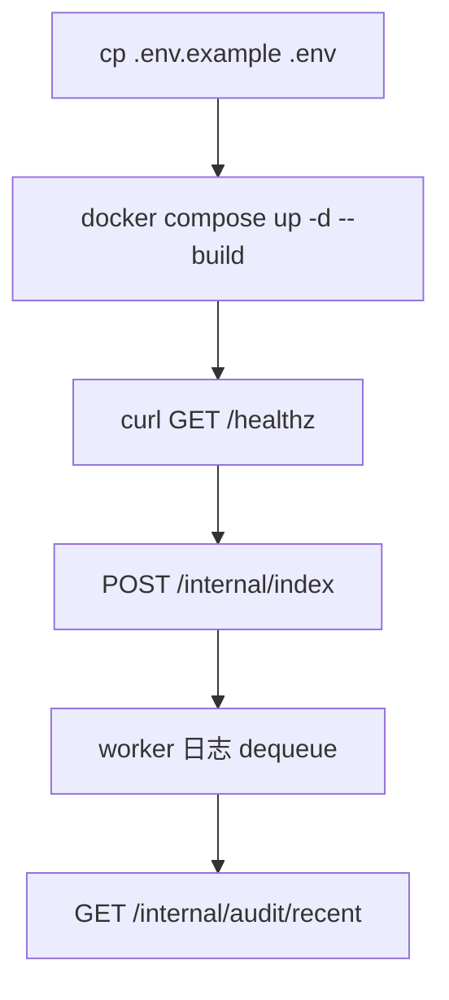
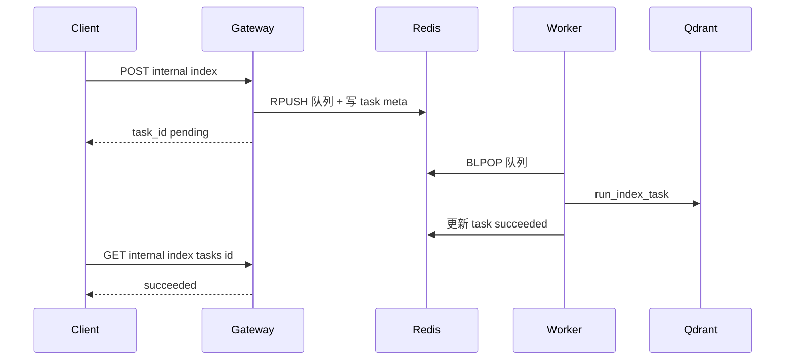

# Phase A 构建思路与代码导读：可内测硬化

> 操作手册见 [phase-a-internal-beta.md](./phase-a-internal-beta.md)。前置：[第 6 周硬化](./hardening-build-and-code-guide.md)。

---

## 目录

1. [构建思路](#1-构建思路)
2. [使用链路](#2-使用链路)
3. [代码导读（按文件）](#3-代码导读按文件)
4. [10 条自测用例](#4-10-条自测用例)
5. [读代码顺序建议](#5-读代码顺序建议)

---

## 1. 构建思路

### 1.1 相对第 6 周补什么

| 痛点 | 方案 | 关键文件 |
|------|------|----------|
| 多实例配额不一致 | Redis 共享计数 | `quota.py`, `rate_limit.py` |
| 索引阻塞 gateway | Redis 队列 + worker | `packages/tasks/queue.py`, `apps/worker/main.py` |
| 只有 access log | SQLite 审计 + 查询 API | `packages/audit/store.py`, `audit_routes.py` |
| 合并无门禁 | CI lint + 冒烟 + baseline | `.github/workflows/ci.yml`, `eval/` |

### 1.2 搭建顺序

1. `packages/state/redis_client.py` — 连接与回退
2. `quota.py` / `rate_limit.py` — 读 `REDIS_URL` 选内存或 Redis
3. `packages/tasks/queue.py` + `rag/task_store.py` — 入队与元数据
4. `apps/worker/main.py` — BLPOP 消费
5. `packages/audit/store.py` + `main.py` 中间件 — 写审计
6. `docker compose up -d --build` 验证

---

## 2. 使用链路

### 2.1 一键启动

### 2.2 异步索引时序

| 步骤 | 行为 |
|------|------|
| 1 | `USE_INDEX_WORKER=true` 时 gateway 只入队，不跑索引 |
| 2 | worker 独立进程消费，与 gateway 扩缩容解耦 |
| 3 | 无 Redis 时回退内存队列 / 第 6 周 BackgroundTasks 行为 |

---

## 3. 代码导读（按文件）

| 文件 | 职责 | 改什么时看 |
|------|------|------------|
| `packages/state/redis_client.py` | Redis 单例 | 连接池、超时 |
| `apps/gateway/quota.py` | 日配额内存/Redis | 配额算法 |
| `apps/gateway/rate_limit.py` | 令牌桶内存/Redis | RPS 策略 |
| `packages/tasks/queue.py` | RPUSH/BLPOP | 队列名、序列化 |
| `apps/gateway/rag/task_store.py` | 任务状态 | pending/success/failed |
| `apps/worker/main.py` | worker 入口 | 消费逻辑 |
| `packages/audit/store.py` | SQLite 写入 | 表结构 |
| `apps/gateway/audit_routes.py` | 审计查询 | 租户隔离 |
| `apps/gateway/main.py` | access 中间件写审计 | 记录字段 |

---

## 4. 10 条自测用例

| # | 输入 | 预期 |
|---|------|------|
| 1 | compose 起四服务 | redis/qdrant/gateway/worker healthy |
| 2 | demo-b 连发 chat | 429 RATE_LIMIT_EXCEEDED（Redis 共享） |
| 3 | POST /internal/index | task_id + pending |
| 4 | worker 日志 | dequeued task_id |
| 5 | GET task 轮询 | succeeded |
| 6 | GET /internal/audit/recent admin | 含刚才有 trace 的记录 |
| 7 | demo-a 查 audit | 仅本租户 |
| 8 | 无 REDIS_URL + worker=false | 回退内存，与第 6 周一致 |
| 9 | validate-baseline | exit 0 |
| 10 | acceptance_smoke.py | 含 PA 项通过 |

---

## 5. 读代码顺序建议

1. `docker-compose.yml` — 四服务与环境变量
2. `redis_client.py` → `quota.py` → `rate_limit.py`
3. `queue.py` → `task_store.py` → `worker/main.py`
4. `audit/store.py` → `main.py` 中间件 → `audit_routes.py`
5. `.github/workflows/ci.yml` — 门禁怎么挂
