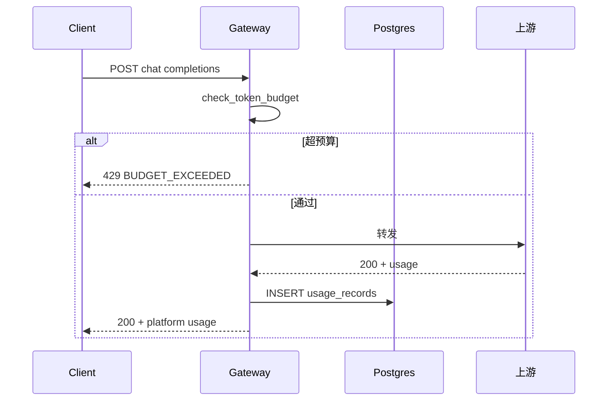

# Phase B 构建思路与代码导读（B1～B3）

> B1：[phase-b-small-production.md](./phase-b-small-production.md) · B2：[phase-b2-parallel.md](./phase-b2-parallel.md) · B3：[phase-b3-rerank-canary.md](./phase-b3-rerank-canary.md) · 前置：[Phase A](./phase-a-build-and-code-guide.md)

---

## 目录

1. [构建思路](#1-构建思路)
2. [使用链路](#2-使用链路)
3. [代码导读（按文件）](#3-代码导读按文件)
4. [10 条自测用例](#4-10-条自测用例)

---

## 1. 构建思路

### B1 — Token 计量与租户预算（#5/#6）

| 模块 | 路径 | 职责 |
|------|------|------|
| 用量解析 | `packages/billing/usage.py` | 从上游 JSON 取 token |
| 落库 | `packages/billing/store.py` | Postgres `usage_records` |
| 预算 | `packages/billing/budget.py` | 日/月汇总与剩余 |
| 拦截 | `apps/gateway/request_guards.py` | `check_token_budget` |
| API | `apps/gateway/billing_routes.py` | 查询/导出 |

**配置**：`DATABASE_URL` · `config/tenants.yaml` 中 `token_budget_daily/monthly`

### B2 — 密钥 / 混合检索 / 可观测（#7/#8/#10）

| 模块 | 路径 | 职责 |
|------|------|------|
| 密钥 | `packages/secrets/provider.py` | Env / Vault |
| 混合检索 | `packages/rag/hybrid.py` | BM25 + 向量 RRF |
| BM25 | `packages/rag/bm25_index.py` | 索引侧写 JSON |
| OTel | `packages/observability/otel.py` | OTLP 导出 |

**配置**：`SECRETS_PROVIDER` · `RAG_RETRIEVAL_MODE=hybrid` · `OTEL_ENABLED`

### B3 — Rerank + KB 金丝雀（#9）

| 模块 | 路径 | 职责 |
|------|------|------|
| Rerank | `packages/rag/rerank.py` | stub 词面重排 |
| 路由 | `packages/rag/routing.py` | hash 分桶选 version |
| 集成 | `apps/gateway/rag/query_service.py` | retrieve → rerank → LLM |

**配置**：`config/rag.yaml` → `rerank_enabled` · `kb_routing`

---

## 2. 使用链路

### 2.1 B1 Chat 计费

### 2.2 B3 RAG 金丝雀 + Rerank

响应 `_platform.routing` 示例：`route=canary, bucket=12, version=2`

---

## 3. 代码导读（按文件）

| Phase | 先读 | 再读 | 改规则时 |
|-------|------|------|----------|
| B1 | `billing/recorder.py` | `main.py` chat 钩子 | `tenants.yaml` 预算 |
| B2 | `secrets/provider.py` | `hybrid.py` + `retrieval.py` | `rag.yaml` retrieval_mode |
| B3 | `routing.py` | `query_service.py` | `rag.yaml` kb_routing |

**读代码顺序**：B1 `store.py` → `budget.py` → `request_guards` → B2 `hybrid.py` → B3 `routing.py` → `rerank.py` → `query_service.py`

---

## 4. 10 条自测用例

| # | 输入 | 预期 |
|---|------|------|
| 1 | demo-b 超日 token 预算 chat | 429 BUDGET_EXCEEDED |
| 2 | chat 成功 | `_platform.usage` 含 tokens |
| 3 | GET /internal/billing/usage | 有记录 |
| 4 | hybrid 模式 RAG query | timings 含 fusion_ms |
| 5 | vector 模式 | 无 bm25 耗时 |
| 6 | Vault secret ref 租户 | bearer 从 Vault 解析 |
| 7 | rerank_enabled=true | citations 经 rerank 重排 |
| 8 | kb 金丝雀 10% | 约 10% 请求 version=2 |
| 9 | GET /internal/kb/routing | 返回 routing 配置 |
| 10 | OTEL_ENABLED span | trace 含 gateway.rag_query |
