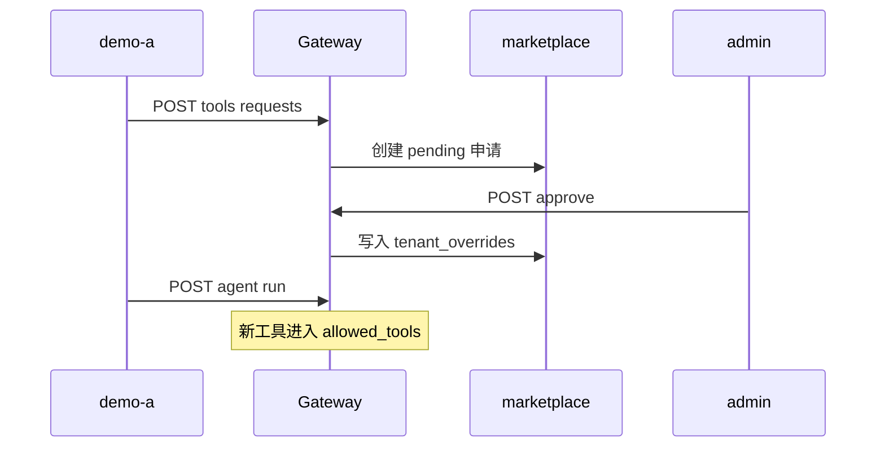
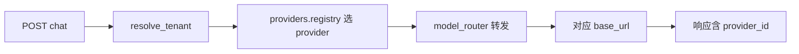

# Phase C 构建思路与代码导读：平台化

> 操作手册：[phase-c-platform.md](./phase-c-platform.md) · 前置：[Phase B](./phase-b-build-and-code-guide.md)

---

## 目录

1. [构建思路](#1-构建思路)
2. [使用链路](#2-使用链路)
3. [代码导读（按文件）](#3-代码导读按文件)
4. [10 条自测用例](#4-10-条自测用例)

---

## 1. 构建思路

Phase C 把「单租户网关」扩展为**平台管理面**：多供应商、Region 驻留、租户自助、工具市场。

| Issue | 能力 | 核心路径 |
|-------|------|----------|
| #11 | 供应商矩阵 | `config/providers.yaml`, `packages/providers/registry.py` |
| #12 | Region 驻留 | `config/regions.yaml`, `packages/region/context.py` |
| #13 | 租户自助 API | `packages/tenant_admin/overrides.py`, `platform_routes.py` |
| #14 | 工具市场 | `packages/agent/marketplace.py`, `config/tools_marketplace.yaml` |

**搭建顺序**：providers.yaml → registry → regions → tenant_admin → marketplace → `model_router.py` 接 provider 选择

---

## 2. 使用链路

### 2.1 工具市场审批

### 2.2 Chat 多供应商路由

---

## 3. 代码导读（按文件）

| 文件 | 职责 |
|------|------|
| `packages/providers/registry.py` | 读矩阵、按策略选 provider |
| `packages/region/context.py` | `X-Region` 与 data_zone 校验 |
| `packages/tenant_admin/overrides.py` | 运行时限额覆盖 |
| `packages/agent/marketplace.py` | 工具目录、申请/审批 |
| `apps/gateway/platform_routes.py` | `/internal/providers|regions|tenants|tools/*` |
| `apps/gateway/model_router.py` | 按 provider 选 base_url |

**改规则时**：供应商价目 → `providers.yaml`；驻留 → `regions.yaml` + 租户 `home_region`；工具 ACL → marketplace + overrides

---

## 4. 10 条自测用例

| # | 输入 | 预期 |
|---|------|------|
| 1 | GET /internal/providers/matrix | 返回供应商列表 |
| 2 | chat 成功 | `_platform.provider_id` 存在 |
| 3 | X-Region 与 data_zone 冲突 | 403 DATA_RESIDENCY_VIOLATION |
| 4 | GET /internal/regions | 含 Qdrant URL |
| 5 | PATCH tenant limits | overrides.json 更新 |
| 6 | demo-a 申请工具 | pending 状态 |
| 7 | admin approve | demo-a 可用新工具 |
| 8 | GET marketplace | 含 risk 分级 |
| 9 | 非 admin PATCH limits | 403 |
| 10 | GET tenant profile | 含 role 与 region |
