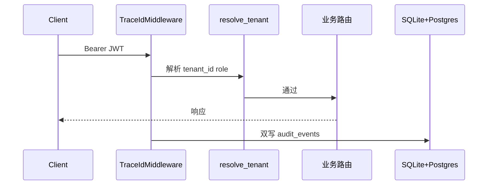
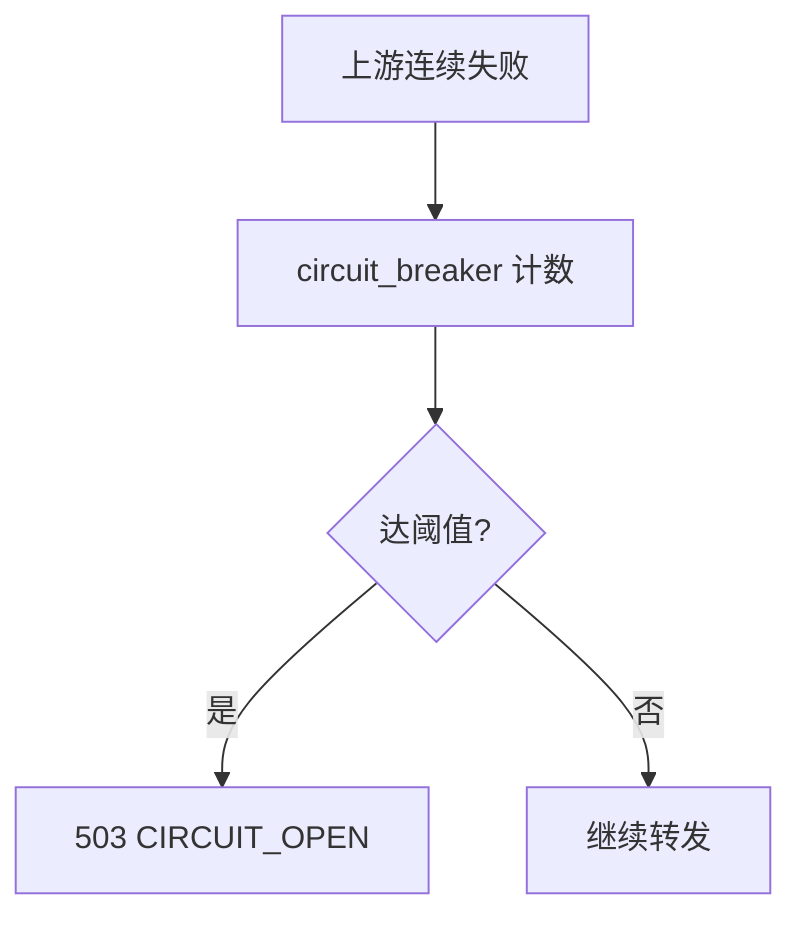

# Phase D 构建思路与代码导读：运维与治理

> 操作手册：[phase-d-ops.md](./phase-d-ops.md) · 远期：[phase-d-future-evolution.md](./phase-d-future-evolution.md) · 前置：[Phase C](./phase-c-build-and-code-guide.md)

---

## 目录

1. [构建思路](#1-构建思路)
2. [使用链路](#2-使用链路)
3. [代码导读（按文件）](#3-代码导读按文件)
4. [10 条自测用例](#4-10-条自测用例)

---

## 1. 构建思路

| 波次 | 能力 | 核心路径 |
|------|------|----------|
| D1 | 熔断 + Grafana | `packages/router/circuit_breaker.py`, `config/grafana/` |
| D2 | JWT + RBAC + Postgres 审计 | `packages/auth/jwt_hs256.py`, `packages/audit/postgres_store.py` |
| D3 | 控制台 MVP | `apps/console/index.html`, `/console/` |
| D4 | Redis Session + 金丝雀守卫 | `packages/agent/session_redis.py`, `packages/rag/canary_guard.py` |
| D5 | 成本估算 | `packages/billing/cost.py`, `/internal/billing/invoice` |

**原则**：观测与治理不侵入业务主路径——中间件/守卫层挂载，失败可降级。

---

## 2. 使用链路

### 2.1 JWT 鉴权 + 审计双写

### 2.2 熔断打开

---

## 3. 代码导读（按文件）

| 文件 | 职责 |
|------|------|
| `packages/router/circuit_breaker.py` | 上游失败计数与打开 |
| `packages/auth/jwt_hs256.py` | 可选 JWT 替代 Bearer |
| `packages/auth/rbac.py` | admin/platform_admin 层级 |
| `packages/audit/postgres_store.py` | 审计 Postgres 双写 |
| `packages/agent/session_redis.py` | 多实例 Session |
| `packages/rag/canary_guard.py` | eval 低分自动压金丝雀 |
| `packages/billing/cost.py` | 分价估算 |
| `config/prometheus/alerts.yml` | 告警规则 |

**改规则时**：JWT → `AUTH_JWT_*`；熔断阈值 → `CIRCUIT_BREAKER_THRESHOLD`；Grafana → `config/grafana/dashboards/`

---

## 4. 10 条自测用例

| # | 输入 | 预期 |
|---|------|------|
| 1 | AUTH_JWT_ENABLED + 合法 JWT | 200 |
| 2 | JWT 过期 | 401 |
| 3 | 上游连续 5xx | 503 CIRCUIT_OPEN |
| 4 | scale gateway=2 + Redis | 配额跨实例一致 |
| 5 | GET /console/ | 静态控制台 |
| 6 | agent run 带 session_id | Redis 存历史 |
| 7 | eval pass_rate 低于阈值 | 金丝雀 traffic=0 |
| 8 | GET /internal/billing/invoice | 月估算 |
| 9 | GET /metrics + Grafana | 面板有数据 |
| 10 | audit Postgres 开启 | 双写可查 |
