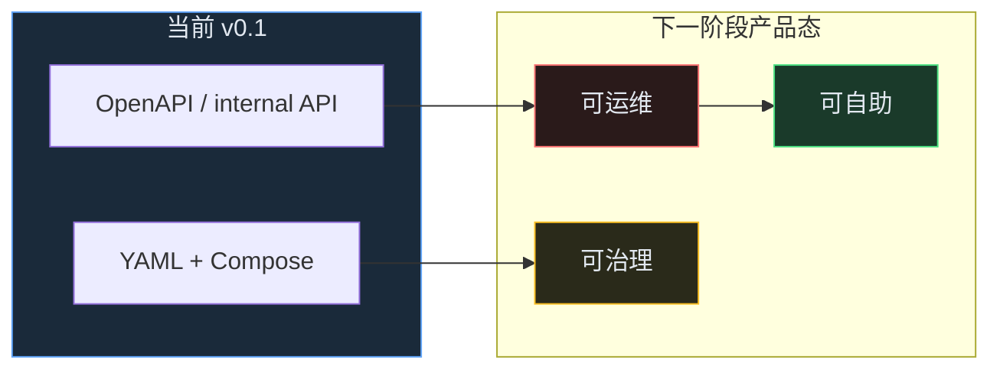
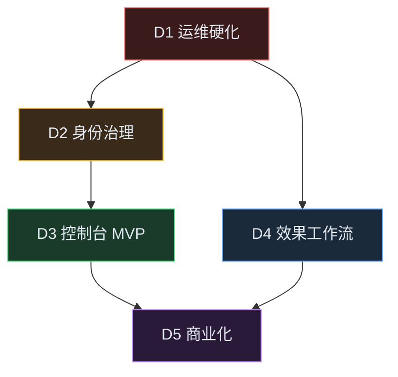

# Phase D 及后续演进方向（规划稿）

> **状态**：规划文档，**尚未实现**。  
> **前置**：Phase A（可内测）→ Phase B（小流量生产）→ Phase C（平台化 API）均已交付，见 [roadmap.md](./roadmap.md)。  
> **定位**：本仓库仍是 **学习 + 面试可讲的最小中台**；下文描述「若继续做，产品形态会往哪走」，不等于承诺全部落地。

---

## 1. 当前产品形态（Phase C 之后）

| 维度 | 已有能力 | 仍缺（相对真产品） |
|------|----------|-------------------|
| 接入 | 多租户 Gateway、别名路由、限流配额 | 水平扩展、熔断权重 |
| RAG | 索引/版本/混合检索/rerank/金丝雀 | 自动回滚、真 rerank、增量索引 |
| Agent | 工具白名单、会话、轨迹 | MCP 生态、长任务、人在回路 |
| 治理 | 审计 SQLite、工具审批、租户 API | OIDC/RBAC、集中 SIEM |
| 商业化 | Token 落库、日/月预算 | 分价账单、成本归因 |
| 运维 | OTel profile、/metrics、CI 冒烟 | SLO、告警、Grafana 面板 |

---

## 2. 建议波次（Phase D 拆解）

按 **性价比 + 面试叙事** 排序；每条可独立开 Issue，避免一个大 Phase 无法交付。

| 波次 | 代号 | 主题 | 目标一句话 | 建议优先级 |
|------|------|------|------------|------------|
| D1 | 运维硬化 | HA / SLO / 告警 | 从「能 curl」到「能 on-call」 | **P0** |
| D2 | 身份与治理 | OIDC / RBAC / 审计升级 | 从「租户 ACL」到「企业可签单」 | **P0** |
| D3 | 控制台 MVP | 消费 Phase C API 的轻量 UI | 从「工程师 curl」到「运营自助」 | P1 |
| D4 | 效果与工作流 | RAG/Agent 深化 + Eval 门禁 | 从「演示」到「业务觉得好用」 | P1 |
| D5 | 商业化 | 分价计费 / 成本归因 | 从「预算拦截」到「可出账单」 | P2 |

---

## 3. D1 — 运维硬化（P0）

**动机**：Phase A 已有 Redis 共享状态，但 Gateway 仍单进程；无 SLO 则「小流量生产」无法自证。

### 3.1 范围（建议）

| 项 | 内容 | 与现有代码关系 |
|----|------|----------------|
| Gateway 多实例 | Compose `replicas` 或 K8s Deployment；无状态路由 | 依赖 `REDIS_URL` 配额/限流 |
| Model Router 增强 | 熔断器（连续失败打开）、按延迟/错误率降权 | 扩展 `apps/gateway/model_router.py` |
| 索引队列生产化 | 死信队列、重试上限、积压深度指标 | 扩展 `packages/tasks/` + Worker |
| 可观测闭环 | Grafana dashboard JSON + Prometheus 告警规则 | 复用 `--profile observability` |
| SLO 草案 | 如：chat p95 &lt; 3s、RAG 可用率 &gt; 99% | 文档 + `/metrics` 衍生指标 |

### 3.2 验收（草案）

- [ ] 2+ Gateway 实例下配额/限流一致（Redis）
- [ ] 上游连续 5xx 触发熔断，恢复后半开探测
- [ ] Grafana 面板可见 QPS、延迟、p95、429 率
- [ ] `docker compose --profile observability` 一键起后告警规则可加载

### 3.3 非目标（D1）

- 不做 K8s Operator 自研
- 不做多 AZ 真异地（仅文档 + 配置占位即可）

---

## 4. D2 — 身份与治理（P0）

**动机**：Phase C 有租户 API 与工具审批，但鉴权仍是 Bearer + `X-Tenant-Id`；审计在 SQLite 文件。

### 4.1 范围（建议）

| 项 | 内容 | 与现有代码关系 |
|----|------|----------------|
| OIDC / API Key | 可选 `Authorization: Bearer <jwt>` 解析 subject | 新 `packages/auth/`，Gateway 中间件 |
| RBAC | 角色：tenant_admin / developer / viewer；资源：model、kb、tool | 扩展 `tenants.yaml` 或 DB |
| 审计升级 | 审计写 Postgres 或 stdout→Loki；字段含 actor、action | 扩展 `packages/audit/` |
| 密钥生产化 | Vault KV → 云 KMS 接口抽象 | 扩展 `packages/secrets/` |
| 内容安全（最小） | 请求/响应长度限制、简单敏感词拦截 hook | Gateway 中间件占位 |

### 4.2 验收（草案）

- [ ] JWT 模式下 `sub` 映射到 tenant + role
- [ ] viewer 不能 `PATCH /internal/tenants/*/limits`
- [ ] 工具审批记录含 reviewer、timestamp，可分页查询
- [ ] 密钥不再出现在 yaml 明文（dev 可回退 env）

### 4.3 非目标（D2）

- 不做完整 IAM 产品
- 不做等保测评级合规打包

---

## 5. D3 — 控制台 MVP（P1）

**动机**：Phase C 刻意 **不做完整 LLMOps UI**；下一步可用最小前端 **消费已有 internal API**。

### 5.1 范围（建议）

| 页面 | 调用的 API | 用户 |
|------|-----------|------|
| 租户概览 | `GET /internal/tenants/{id}/profile` | tenant_admin |
| 配额调整 | `PATCH /internal/tenants/{id}/limits` | platform admin |
| 知识库版本 | `GET /internal/kb/{id}/versions`、`/routing` | developer |
| 工具市场 | `GET /internal/tools/marketplace`、申请/审批 | developer / admin |
| 用量 | `GET /internal/billing/usage` | tenant_admin |
| 供应商/Region | `GET /internal/providers/matrix`、`/regions` | platform admin |

### 5.2 技术选型（建议）

- **轻量**：单页静态站（Vite + 少量 fetch）或 Obsidian/内部 Wiki 仅链 API
- **鉴权**：复用 Bearer；生产接 D2 JWT
- **部署**：`apps/console/` 静态资源由 Gateway 挂载或独立容器

### 5.3 验收（草案）

- [ ] 不新增业务逻辑，仅调用现有 API
- [ ] admin 可完成一次「工具申请 → 审批」全流程点击路径
- [ ] README 增加控制台启动说明

### 5.3 非目标（D3）

- 不做拖拽式 Agent 编排器
- 不做知识库可视化标注平台

---

## 6. D4 — 效果与工作流（P1）

**动机**：Phase B3 为 rerank stub + 手动金丝雀；Agent Session 内存、工具内置。

### 6.1 RAG 深化

| 项 | 内容 |
|----|------|
| 真 rerank | cross-encoder 或托管 rerank API；与 hybrid 链接 |
| 索引增量 | 按 `source_uri` hash 跳过未变 chunk |
| 自动回滚 | canary 期间对比 `eval/run.py` pass_rate，低于阈值自动 `canary_percent=0` |
| Embedding 治理 | 独立 embedding 服务配置、与 chat 供应商解耦 |

### 6.2 Agent 深化

| 项 | 内容 |
|----|------|
| MCP 适配 | 工具注册从内置列表 → MCP server 描述拉取 |
| Session 持久化 | Redis/Postgres；`session_id` 跨重启 |
| Human-in-the-loop | 高风险工具（如 httpbin_delay）执行前 pending → 人工 confirm API |
| 长任务 | `POST /v1/agent/run` 异步 job_id + webhook/轮询 |

### 6.3 Eval 产品化

| 项 | 内容 |
|----|------|
| CI 门禁 | 有 Key 时 PR 跑 `eval/run.py --min-pass-rate` |
| 对比报告 | 金丝雀/rerank 变更自动 `compare` 评论到 PR |
| 线上采样 | 1% 流量 shadow eval（仅记录，不拦请求） |

### 6.4 验收（草案）

- [ ] hybrid+rerank 较 baseline pass_rate 可量化（`compare` 报告入库）
- [ ] Session 重启 Gateway 后仍可 `session_id` 续聊
- [ ] MCP 工具至少 1 个 demo 接入

---

## 7. D5 — 商业化（P2）

**动机**：Phase B1 按 token 计数 + 预算；无单价、无发票。

### 7.1 范围（建议）

| 项 | 内容 |
|----|------|
| 分价 | `providers.yaml` 价格参与 `usage_records` 成本字段 |
| 账单 API | `GET /internal/billing/invoice?month=2026-05` CSV/JSON |
| 成本归因 | 按 tenant / kb_id / model / provider_id 聚合 |
| 预算告警 | 80% 预算 Webhook 或邮件 stub |

### 7.2 非目标（D5）

- 真实支付通道、发票法务流程（见 roadmap 非目标）

---

## 8. 与「已知限制」的映射

| roadmap 已知限制 | 建议波次 |
|------------------|----------|
| 单进程 Gateway | D1 |
| 无熔断/权重路由 | D1 |
| 无 OIDC/RBAC | D2 |
| SQLite 审计 | D2 |
| 无完整 UI | D3 |
| rerank stub、无自动回滚 | D4 |
| Session 内存 | D4 |
| 无 MCP 市场 | D4 |
| 无 input/output 分价 | D5 |

---

## 9. 推荐执行顺序（若继续在本 repo 做）

1. **D1 运维硬化** — 复用 Redis + observability profile，面试最好讲「生产运维」  
2. **D2 身份治理** — 与 D1 并行度低，但 D3 控制台依赖稳定鉴权模型  
3. **D3 控制台 MVP** — 纯消费 Phase C API，交付快、演示强  
4. **D4 效果工作流** — 按业务痛点选 RAG 或 Agent 子集  
5. **D5 商业化** — 有真实用量后再做

---

## 10. 本仓库持续「非目标」

以下仍建议 **不做** 或 **另开仓库**，避免 scope 失控：

- 训练 / 微调流水线  
- 向量库自研  
- 完整 LLMOps 套件（大而全 UI、可视化标注工厂）  
- 真实支付与发票  

---

## 11. 开 Issue 时的标题模板（备用）

落地时可按此创建 GitHub Issues（编号待分配）：

| 建议 Issue | 标题 |
|------------|------|
| D1-1 | [Phase D] Gateway 多实例 + Redis 配额一致性验证 |
| D1-2 | [Phase D] Model Router 熔断与权重路由 |
| D1-3 | [Phase D] Grafana 面板 + Prometheus 告警规则 |
| D2-1 | [Phase D] OIDC/JWT 鉴权与租户角色 |
| D2-2 | [Phase D] RBAC 与审计 Postgres 化 |
| D3-1 | [Phase D] 控制台 MVP（租户/工具/用量） |
| D4-1 | [Phase D] kb 金丝雀自动回滚 + eval 门禁 |
| D4-2 | [Phase D] Agent Session 持久化 + MCP demo |
| D5-1 | [Phase D] 分价计费与账单导出 API |

---

## 12. 相关文档

- [roadmap.md](./roadmap.md) — 已完成阶段与诚实边界  
- [phase-c-platform.md](./phase-c-platform.md) — Phase C 交付说明  
- [architecture.md](./architecture.md) — 分层与数据流  
- [AI中台学习执行手册.md](./AI中台学习执行手册.md) — 8 周学习主线  
