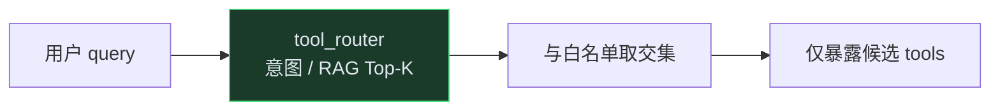
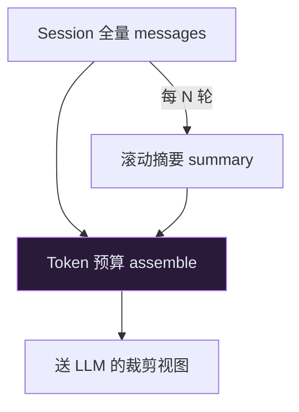

# Phase E — Agent 效果深化

> **状态**：Phase E 已交付（E1～E5）。见 [roadmap.md](./roadmap.md) Issue #24～#28。  
> **前置**：Phase D（`phase-d-ops`）Agent 治理 + Redis Session。

---

## E1 — Agent 轨迹评测 ✅

### 目标

不只看 `final_message`，用 **tool trajectory** 量化选工具是否准确：

| 指标 | 含义 |
|------|------|
| `tool_precision_at_1` | 声明了 `expect_first_tool` 的用例中，第一步工具选对比例 |
| `needless_tool_rate` | 有 `forbid_tools` / `expect_no_tools` 却误调工具的比例 |
| `missing_tool_rate` | 有 `expect_tools` 但未全部出现的比例 |
| `arg_valid_rate` | 发生过工具调用的用例中，无参数校验失败的比例 |
| `pass_rate` | 业务断言（含轨迹）通过比例 |

### 用例文件

[`eval/agent_baseline.jsonl`](../eval/agent_baseline.jsonl) — 5 条：

| id | 测什么 |
|----|--------|
| `agent-calc-01` | 必须调 `calc`，禁止 `get_kb_snippet` |
| `agent-kb-01` | 必须调 `get_kb_snippet`，禁止 `calc` |
| `agent-chitchat-01` | 不应调任何工具 |
| `agent-forbidden-01` | demo-b 调未授权工具 → `AGENT_TOOL_FORBIDDEN` |
| `agent-demo-a-calc` | demo-a 租户白名单内 calc |

### 字段说明

```json
{
  "id": "agent-kb-01",
  "tenant_id": "admin",
  "session_id": "eval-kb-01",
  "kb_id": "lab-demo",
  "messages": [{"role": "user", "content": "..."}],
  "expect": "success",
  "expect_tools": ["get_kb_snippet"],
  "forbid_tools": ["calc"],
  "expect_first_tool": "get_kb_snippet",
  "assert_contains_any": ["管道", "RAG"]
}
```

| 字段 | 说明 |
|------|------|
| `expect` | `success`（默认）或 `error` |
| `expect_error_code` | `expect=error` 时必填 |
| `expect_tools` | 轨迹中须出现的工具（顺序不限） |
| `forbid_tools` | 轨迹中不得出现 |
| `expect_first_tool` | 第一步工具名（用于 Precision@1） |
| `expect_no_tools` | 为 true 时不应有任何 tool_calls |
| `assert_contains` / `assert_contains_any` | 检查 `final_message` |

### 命令

```bash
# 无需服务 — CI 已接入
python eval/agent_run.py validate-baseline

# 需 Gateway + LLM_API_KEY + 已索引 lab-demo
python eval/agent_run.py run --run-id e1-baseline
python eval/agent_run.py run --min-pass-rate 0.8

# 对比两次（如改工具描述前后）
python eval/agent_run.py compare \
  eval/runs/agent/before.json \
  eval/runs/agent/after.json
```

报告写入 `eval/runs/agent/{run_id}.json`。

### 验收

- [x] ≥5 条 agent 用例
- [x] `validate-baseline` 无需 Key
- [x] 冒烟 `acceptance_smoke.py` 覆盖格式校验 + 评估逻辑
- [x] CI lint job 校验 agent baseline

---

## E2 — 意图路由 + Tool-RAG ✅

### 原理



- 配置：[`config/agent_tool_routing.yaml`](../config/agent_tool_routing.yaml)
- 实现：[`packages/agent/tool_router.py`](../packages/agent/tool_router.py)
- Runner 响应 `_platform.tool_routing`：`strategy`、`intent`、`candidate_tools`、`filtered_count`
- Decoy 工具：`search_web_stub`、`math_llm_stub`（路由应过滤）
- 环境变量：`AGENT_TOOL_RAG_ENABLED=true` 启用词袋 RAG 打分（默认仅意图路由）

### 验收

- [x] 白名单仍 enforce；路由只缩小候选
- [x] 冒烟覆盖 kb / calc 意图路由
- [x] admin 空白名单时 decoy 不进入 kb/calc 候选

---

## E3 — Session 滚动摘要 + Token 预算 ✅

### 原理



| 能力 | 实现 |
|------|------|
| Token 预算 | `packages/agent/context_budget.py` — `assemble_llm_messages` |
| 滚动摘要 | `maybe_compact_session` — stub 拼接旧轮次（每 6 轮默认） |
| Tool 截断 | `agent_tool_result_max_chars`（默认 2000） |
| Session 状态 | `SessionState`：`messages` + `summary` + `turn_count` |
| Redis 格式 | `{"v":1,"messages":[],"summary":null,"turn_count":0}` 兼容旧 list |

配置：[`config/agent.yaml`](../config/agent.yaml)  
响应：`_platform.context_budget`、`session_turn_count`、`session_summary`

### 验收

- [x] 超长 tool 结果截断
- [x] 超预算裁 history（保留 summary system）
- [x] turn_count=6 触发 compact + summary
- [x] 内存 Session 读写 turn_count

---

## E4 — 结果质量门 + 反思重规划 ✅

| 能力 | 实现 |
|------|------|
| 统一 envelope | `packages/agent/tool_envelope.py` — `{ok, data, error_code, quality_score}` |
| 质量门 | `packages/agent/quality_gate.py` — KB 空结果 / 低分 → `low_quality` |
| 反思 hint | `low_quality` 时注入 `platform_quality_hint`，消耗 `reflect_max_retries` |
| 轨迹字段 | `tool_calls[].quality_gate`：`passed` / `low_quality` / `failed` |

配置：`quality_min_score`（0.3）、`reflect_max_retries`（2）  
响应：`_platform.reflect_remaining`

---

## E5 — HITL + Shadow Agent ✅

| 能力 | 实现 |
|------|------|
| 高风险拦截 | `httpbin_delay` → `risk_level: high` → `202 pending_approval` |
| 审批 API | `GET/POST /internal/agent/approvals/...` |
| Resume | `approval_id` 续跑已确认工具 |
| Shadow | `X-Agent-Shadow: true` → `shadow_tool_calls` |

大厂 SOP 对照：[enterprise-ai-platform-sop.md § Agent 效果进阶](./enterprise-ai-platform-sop.md)

---

*文档版本：Phase E 完整 | Issues #24–#28 | 建议 tag `phase-e-agent-quality`*
