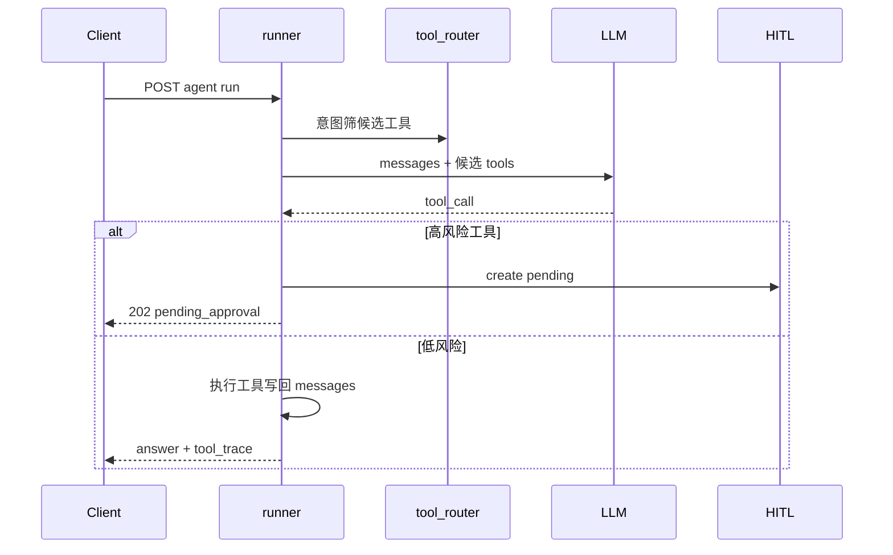
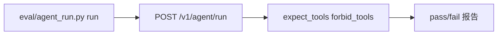

# Phase E 构建思路与代码导读：Agent 效果深化

> 操作手册：[phase-e-agent-quality.md](./phase-e-agent-quality.md) · 前置：[Phase D](./phase-d-build-and-code-guide.md)

---

## 目录

1. [构建思路](#1-构建思路)
2. [使用链路](#2-使用链路)
3. [代码导读（按文件）](#3-代码导读按文件)
4. [10 条自测用例](#4-10-条自测用例)

---

## 1. 构建思路

| 子项 | 能力 | 核心路径 |
|------|------|----------|
| E1 | 轨迹评测 | `eval/agent_run.py`, `eval/agent_baseline.jsonl` |
| E2 | 意图路由 + Tool-RAG | `packages/agent/tool_router.py`, `config/agent_tool_routing.yaml` |
| E3 | 上下文预算 + 摘要 | `packages/agent/context_budget.py`, `config/agent.yaml` |
| E4 | 质量门 + 反思 | `packages/agent/quality_gate.py`, `tool_envelope.py` |
| E5 | HITL + Shadow | `packages/agent/hitl.py`, `risk.py`, `shadow.py` |

**集成点**：全部在 `packages/agent/runner.py` 主循环挂载；E5 审批 REST 在 `apps/gateway/agent/approval_routes.py`（Phase H 有完整 HITL 实现，E5 为 stub 版）。

---

## 2. 使用链路

### 2.1 Agent Run 全链路（E2～E5）

### 2.2 E1 离线轨迹评测

---

## 3. 代码导读（按文件）

| 文件 | 职责 |
|------|------|
| `packages/agent/runner.py` | 主循环，集成 E2～E5 |
| `packages/agent/tool_router.py` | 关键词意图 + Tool-RAG Top-K |
| `packages/agent/context_budget.py` | token 裁剪 + 滚动摘要 |
| `packages/agent/quality_gate.py` | 低分 KB → 反思 hint |
| `packages/agent/risk.py` | 工具 risk 分级 |
| `packages/agent/hitl.py` | pending/confirm/reject |
| `packages/agent/shadow.py` | X-Agent-Shadow 只记录 |
| `eval/agent_run.py` | 轨迹评测 CLI |

**读代码顺序**：`runner.py` → `tool_router.py` → `context_budget.py` → `quality_gate.py` → `hitl.py` → `eval/agent_run.py`

---

## 4. 10 条自测用例

| # | 输入 | 预期 |
|---|------|------|
| 1 | agent run calc 题 | tool_trace 含 calc |
| 2 | AGENT_TOOL_ROUTING_ENABLED | `_platform.tool_routing` 有候选 |
| 3 | 超长 session | context_budget 裁剪 |
| 4 | KB 空结果 + quality_gate | reflect_remaining > 0 |
| 5 | 高风险工具 httpbin_delay | 202 pending_approval |
| 6 | confirm approval 重跑 | 工具执行成功 |
| 7 | X-Agent-Shadow true | shadow_tool_calls 有记录未执行 |
| 8 | agent_run.py run | baseline 通过率 |
| 9 | forbid_tools 用例 | eval fail |
| 10 | expect_tools 用例 | eval pass |
