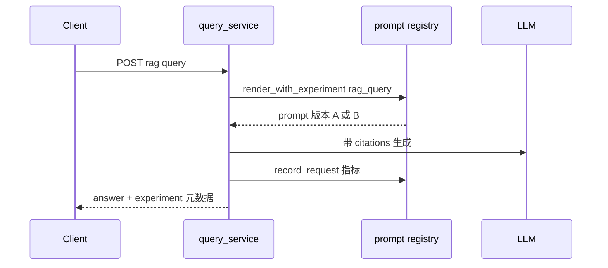

# Phase F 构建思路与代码导读：能力中台补全

> 规格书：[prompt-registry](./phase-f-prompt-registry.md) · [A/B](./phase-f-prompt-experiment.md) · [memory](./phase-f-memory.md) · [MCP](./phase-f-mcp.md) · [compress](./phase-f-context-compress.md)

---

## 目录

构建思路、使用链路与逐文件代码说明见 [phase-f-build-and-code-guide.md](./phase-f-build-and-code-guide.md)。

1. [构建思路](#1-构建思路)
2. [使用链路](#2-使用链路)
3. [代码导读（按文件）](#3-代码导读按文件)
4. [10 条自测用例](#4-10-条自测用例)

---

## 1. 构建思路

| Issue | 能力 | 核心包 |
|-------|------|--------|
| #29 | Prompt 版本化 | `packages/prompt/registry.py`, `prompt_routes.py` |
| #30 | Prompt A/B | `packages/prompt/experiment.py`, `prompt_experiment_routes.py` |
| #31 | 长记忆 | `packages/memory/store.py`, `memory_routes.py` |
| #32 | MCP 集成 | `packages/mcp/`, `mcp_routes.py` |
| #33 | 上下文压缩 | `packages/agent/context_compress.py`（无独立 REST） |

**搭建顺序**：registry → experiment → memory Postgres → MCP registry → context_compress 挂 runner

**运行时集成**：RAG `query_service.py` 用 `render_with_experiment`；Agent `runner.py` 用 memory 注入 + LLM 摘要压缩。

---

## 2. 使用链路

### 2.1 Prompt A/B 在 RAG 问答

### 2.2 Agent 记忆 + 压缩

---

## 3. 代码导读（按文件）

| 模块 | 文件 | 职责 |
|------|------|------|
| Prompt | `packages/prompt/registry.py` | 版本/active/render |
| Prompt | `packages/prompt/experiment.py` | 分桶、胜出 |
| Memory | `packages/memory/store.py` | Postgres + 搜索 |
| Memory | `packages/memory/summarize.py` | 对话摘要 |
| MCP | `packages/mcp/registry.py` | 服务注册、工具拉取 |
| MCP | `packages/mcp/client.py` | JSON-RPC 调用 |
| Compress | `packages/agent/context_compress.py` | LLM 摘要 + 记忆注入 |
| Gateway | `apps/gateway/main.py` lifespan | init 各 store |

**改规则时**：Prompt 模板 → `config/prompts.yaml`；MCP 服务 → `config/mcp_servers.yaml`；记忆 TTL → `MEMORY_*` env

---

## 4. 10 条自测用例

| # | 输入 | 预期 |
|---|------|------|
| 1 | POST prompt version + activate | get_active 返回新版本 |
| 2 | 创建 A/B experiment | 流量分桶 |
| 3 | 同 query 多次 RAG | 可能命中不同 prompt 版本 |
| 4 | POST /internal/memory | 写入成功 |
| 5 | agent run 多轮 | memory 检索注入 |
| 6 | CONTEXT_LLM_SUMMARY_ENABLED | 长对话被压缩 |
| 7 | GET /internal/mcp/servers | 列表 |
| 8 | MCP test 连接 | tools 列表 |
| 9 | agent 调用 MCP 工具 | tool_trace 有结果 |
| 10 | promote experiment winner | active 版本切换 |
