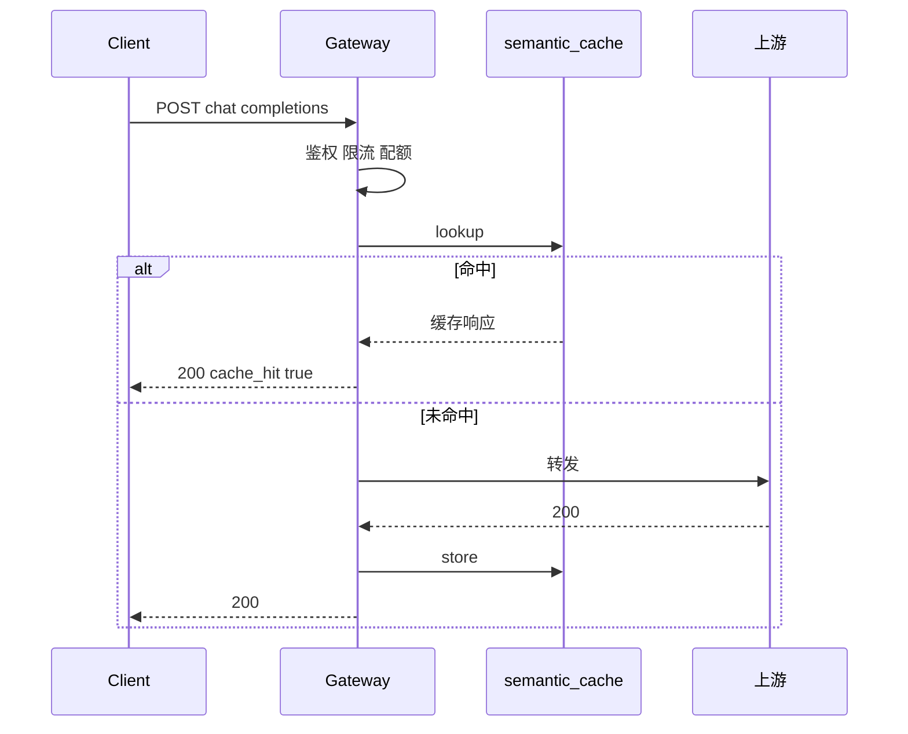
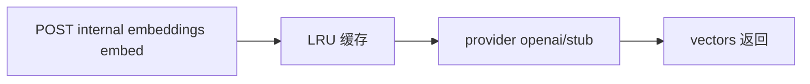

# Phase G 构建思路与代码导读：模型服务增强

> 规格书：[semantic-cache](./phase-g-semantic-cache.md) · [embedding](./phase-g-embedding.md)

---

## 目录

构建思路、使用链路与逐文件代码说明见 [phase-g-build-and-code-guide.md](./phase-g-build-and-code-guide.md)。

1. [构建思路](#1-构建思路)
2. [使用链路](#2-使用链路)
3. [代码导读（按文件）](#3-代码导读按文件)
4. [10 条自测用例](#4-10-条自测用例)

---

## 1. 构建思路

| Issue | 能力 | 核心路径 |
|-------|------|----------|
| #34 | 语义缓存 | `packages/semantic_cache/store.py`, `main.py` chat 拦截 |
| #35 | Embedding 独立服务 | `packages/embedding/`, `embedding_routes.py` |

**#34 原则**：在 quota 之后、上游之前查缓存；stream 与高 temperature 跳过；Redis 不可达回退内存。

**#35 原则**：LRU 缓存 + provider 工厂（openai/stub）；与 RAG embed 解耦，供 memory 搜索等复用。

---

## 2. 使用链路

### 2.1 语义缓存 Chat

### 2.2 Embedding 服务

---

## 3. 代码导读（按文件）

| 文件 | 职责 |
|------|------|
| `packages/semantic_cache/store.py` | InMemory/Redis、exact/semantic |
| `packages/semantic_cache/metrics.py` | Prometheus 指标 |
| `apps/gateway/main.py` | chat 路径 lookup/store |
| `packages/embedding/service.py` | embed 编排 |
| `packages/embedding/providers.py` | openai/stub 实现 |
| `config/embedding_models.yaml` | 模型矩阵 |
| `apps/gateway/embedding_routes.py` | REST API |

**改规则时**：缓存阈值 → `SEMANTIC_CACHE_*`；embedding 模型 → `embedding_models.yaml`

---

## 4. 10 条自测用例

| # | 输入 | 预期 |
|---|------|------|
| 1 | 相同 chat 请求两次 | 第二次 cache_hit |
| 2 | semantic 模式近义 query | 可能命中 |
| 3 | stream=true | 不走缓存 |
| 4 | temperature>0.3 | 跳过缓存 |
| 5 | GET /metrics | semantic_cache 指标 |
| 6 | POST embed | vectors 维度正确 |
| 7 | 相同 text 两次 embed | 第二次 cache hit |
| 8 | GET embedding models | 模型列表 |
| 9 | Redis 语义缓存 | 跨 gateway 实例命中 |
| 10 | embedding 服务不可用 semantic | 降级 exact |
