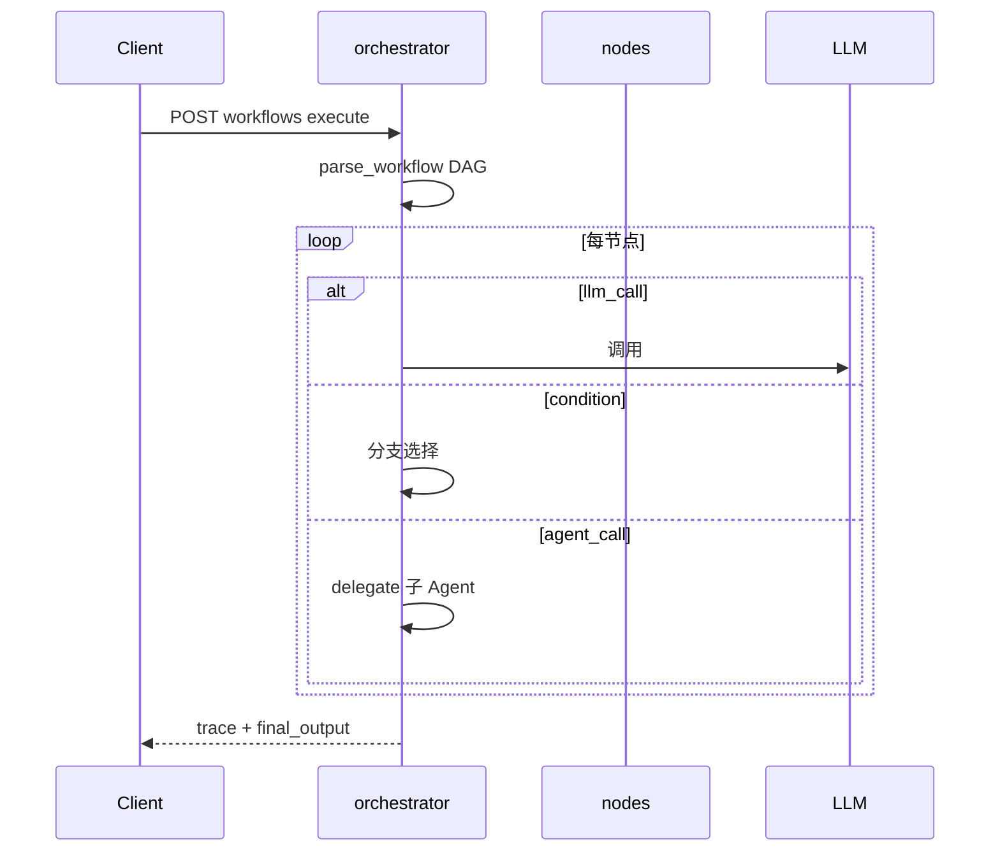
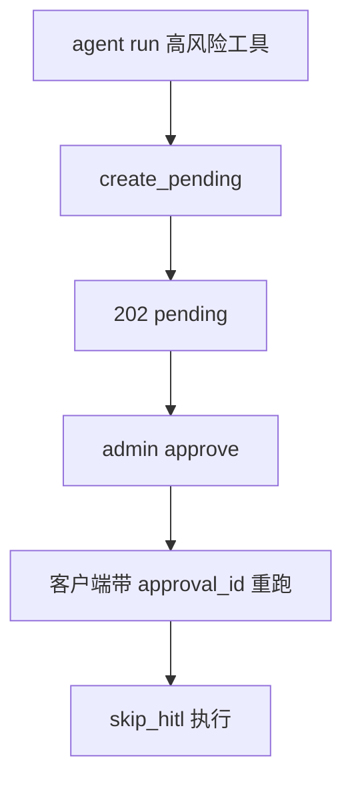

# Phase H 构建思路与代码导读：Agent 高阶能力

> 规格书：[orchestrator](./phase-h-orchestrator.md) · [multi-agent](./phase-h-multi-agent.md) · [lifecycle](./phase-h-agent-lifecycle.md) · [hitl](./phase-h-hitl.md)

---

## 目录

构建思路、使用链路与逐文件代码说明见 [phase-h-build-and-code-guide.md](./phase-h-build-and-code-guide.md)。

1. [构建思路](#1-构建思路)
2. [使用链路](#2-使用链路)
3. [代码导读（按文件）](#3-代码导读按文件)
4. [10 条自测用例](#4-10-条自测用例)

---

## 1. 构建思路

| Issue | 能力 | 核心路径 |
|-------|------|----------|
| #37 | 控制流编排 | `packages/agent/orchestrator/engine.py` |
| #38 | Multi-Agent | `packages/agent/multi_agent/delegation.py` |
| #39 | Agent 生命周期 | `packages/agent/lifecycle/registry.py` |
| #40 | HITL 完整版 | `packages/hitl/service.py`, `hitl_routes.py` |

**依赖关系**：orchestrator 的 `agent_call` 节点 → multi_agent delegate；HITL 在 `runner._execute_tool` 拦截高风险工具。

**注意**：lifecycle 目前为管理 API，尚未自动接入 `/v1/agent/run` 选版。

---

## 2. 使用链路

### 2.1 工作流执行

### 2.2 HITL 审批

---

## 3. 代码导读（按文件）

| 文件 | 职责 |
|------|------|
| `packages/agent/orchestrator/engine.py` | DAG 遍历、ExecutionContext |
| `packages/agent/orchestrator/nodes.py` | 节点类型实现 |
| `packages/agent/multi_agent/delegation.py` | 委托子 Agent |
| `packages/agent/lifecycle/registry.py` | 版本/灰度/回滚 |
| `packages/hitl/service.py` | 审批 CRUD |
| `packages/hitl/webhook.py` | 外部通知 |
| `packages/agent/runner.py` | HITL 拦截点 |
| `apps/gateway/orchestrator_routes.py` | workflow REST |

**读代码顺序**：`engine.py` → `nodes.py` → `delegation.py` → `hitl/service.py` → `runner.py`

---

## 4. 10 条自测用例

| # | 输入 | 预期 |
|---|------|------|
| 1 | POST workflow + execute | final_output |
| 2 | condition 节点 false 分支 | 走 else 边 |
| 3 | parallel 节点 | 多分支并行 |
| 4 | POST agents delegate | 子 Agent 结果 |
| 5 | 超 MULTI_AGENT_MAX_DEPTH | 错误拒绝 |
| 6 | POST lifecycle version activate | active 切换 |
| 7 | traffic 10% canary | 流量拆分记录 |
| 8 | 高风险 tool agent run | pending approval |
| 9 | POST hitl approve + 重跑 | 工具执行 |
| 10 | webhook test | 签名正确 |
