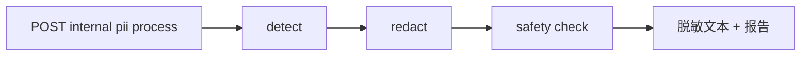
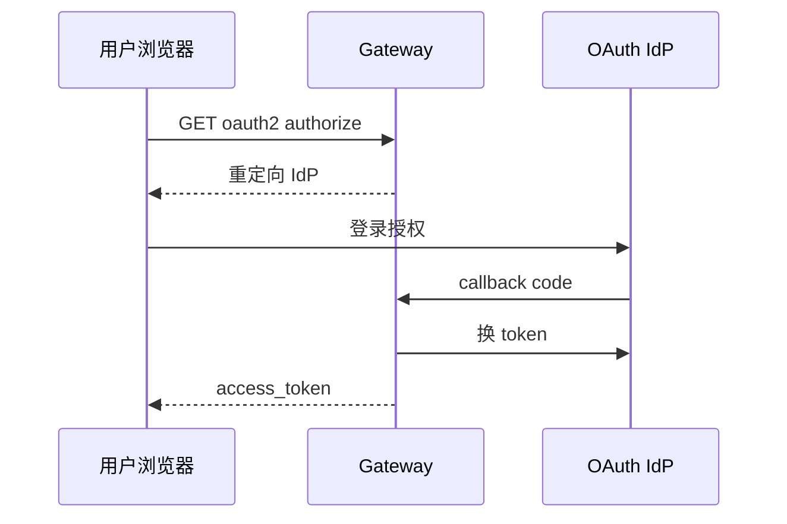
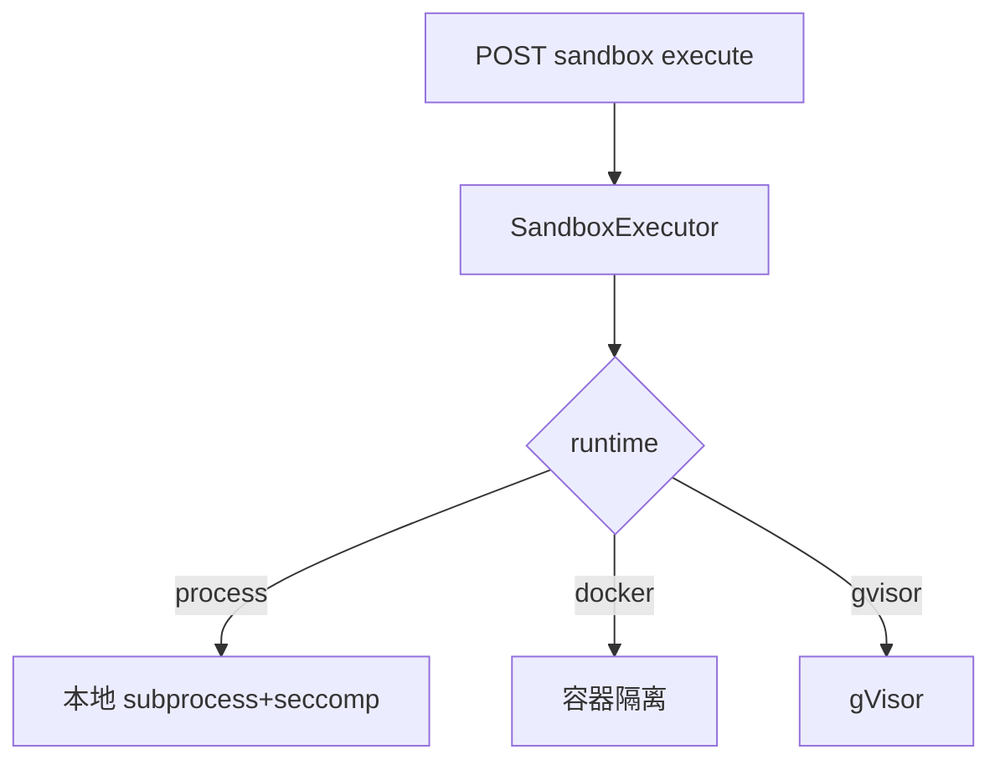

# Phase I 构建思路与代码导读：安全与合规

> 规格书：[sandbox](./phase-i-sandbox.md) · [audit-actions](./phase-i-audit-actions.md) · [pii](./phase-i-pii.md) · [auth](./phase-i-auth.md)

---

## 目录

构建思路、使用链路与逐文件代码说明见 [phase-i-build-and-code-guide.md](./phase-i-build-and-code-guide.md)。

1. [构建思路](#1-构建思路)
2. [使用链路](#2-使用链路)
3. [代码导读（按文件）](#3-代码导读按文件)
4. [10 条自测用例](#4-10-条自测用例)

---

## 1. 构建思路

| Issue | 能力 | 核心路径 |
|-------|------|----------|
| #41 | 沙箱隔离 | `packages/sandbox/executor.py`, `seccomp_profiles.py` |
| #42 | 动作分级审计 | `packages/audit/action_levels.py`, `action_logger.py` |
| #43 | PII 脱敏 | `packages/pii/service.py`, `redactor.py` |
| #44 | OAuth2/mTLS | `packages/auth/oauth2.py`, `mtls.py` |

**现状说明**（面试主动讲）：Sandbox/PII/Audit 主链路以 `/internal/*` API 就绪为主；Agent runner 尚未全量自动挂载。OAuth2 中间件已实现，需在 `main.py` opt-in 启用。

---

## 2. 使用链路

### 2.1 PII 处理 API

### 2.2 OAuth2 授权码

### 2.3 沙箱执行

---

## 3. 代码导读（按文件）

| 文件 | 职责 |
|------|------|
| `packages/sandbox/executor.py` | 三 runtime 执行 |
| `packages/sandbox/tool_wrapper.py` | 工具包装（待接 runner） |
| `packages/audit/action_levels.py` | read/write/destructive |
| `packages/audit/action_logger.py` | 分级审计落库 |
| `packages/pii/detectors.py` | 正则/模式检测 |
| `packages/pii/content_safety.py` | 关键词安全 |
| `packages/auth/oauth2.py` | 授权码流程 |
| `packages/auth/mtls.py` | 客户端证书校验 |
| `config/tool_classifications.yaml` | 工具默认分级 |
| `config/pii_patterns.yaml` | PII 模式 |

---

## 4. 10 条自测用例

| # | 输入 | 预期 |
|---|------|------|
| 1 | sandbox execute echo | stdout JSON |
| 2 | docker runtime 无 Docker | 明确错误 |
| 3 | classify 工具 | read/write/destructive |
| 4 | log destructive action | 审计记录 |
| 5 | detect 含手机号文本 | spans 命中 |
| 6 | redact 邮箱 | 掩码输出 |
| 7 | safety 违禁词 | block 或 flag |
| 8 | OAUTH2_ENABLED authorize | 重定向 URL |
| 9 | callback 换 token | access_token |
| 10 | GET mtls status | 配置状态 |
