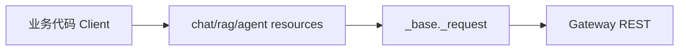
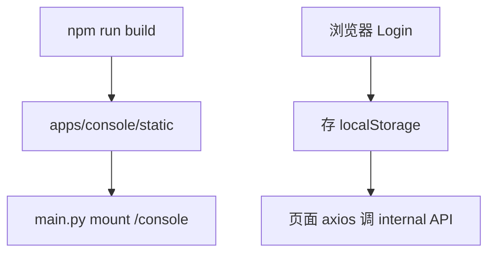
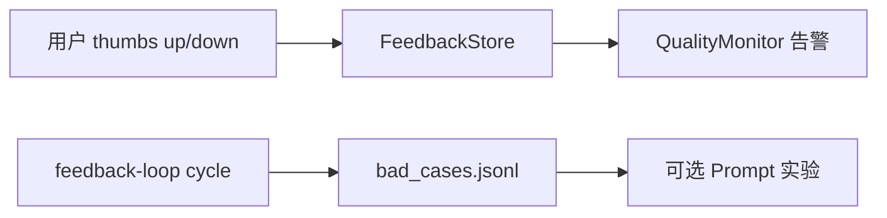

# Phase J 构建思路与代码导读：平台开发者体验

> 规格书：[python-sdk](./phase-j-python-sdk.md) · [console-v2](./phase-j-console-v2.md) · [eval-pipeline](./phase-j-eval-pipeline.md) · [feedback-loop](./phase-j-feedback-loop.md)

---

## 目录

构建思路、使用链路与逐文件代码说明见 [phase-j-build-and-code-guide.md](./phase-j-build-and-code-guide.md)。

1. [构建思路](#1-构建思路)
2. [使用链路](#2-使用链路)
3. [代码导读（按文件）](#3-代码导读按文件)
4. [10 条自测用例](#4-10-条自测用例)

---

## 1. 构建思路

| Issue | 能力 | 核心路径 |
|-------|------|----------|
| #45 | Python SDK | `sdk/python/ai_platform_lab/` |
| #46 | Console V2 | `console-v2/` → `apps/console/static/` |
| #47 | 评测 Pipeline | `eval/pipeline.py`, `eval/gate.py` |
| #48 | 反馈飞轮 | `packages/feedback_loop/`, `feedback_routes.py` |

**原则**：SDK/Console 是 Gateway REST 的薄封装；评测与反馈闭环把线上信号回流到 eval 与 Prompt A/B。

---

## 2. 使用链路

### 2.1 Python SDK

### 2.2 Console V2

### 2.3 反馈飞轮

---

## 3. 代码导读（按文件）

| 模块 | 文件 | 职责 |
|------|------|------|
| SDK | `sdk/python/ai_platform_lab/client.py` | Client/AsyncClient |
| SDK | `resources/chat.py` 等 | REST 封装 |
| Console | `console-v2/src/App.tsx` | 路由 |
| Console | `console-v2/src/api/client.ts` | axios + 鉴权 |
| Eval | `eval/pipeline.py` | 多类别评测 |
| Eval | `eval/gate.py` | baseline 回退门禁 |
| Feedback | `packages/feedback/store.py` | 反馈落库 |
| Feedback | `packages/feedback_loop/pipeline.py` | 全周期编排 |
| Gateway | `apps/gateway/main.py` | mount /console + init |

**读代码顺序**：`client.py` → `resources/` → `pipeline.py` → `feedback_loop/pipeline.py` → `console-v2/src/pages/`

---

## 4. 10 条自测用例

| # | 输入 | 预期 |
|---|------|------|
| 1 | Client.chat.completions.create | 200 |
| 2 | AsyncClient 同上 | await 成功 |
| 3 | 错误 tenant | AIPlatformError |
| 4 | npm run build console | static 生成 |
| 5 | GET /console/ | 页面加载 |
| 6 | eval/run.py run-eval | eval/runs 报告 |
| 7 | eval/run.py gate | 回退超阈值 exit 1 |
| 8 | POST /internal/feedback | 写入成功 |
| 9 | POST feedback-loop cycle | bad_cases 更新 |
| 10 | pytest tests/test_sdk.py | 通过 |
