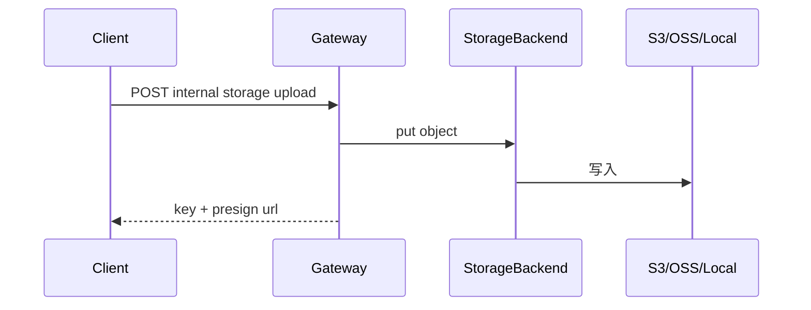
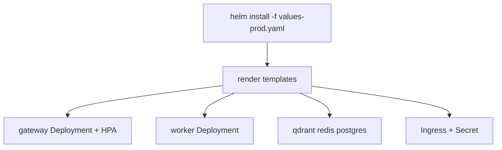
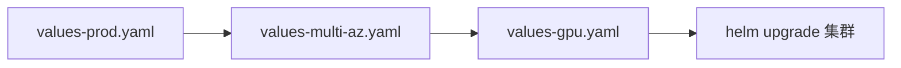

# Phase K 构建思路与代码导读：生产基础设施

> 规格书：[object-storage](./phase-k-object-storage.md) · [helm](./phase-k-helm.md) · [multi-az](./phase-k-multi-az.md) · [gpu-scheduling](./phase-k-gpu-scheduling.md)

---

## 目录

构建思路、使用链路与逐文件代码说明见 [phase-k-build-and-code-guide.md](./phase-k-build-and-code-guide.md)。

1. [构建思路](#1-构建思路)
2. [使用链路](#2-使用链路)
3. [代码导读（按文件）](#3-代码导读按文件)
4. [10 条自测用例](#4-10-条自测用例)

---

## 1. 构建思路

| Issue | 能力 | 核心路径 |
|-------|------|----------|
| #49 | 对象存储 | `packages/storage/`, `storage_routes.py` |
| #50 | Helm Chart | `deploy/helm/ai-platform-lab/` |
| #51 | 多 AZ | `deploy/helm/values-multi-az.yaml` |
| #52 | GPU 调度 | `deploy/helm/values-gpu.yaml` |

**原则**：K 阶段以**部署工件**为主——Python 侧 storage 抽象 + Helm 模板；GPU/Multi-AZ 通过 values overlay 组合。

---

## 2. 使用链路

### 2.1 对象存储

### 2.2 Helm 部署

### 2.3 Multi-AZ + GPU overlay

---

## 3. 代码导读（按文件）

| 模块 | 路径 | 职责 |
|------|------|------|
| Storage | `packages/storage/backend.py` | 抽象接口 |
| Storage | `packages/storage/s3.py`, `oss.py` | 云后端 |
| Storage | `packages/storage/factory.py` | 按 env 选型 |
| Storage | `apps/gateway/storage_routes.py` | upload/list/presign |
| Helm | `deploy/helm/ai-platform-lab/Chart.yaml` | Chart 元数据 |
| Helm | `templates/gateway-deployment.yaml` | 网关部署 |
| Helm | `templates/hpa.yaml` | 自动伸缩 |
| Multi-AZ | `values-multi-az.yaml` | 拓扑打散、Sentinel |
| GPU | `values-gpu.yaml` | embedding/rerank GPU Deployment |
| 测试 | `tests/test_helm_chart.py` | render 校验 |

**读代码顺序**：`storage/factory.py` → `storage_routes.py` → `deploy/helm/README.md` → `values-multi-az.yaml` → `values-gpu.yaml`

---

## 4. 10 条自测用例

| # | 输入 | 预期 |
|---|------|------|
| 1 | STORAGE_BACKEND=local upload | 文件落 local root |
| 2 | presign GET | 可下载 URL |
| 3 | helm template prod | YAML 合法 |
| 4 | helm template multi-az | topologySpreadConstraints 存在 |
| 5 | helm template gpu | nvidia.com/gpu 请求 |
| 6 | test_helm_chart.py | pass |
| 7 | test_multi_az.py | pass |
| 8 | test_gpu_scheduling.py | pass |
| 9 | gateway HPA min/max | values 生效 |
| 10 | helm upgrade rollback | 版本回退文档可执行 |
