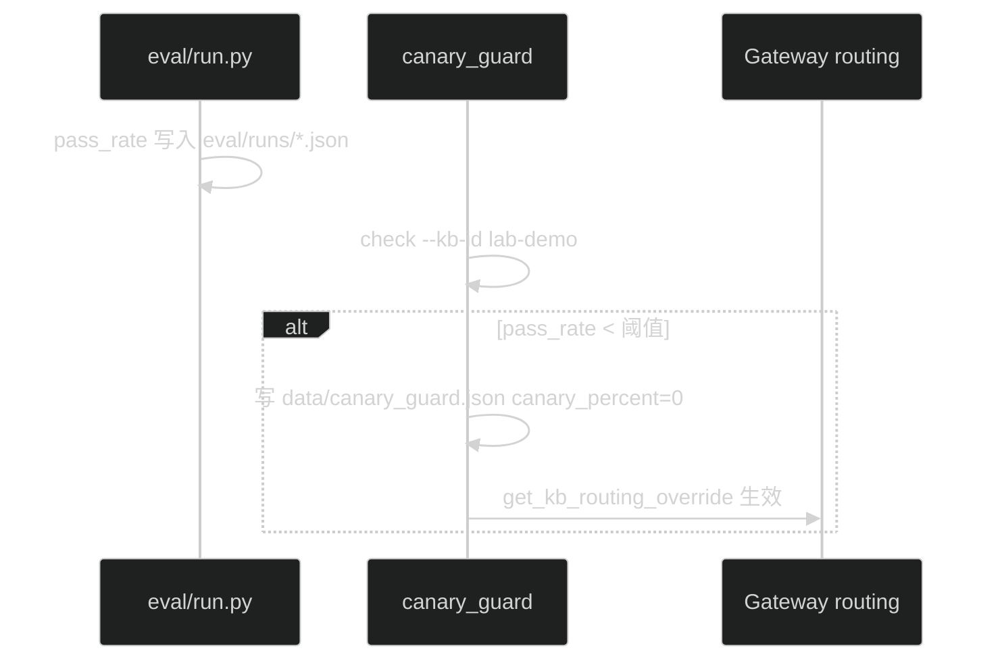

# Phase L #57 — kb 金丝雀自动回滚

> **状态**：✅ CLI + guard 文件 + metrics + webhook stub

## SOP 闭环



## CLI

```bash
# eval 后检查（pass_rate < 0.85 则回滚）
python eval/run.py run-eval --run-id demo-v2   # 或 pipeline eval
python -m packages.rag.canary_guard check --kb-id lab-demo --min-pass-rate 0.85

# 指定报告 / 演练
python -m packages.rag.canary_guard check --kb-id lab-demo --eval-path eval/runs/demo-v2.json --dry-run

# 查看 guard 状态
python -m packages.rag.canary_guard status
```

## 配置

| 变量 | 说明 |
|------|------|
| `CANARY_AUTO_ROLLBACK_MIN_PASS_RATE` | 默认 0.85（Gateway settings） |
| `CANARY_GUARD_WEBHOOK_URL` | 可选，回滚时 POST JSON |
| `CANARY_GUARD_WEBHOOK_SECRET` | 可选，Header `X-Canary-Guard-Secret` |

## 指标

`/metrics` 暴露 `canary_auto_rollback_total{kb_id="..."}`。

## 与 #56 联动

`latest_eval_pass_rate()` 读取 `eval/runs/*.json` 的 `summary.pass_rate` 或顶层 `pass_rate`（兼容 pipeline 报告）。

## 测试

```bash
python3 tests/test_canary_guard.py
```
