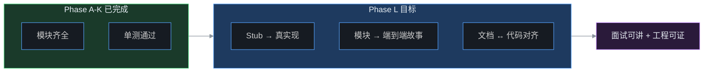
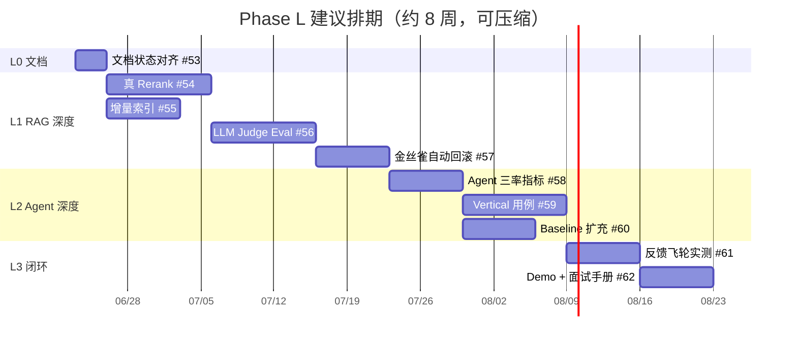
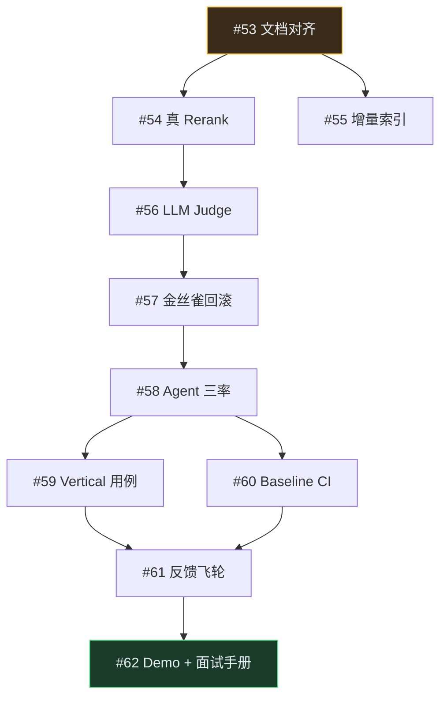

# Phase L — 工程深度与面试叙事（规划）

> **状态**：**Phase L ✅ 完成**（#53～#63）；打 tag `phase-l-engineering-depth`  
> **前置**：Phase A～K 功能清单已完成（484+ 单测）；见 [PROJECT_STATUS.md](./PROJECT_STATUS.md)。  
> **目标**：**不扩新模块**，把 stub / 未验证能力 **做深、做真、串成故事**，支撑面试讲解与工程 credibility。  
> **ROI 优先级**：[phase-l-priority-roi.md](./phase-l-priority-roi.md)  
> **Issue 正文**：[issues-backlog-phase-l.md](./issues-backlog-phase-l.md)（GitHub #37～#47 对应 backlog #53～#63）。  
> **面试稿**：[interview-narrative.md](./interview-narrative.md)

---

## 1. 为什么要 Phase L？

Phase A～K 完成了「平台能力全景」——网关、RAG、Agent、治理、SDK、Helm 等模块 **清单齐全**。但对照代码与文档，存在三类 gap：

| Gap 类型 | 表现 | 面试风险 |
|----------|------|----------|
| **Stub 未替换** | Rerank 词面 stub、Eval 关键词匹配 | 被追问「效果怎么量化」时说不清 |
| **链路未串通** | Orchestrator / Multi-Agent / HITL / 金丝雀 / Eval 各自有代码，缺一条端到端演示 | 只能讲模块，讲不清「怎么发版、怎么回滚」 |
| **文档滞后** | `roadmap.md` 已知限制、`gap-analysis-diagram.md` 与 Phase I～K 矛盾 | 口述与仓库现状不一致，易被穿帮 |

Phase L 的定位：**从「功能清单 ✅」到「能讲、能证、能对比」**。



---

## 2. 设计原则

1. **深化优先于扩面**：Phase L 不做多模态 Embedding、TS SDK、Service Mesh 等新模块（留 Phase M 或另开仓库）。
2. **可量化验收**：每个 Issue 必须有 **before/after 数字**（pass_rate、三率指标、latency）或 **可复现脚本**。
3. **向后兼容**：新能力 opt-in；默认行为与 Phase K 一致。
4. **单测不依赖外部 Key**：LLM / Rerank API 相关用 mock；live 验证写在 `docs/` + 可选 CI job。
5. **面试叙事驱动**：每个 Wave 对应 SOP 文档中的一条大厂故事（见 [enterprise-ai-platform-sop.md](./enterprise-ai-platform-sop.md)）。

---

## 3.5 ROI 优先级（面试 + 工程深度路线）

完整对照表、状态矩阵见 **[phase-l-priority-roi.md](./phase-l-priority-roi.md)**。

| 优先级 | 主题 | Issue | 状态 |
|--------|------|-------|------|
| 🥇 第一 | Console + Demo + SDK | #62-console ✅、#62 ✅、#63 ✅ | **完成** |
| 🥈 第二 | RAG 深化 | #54～#57 | ✅ |
| 🥉 第三 | Agent 深化 | #58～#60 | ✅ **L2 完成** |
| 第四 | 反馈飞轮 | #61 | ✅ |
| 第五 并行 | 文档对齐 | #53 | ✅ |
| 第六 后置 | 多模态等 | Phase M | 刻意不做 |

---

## 3. Phase L 波次与 Issue 映射

| 波次 | 代号 | 主题 | Issue | 工期 | 面试讲点 |
|------|------|------|-------|------|----------|
| **L0** | 文档对齐 | roadmap / gap / 远期文档同步 | #53 | 2d | 诚实边界、架构全景图准确 |
| **L1** | RAG 工程深度 | 真 rerank + 增量索引 + LLM Judge + 金丝雀自动回滚 | #54～#57 | 3～4w | version bump + 金丝雀 + eval 对比 |
| **L2** | Agent 工程深度 | 三率指标 + vertical 用例 + baseline 扩充 | #58～#60 | 2～3w | Tool Precision / Needless / Missing |
| **L3** | 闭环与叙事 | 反馈飞轮实测 + Demo 脚本 + 面试手册 | #61～#62 | 2w | 线上 Bad Case → Prompt 迭代 |

**建议执行顺序**：L0 → L1（#54→#56→#57，#55 可与 #54 并行）→ L2（#58→#59→#60）→ L3（#61→#62）。



---

## 4. 各波次详细范围

### L0 — 文档对齐（#53）

**动机**：`roadmap.md` §已知限制仍写「无 MCP / 无 HITL」；`gap-analysis-diagram.md` 完成度 ~50%；`phase-d-future-evolution.md` 头部写「尚未实现」——与 Phase D～K 交付矛盾。

**范围**：

| 文件 | 动作 |
|------|------|
| `docs/roadmap.md` | 重写 §已知限制；新增 Phase L 章节；Gap 表更新完成度 |
| `docs/gap-analysis-diagram.md` | Mermaid 节点改为 ✅；完成度表 ~90% |
| `docs/phase-d-future-evolution.md` | 头部标注「D～K 已交付，下文为历史规划」 |
| `docs/PROJECT_STATUS.md` | 增加 Phase L 链接与 next steps |
| `README.md` | 文档导航增加 Phase L 一行 |

**验收**：三份文档对同一能力（如 HITL、MCP、语义缓存）描述一致；无「已实现却写缺失」条目。

---

### L1 — RAG 工程深度（#54～#57）

对标 SOP：**「RAG 知识库：version bump + 金丝雀 + eval 对比再全量」**。

#### #54 真 Rerank Provider

| 项 | 现状 | 目标 |
|----|------|------|
| `packages/rag/rerank.py` | `mode=stub` 词面重合 | 新增 `api` / `local` provider（Cohere、Jina 或 bge-reranker HTTP） |
| 配置 | `rerank_mode: stub` | `rerank_mode: stub\|api\|local`，API Key 走 secrets |
| 指标 | `timings.rerank_ms` | 增加 `rerank_provider` 字段 |

**工程验收**：

- 单测 mock API，≥ 12 用例
- `eval/run.py compare` 文档示例：stub vs api 的 pass_rate 对比（live 可选）
- `docs/phase-l-rerank.md`

#### #55 RAG 增量索引

| 项 | 目标 |
|----|------|
| chunk 指纹 | 按 `source_uri + chunk_index + content_hash` 跳过未变 chunk |
| 删除同步 | 源文件删除时标记 stale / 可选 purge |
| 任务指标 | Worker 上报 `skipped_chunks` / `new_chunks` |

**工程验收**：同一 `source_uri` 二次索引，`new_chunks=0`；变更 1 段文本仅 re-embed 受影响 chunk。

#### #56 LLM-as-Judge Eval

| 项 | 现状 | 目标 |
|----|------|------|
| `eval/pipeline.py` | `expected_keywords` | 增加 `grading: keyword\|llm_judge` |
| LLM Judge | 无 | 结构化 rubric（相关性 /  groundedness / 拒答正确性） |
| CI | 无 Key 跳过 | `.github/workflows/eval.yml` 增加 `workflow_dispatch` + `EVAL_API_KEY` secret |

**工程验收**：无 Key 时 100% 走 keyword；有 Key 时 RAG 类用例可选 llm_judge；报告含 `grading_mode` 字段。

#### #57 金丝雀自动回滚 Job

| 项 | 现状 | 目标 |
|----|------|------|
| `canary_guard.py` | 读最近 eval pass_rate | 定时/手动 trigger + 写 `canary_guard.json` + 可选 webhook |
| 集成 | pipeline 内调用 | CLI `python eval/canary_guard.py check --kb-id lab-demo` |
| 告警 | 无 | pass_rate < 阈值 → log + metrics + stub webhook |

**工程验收**：模拟 pass_rate 下降 → `canary_percent` 自动置 0；单测覆盖阈值边界。

---

### L2 — Agent 工程深度（#58～#60）

对标 SOP：**Agent L2「选工具准」+ 轨迹评测双门禁**。

#### #58 Agent 三率指标

扩展 `eval/agent_run.py` 与报告：

| 指标 | 定义 |
|------|------|
| **Tool Precision@1** | 第一步工具 ∈ `expect_tools` |
| **Needless Tool Rate** | 标注 `direct_answer: true` 却调工具的比例 |
| **Missing Tool Rate** | 标注 `require_tools` 却未调的比例 |
| **Arg Valid Rate** | 已有 `AGENT_TOOL_BAD_ARGS` 聚合为率 |

**工程验收**：`agent_baseline.jsonl` 新增字段；`eval/agent_run.py run` 输出 JSON 含四率；单测 ≥ 10。

#### #59 Agent Vertical 用例（Orchestrator + Multi-Agent + HITL）

**目标**：一条可 curl / SDK 复现的 **端到端场景**，写入 `docs/demo-agent-vertical.md`：

```
用户提问 → Orchestrator workflow
  → primary Agent 委托 rag_specialist
  → specialist 调 get_kb_snippet
  → destructive 工具触发 HITL pending
  → POST approve → 继续 → final_message + tool_trace + audit
```

**工程验收**：

- `eval/agent_scenarios.jsonl` 增加 `vertical-hitl-01`
- `acceptance_smoke.py` 新增 `--agent-vertical` 段（无 Key 测状态机；有 Key 测全链路）
- 审计记录含 `action_level`

#### #60 Agent Baseline 扩充 + CI 门禁

| 项 | 目标 |
|----|------|
| 用例数 | `agent_scenarios.jsonl` ≥ 30 条（含三率覆盖） |
| CI | PR 跑 agent eval gate（回退 >5% block，与 RAG gate 对称） |
| 对比 | `eval/agent_run.py compare` 与 RAG compare 同 UX |

---

### L3 — 闭环与叙事（#61～#62）

#### #61 反馈飞轮 LLM 实测闭环

串联已有模块：

```
POST /internal/feedback (点踩)
  → bad_cases.jsonl
  → feedback_loop.run_full_cycle()
  → PromptSuggestion
  → POST /internal/prompts/{id}/experiments (可选自动)
```

**工程验收**：

- `docs/phase-l-feedback-loop-e2e.md` 含 live 命令（需 Key）
- mock 单测覆盖全流程；live 脚本 `eval/feedback_loop_demo.py`

#### #62 平台 Demo 脚本 + 面试叙事手册

| 交付物 | 说明 |
|--------|------|
| `docs/demo-walkthrough.md` | 15 分钟：租户 → RAG v1/v2 金丝雀 → eval compare → Agent vertical → Console（可选） |
| `docs/interview-narrative.md` | 10 分钟口述模板 + 诚实边界 + 常见追问 Q&A |
| `eval/platform_demo.sh` | 一键 smoke（分 `--no-llm` / `--with-llm`） |
| Console | `console-v2` build 产出挂 static（若 #62 含 UI，或单列 #63） |

**面试验收**：按 `interview-narrative.md` 能讲完 6 层架构 + 2 条深度故事（RAG 发版、Agent 治理）。

---

## 5. 成功标准（Phase L 整体 Done）

Phase L 打 tag `phase-l-engineering-depth` 的条件：

- [x] #53～#62 全部关闭
- [x] `python eval/acceptance_smoke.py --platform-demo` 通过
- [x] RAG：`eval/run.py compare` stub vs 真 rerank（见 `docs/phase-l-rerank.md`）
- [x] Agent：`eval/agent_run.py run` 输出四率指标
- [x] 金丝雀：CLI 演示自动回滚（#57）
- [x] 文档：`roadmap` / `interview-narrative` / `demo-walkthrough` 一致
- [x] 累计单测仍全绿

---

## 6. 非目标（Phase L 刻意不做）

与 [roadmap.md](./roadmap.md) 非目标一致，并额外明确：

| 不做 | 原因 |
|------|------|
| 多模态 Embedding | 扩面；留 Phase M |
| TypeScript SDK | 开发者体验次要于 RAG/Agent 深度 |
| 真实 K8s 集群部署验证 | 运维 story 已在 Phase K 文档；L 聚焦效果与 eval |
| 完整 LLMOps UI / 拖拽编排 | Console 仅保证 build + 关键页可用 |
| 训练 / 微调 / 向量库自研 | 仓库非目标 |

---

## 7. 面试叙事结构（#62 将展开）

Phase L 完成后，建议 **10 分钟** 分两层讲：

### 7.1 平台全景（3 分钟）

1. 租户边界：鉴权、配额、工具 ACL  
2. 模型层：Router、熔断、语义缓存、计费  
3. 能力层：RAG + Agent + Prompt/Memory/MCP  

### 7.2 两条深度故事（各 3～4 分钟）

**故事 A — RAG 怎么安全发版**

```
索引 v2 → canary 30% → eval compare (keyword + llm_judge)
  → pass_rate OK → promote stable
  → pass_rate 跌破阈值 → canary_guard 自动回滚
```

**故事 B — Agent 怎么管得住、选得准**

```
allowed_tools 网关 enforce → 三率指标门禁
  → destructive 动作 HITL → 审计 action_level
  → Orchestrator 编排 multi-agent 委托
```

**诚实边界（1 分钟）**：引用更新后的 `roadmap.md` §已知限制。

---

## 8. 依赖关系



---

## 9. 相关文档

| 文档 | 说明 |
|------|------|
| [issues-backlog-phase-l.md](./issues-backlog-phase-l.md) | #53～#63 Issue 正文（GitHub 待创建） |
| [phase-l-priority-roi.md](./phase-l-priority-roi.md) | ROI 优先级与状态矩阵 |
| [phase-l-console-integration.md](./phase-l-console-integration.md) | Console 集成跑真 ✅ |
| [demo-walkthrough.md](./demo-walkthrough.md) | 15 分钟 Demo 脚本 |
| [enterprise-ai-platform-sop.md](./enterprise-ai-platform-sop.md) | 大厂 SOP 对照（RAG 发版、Agent 三率） |
| [phase-d-future-evolution.md](./phase-d-future-evolution.md) | D4 效果工作流历史规划（#54～#57 继承） |
| [PROJECT_STATUS.md](./PROJECT_STATUS.md) | 当前完成度与诚实边界 |
| [CONTRIBUTING.md](../CONTRIBUTING.md) | Issue 驱动流程 |

---

## 10. 创建 Issue 后的维护动作

1. 在 GitHub 创建 #53～#62，Labels：`phase-task` + `feature` + `phase-l`  
2. Milestone：`Phase L — 工程深度与面试叙事`  
3. 依赖评论：`#56 depends on #54`；`#57 depends on #56`；`#59 depends on #58`；`#62 depends on #61`  
4. 合并完成后打 tag：`phase-l-engineering-depth`  
5. 更新本文件头部状态为 **已完成**
