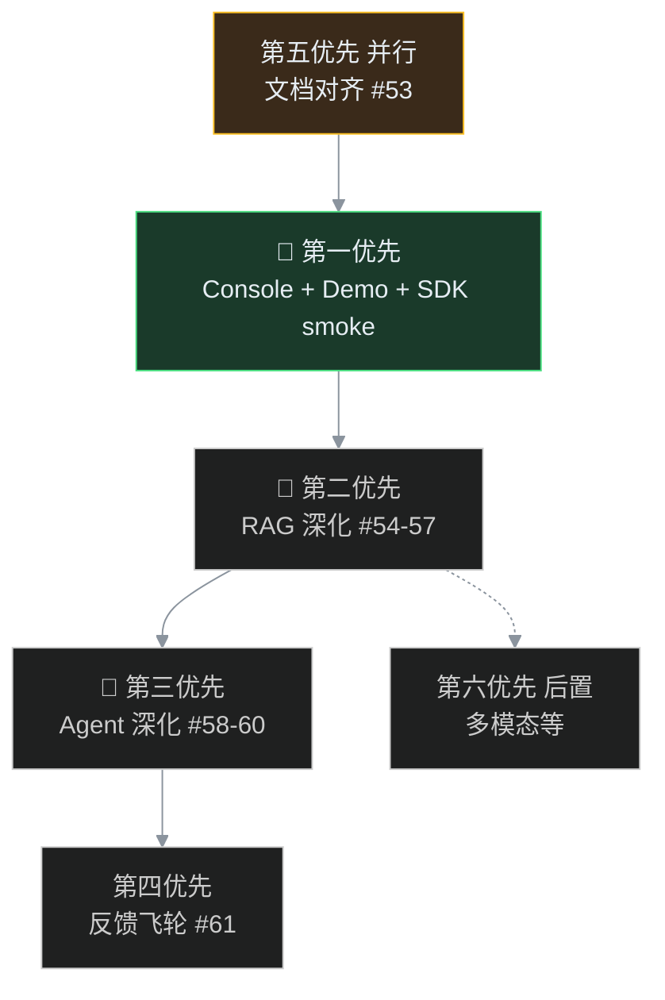

# Phase L — ROI 优先级与 Issue 对照

> 本文档把「面试 + 工程深度」路线整理为 **可执行的优先级**，并与 [issues-backlog-phase-l.md](./issues-backlog-phase-l.md) 中的 Issue 编号一一对应。  
> 总规划见 [phase-l-engineering-depth.md](./phase-l-engineering-depth.md)。

---

## 总览：文档与 Issue 是否齐全？

| 你关心的项 | 规划文档 | Issue 正文（本地） | GitHub Issue | 代码/交付物 | 当前状态 |
|-----------|---------|-------------------|--------------|------------|----------|
| **Console 跑真** | [phase-l-console-integration.md](./phase-l-console-integration.md) | #62-console（见 backlog） | ❌ 未建 | `console_routes.py`、build、挂载 | ✅ **已完成** |
| **15 分钟 Demo 脚本** | [demo-walkthrough.md](./demo-walkthrough.md) | #62 | ❌ 未建 | `eval/platform_demo.sh` | ✅ |
| **SDK 端到端 smoke** | 本文 §第一优先 | #63 | ❌ 未建 | `eval/sdk_smoke.py` | ✅ |
| **面试叙事手册** | [interview-narrative.md](./interview-narrative.md) | #62 | ❌ 未建 | — | ✅ |
| **文档债务清理** | 本文 §第五优先 | #53 | ❌ 未建 | roadmap/gap 已同步 | ✅ |
| **RAG 深化**（rerank/增量/Judge/回滚） | phase-l §L1 | #54～#57 | [#38～#41](https://github.com/xingyun0812/ai-platform-lab/issues/38) | rerank/judge/guard ✅ | ✅ Wave2 |
| **Agent 三率** | [phase-l-agent-metrics.md](./phase-l-agent-metrics.md) | #58 | [#42](https://github.com/xingyun0812/ai-platform-lab/issues/42) | `eval/agent_run.py` | ✅ |
| **Agent vertical/CI** | phase-l §L2 | #59～#60 | [#43](https://github.com/xingyun0812/ai-platform-lab/issues/43) [#44](https://github.com/xingyun0812/ai-platform-lab/issues/44) | 待做 | ⏳ |
| **反馈飞轮 E2E** | phase-l §L3 | #61 | [#45](https://github.com/xingyun0812/ai-platform-lab/issues/45) | 代码有、未 live 验证 | ⏳ |
| **多模态 Embedding** | phase-l 非目标 | Phase M / 原 #36 | — | — | 刻意后置 |

**结论**：Phase L Wave1～Wave2 与 **#58** 已交付；GitHub Issue **#37～#47** 已创建（对应 backlog #53～#63）。**下一步 #59 Agent Vertical**。

---

## Wave1 验收（2026-06）

```bash
./eval/platform_demo.sh --no-llm    # 含 sdk smoke（无 Key 时 skip 三接口）
python eval/sdk_smoke.py            # exit 0
# 文档：interview-narrative.md、roadmap §已知限制、gap-analysis ~88%
```

## 建议优先级（按 ROI 排序）



---

### 🥇 第一优先：把已有能力「跑真」—— Console + 端到端 Demo

**为什么：** 模块已齐，缺一条能给别人看的完整故事。

| 子任务 | Issue | 工期 | 状态 |
|--------|-------|------|------|
| Console V2 build + 挂载 + 适配 API | **#62-console** | 3～5d | ✅ 完成 → [phase-l-console-integration.md](./phase-l-console-integration.md) |
| 15 分钟平台 Demo 脚本 | **#62** | 2～3d | ✅ [demo-walkthrough.md](./demo-walkthrough.md) + `eval/platform_demo.sh` |
| SDK 端到端 smoke | **#63** | 1～2d | ✅ `eval/sdk_smoke.py` |
| 面试叙事手册 | **#62** | 0.5d | ✅ [interview-narrative.md](./interview-narrative.md) |

**验收：**

```bash
cd console-v2 && npm run build
uvicorn apps.gateway.main:app --host 127.0.0.1 --port 8000
# 浏览器 http://127.0.0.1:8000/console/  admin / sk-tenant-admin-change-me

./eval/platform_demo.sh --no-llm
python eval/sdk_smoke.py --base-url http://127.0.0.1:8000
```

**价值：** 从「代码仓库」→「可演示平台」。

---

### 🥈 第二优先：深化 RAG — SOP「version bump + 金丝雀 + eval 对比」

| 子项 | Issue | 现状 | 目标 | 工期 |
|------|-------|------|------|------|
| 真 Rerank | #54 | 词面 stub | API / cross-encoder | 1～2w |
| 增量索引 | #55 | 全量重建 | source_uri hash 跳过 | 1w |
| LLM-as-Judge Eval | #56 | 关键词 | optional LLM 打分 + CI | 1～2w |
| 金丝雀自动回滚 | #57 | 读 pass_rate | CLI + webhook + Console | 1w |

**验收：**

```bash
python eval/run.py run --run-id before-rerank
# 开启真 rerank 后
python eval/run.py run --run-id after-rerank
python eval/run.py compare eval/runs/before-rerank.json eval/runs/after-rerank.json
```

---

### 🥉 第三优先：深化 Agent — SOP L2「选工具准」

| 子项 | Issue | 内容 |
|------|-------|------|
| 三率指标 | #58 | Precision@1 / Needless / Missing / Arg Valid |
| Vertical 用例 | #59 | Orchestrator + Multi-Agent + HITL 串联 |
| Baseline + CI | #60 | agent_scenarios ≥30 + PR gate |

---

### 第四优先：反馈飞轮跑通真实闭环 — #61

```
点踩 → bad_cases.jsonl → eval 失败 → Prompt 建议 → A/B → promote
```

需 LLM Key + live walkthrough 写入 `docs/phase-l-feedback-loop-e2e.md`。

---

### 第五优先：文档债务清理 — #53（建议与第一优先并行）

| 文件 | 问题 |
|------|------|
| `roadmap.md` §已知限制 | 仍写无 MCP/HITL/PII |
| `gap-analysis-diagram.md` | 完成度 ~50% |
| `phase-d-future-evolution.md` | 头部「尚未实现」 |
| `PROJECT_STATUS.md` | Console 状态需更新 |

---

### 第六优先：扩广度（后置）

| 项 | 建议 |
|----|------|
| 多模态 Embedding（原 #36） | RAG 深化完成后再做 |
| TS SDK | 有前端团队再做 |
| 跨 Region / Service Mesh | infra 向，面试 ROI 低 |

---

## Issue 编号速查（#53～#63）

| # | 优先级 | 标题 |
|---|--------|------|
| 53 | P5 并行 | 文档状态对齐 |
| 54～57 | P2 | RAG 深化 |
| 58～60 | P3 | Agent 深化 |
| 61 | P4 | 反馈飞轮 E2E |
| 62-console | P1 ✅ | Console 集成跑真（**已完成，无独立 GH 号时可合入 #62**） |
| 62 | P1 | Demo 脚本 + 面试叙事手册 |
| 63 | P1 | SDK 端到端 smoke |

创建 GitHub Issue 时建议 Milestone：`Phase L — 工程深度与面试叙事`。
