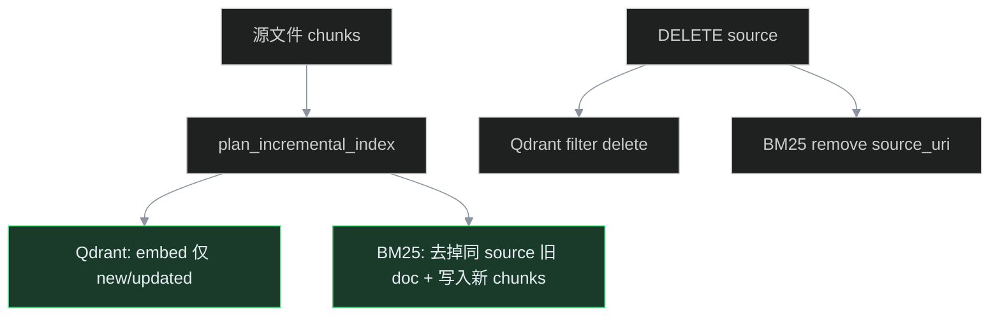

# Phase M — RAG 增量索引做满

> **状态**：✅ 已交付（堆叠 PR #68–#71 补录；待 tag `phase-m-incremental-index`）  
> **GitHub**：#63–#66 · Milestone `Phase M — 增量索引`  
> **备份**：`backup/phase-m-pre-split`
> **前置**：Phase L #55 向量侧 chunk 指纹增量 ✅；BM25 仍全量 scroll 重建  
> **Tag**（完成后）：`phase-m-incremental-index`

## 目标

把增量索引从「向量层可用」升级为 **端到端可演示、可观测、可清理**：

1. BM25 **按 source 差量** merge，避免每次索引全库 scroll
2. 删除文档时 **同步清理** Qdrant 向量 + BM25 条目
3. 任务 API / Console / Prometheus **暴露** `new/updated/skipped_chunks`
4. `platform_demo --with-llm` **二次索引断言** `skipped_chunks >= 1`

## Issue 拆分

| # | 标题 | 状态 |
|---|------|------|
| M1 | BM25 按 source 增量 merge | ✅ #63 |
| M2 | purge-source 清理向量+BM25 | ✅ #64 |
| M3 | 任务 API + 指标暴露增量统计 | ✅ #65 |
| M4 | demo 二次索引断言 + 单测 | ✅ #66 |

## 原理



## 验证

```bash
python3 -m pytest tests/test_incremental_index.py tests/test_bm25_incremental.py tests/test_source_purge.py -q
./eval/platform_demo.sh --with-llm   # 含二次索引 skipped 断言
```
