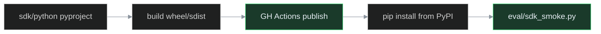

# Phase N — Python SDK 发布 PyPI

> **状态**：规划中  
> **前置**：Phase L #63 `sdk_smoke.py` ✅ · SDK 源码 `sdk/python/`  
> **Tag**（完成后）：`phase-n-pypi-sdk`  
> **非目标**：TS SDK、多模态 Embedding、RBAC、SLO（留 Phase O+）

## 目标

把开发者体验从 `pip install -e sdk/python` 升级为 **`pip install ai-platform-lab`**（包名以 PyPI 可用性为准），并形成可重复的发布与 smoke 流程。

## 一句话面试讲法

「平台不只提供 HTTP API，还提供 **可版本化的 Python SDK**；CI 打 tag 自动发 PyPI，`sdk_smoke` 用安装后的包验 chat/rag/agent。」

## Issue 拆分

| # | 标题 | 依赖 | 工期 |
|---|------|------|------|
| N1 | 包元数据与 README | — | 1d |
| N2 | GitHub Actions 发布 PyPI | N1 | 1～2d |
| N3 | 发布后 `pip install` smoke | N2 | 1d |
| N4 | 文档与 roadmap 同步 | N3 | 0.5d |

## 技术要点



### N1 — 包元数据

- 补 `sdk/python/README.md`（安装、Client 示例、环境变量）
- `[project]`：`authors`、`urls`（Homepage、Repository）
- 包名冲突时备选：`ai-platform-lab-sdk`（Issue 内记录决策）
- `__version__` 与 `pyproject.toml` 单源同步

### N2 — CI 发布

- `.github/workflows/publish-sdk.yml`：`workflow_dispatch` + `release`/`tag` 触发
- 使用 PyPI **Trusted Publishing**（OIDC）或 `PYPI_API_TOKEN` secret
- 仅当 `sdk/python/**` 变更或手动发布时构建

### N3 — Smoke

- `eval/sdk_pypi_smoke.sh`：venv 内 `pip install ai-platform-lab==<ver>` → `sdk_smoke.py`
- CI optional job（可用 TestPyPI）

### N4 — 文档

- `README.md` 安装段、`interview-narrative.md` SDK 层
- `PROJECT_STATUS.md` / `roadmap.md` 开发者体验 ✅ PyPI

## 验证

```bash
cd sdk/python && python -m build
pip install dist/*.whl
python -c "from ai_platform_lab import Client; print(Client)"
./eval/sdk_smoke.py --base-url http://127.0.0.1:8000
```

## 诚实边界（面试主动说）

- 发布的是 **HTTP 客户端 SDK**，不包含 Gateway 服务端
- 首版 **0.1.0**，SemVer；breaking 变更走 minor/major
- TestPyPI 可先验再发生产 PyPI
