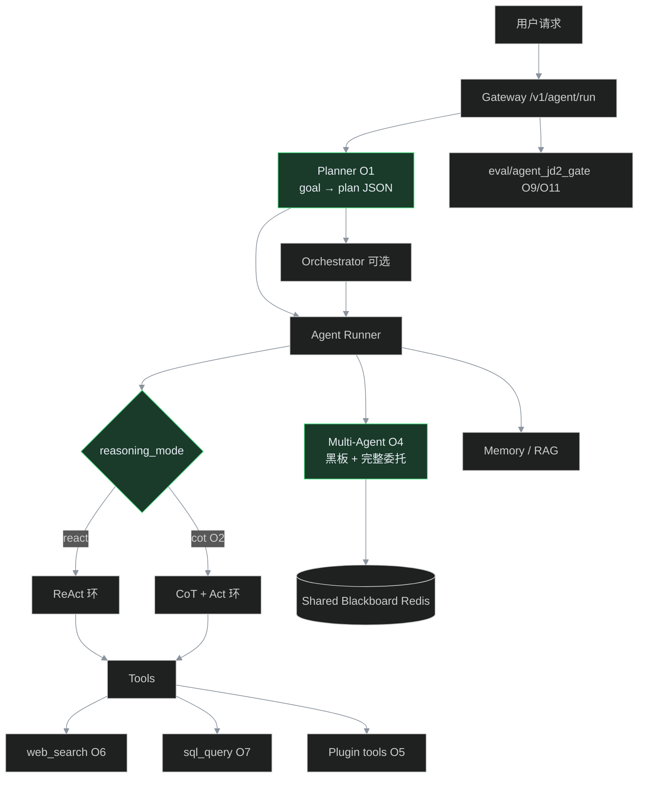
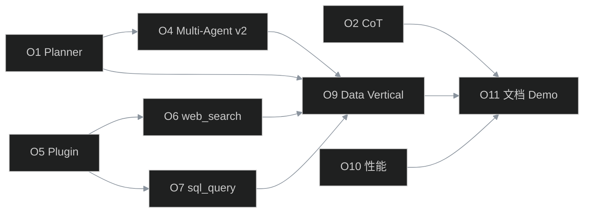

# Phase O — Agent 能力对齐 JD2（智能体研发岗）

> **状态**：✅ 已完成（O1～O11 · tag `phase-o-agent-jd2` · Milestone Phase O）  
> **前置**：Phase N ✅ tag `phase-n-pypi-sdk`  
> **动机**：对照 [tmp-jd-platform-comparison.md](./tmp-jd-platform-comparison.md) §4.1 岗位职责，把 ⚠️/❌ 项做成 **可演示、可单测、可面试** 的增量交付。  
> **Tag**（完成后）：`phase-o-agent-jd2`  
> **非目标**：PyTorch 训推、真实 RPA 引擎、LangChain 依赖绑定、亿级在线规模

---

## 1. 目标与一句话讲法

**目标**：在现有 Agent Runtime 上补齐 JD2 最常问的「规划 / 推理 / 协作 / 外部工具 / 业务场景 / 性能」六块，形成 **15 分钟可演示的 Agent 研发故事**。

**面试一句话**：

> Phase O 把 Agent 从「ReAct 调工具」升级为 **可规划、可显式推理、可协作、可接搜索/SQL、可跑数据分析 vertical**；Multi-Agent 委托走完整 Runner，并有 eval 门禁。

---

## 2. JD2 §4.1 现状 → 目标对照

| # | JD2 岗位职责 | 现状 | Phase O 目标 | Issue |
|---|--------------|------|--------------|-------|
| 1 | **任务规划** | Orchestrator DAG，无 LLM Planner | LLM 生成结构化 Plan → 执行/落 Orchestrator | **O1** |
| 2 | **工具调用** | ✅ ReAct + 白名单 | 保持；补并行工具与 trace 增强 | **O10** |
| 3 | **记忆管理** | ✅ Memory Store + Session | Planner 可读写 memory 摘要 | O1 附带 |
| 4 | **知识检索** | ✅ RAG hybrid | 保持；vertical 串联 | **O9** |
| 5 | **对话管理** | ✅ Session + 滚动摘要 | 保持 | — |
| 6 | **自动化任务分解** | 仅 `max_steps` | Plan → subtasks → 逐步执行/委托 | **O1** |
| 7 | **链式推理 CoT** | ReAct 隐含 | `reasoning_mode=cot`，trace 存 thinking | **O2** |
| 8 | **Multi-Agent 协作** | 委托直连 LLM | 黑板 + 委托走完整 Runner | **O4** |
| 9 | **API 调用** | ✅ MCP + httpbin | 保持 | — |
| 10 | **插件系统** | MCP + marketplace 雏形 | YAML Plugin Manifest 动态注册 | **O5** |
| 11 | **RPA** | ❌ | **不实现**；文档说明 MCP 可接外部 RPA | — |
| 12 | **知识库** | ✅ kb_id/version | 保持 | — |
| 13 | **搜索引擎** | 仅 BM25 | `web_search` 工具（可 mock） | **O6** |
| 14 | **数据库** | Postgres 存业务数据 | 只读 `sql_query` 工具 + 沙箱 | **O7** |
| 15 | **办公/数据分析场景** | vertical 演示级 | **数据分析 vertical** + eval 门禁 | **O9** |
| 16 | **性能调优** | 网关层缓存/限流 | 工具并行、长上下文策略、Agent 指标 | **O10** |
| 17 | 与产品推动落地 | 经历项 | 用 Demo 脚本 + Console 页代替 | **O11** |

图例：**✅ 已有** · **Issue 列 = Phase O 新增工作**

---

## 3. 架构增量（Phase O 后）



---

## 4. Issue 拆分与依赖

| Issue | 标题 | 依赖 | 工期 | JD2 对齐 | GitHub |
|-------|------|------|------|----------|--------|
| **O1** | Task Planner + 任务分解 | — | 3～4d | 任务规划、自动化分解 | [#87](https://github.com/xingyun0812/ai-platform-lab/issues/87) |
| **O2** | CoT 推理模式 + trace | — | 2d | 链式推理 | [#88](https://github.com/xingyun0812/ai-platform-lab/issues/88) |
| **O4** | Multi-Agent v2（黑板 + Runner 委托） | O1 可选 | 4～5d | Multi-Agent 协作 | [#89](https://github.com/xingyun0812/ai-platform-lab/issues/89) |
| **O5** | Plugin Manifest 动态工具 | — | 2～3d | 插件系统 | [#90](https://github.com/xingyun0812/ai-platform-lab/issues/90) |
| **O6** | web_search 工具 | O5 可选 | 2d | 搜索引擎 | [#91](https://github.com/xingyun0812/ai-platform-lab/issues/91) |
| **O7** | sql_query 只读工具 | 沙箱 #41 | 2～3d | 数据库 | [#92](https://github.com/xingyun0812/ai-platform-lab/issues/92) |
| **O9** | 数据分析 Vertical + Orchestrator | O1,O6,O7 | 3～4d | 办公/数据分析场景 | [#93](https://github.com/xingyun0812/ai-platform-lab/issues/93) |
| **O10** | Agent 性能：并行工具 + 长上下文 | — | 2～3d | 性能调优 | [#94](https://github.com/xingyun0812/ai-platform-lab/issues/94) |
| **O11** | 文档 / Demo / eval 门禁 / 叙事 | O1～O10 | 2d | 面试可讲闭环 | [#95](https://github.com/xingyun0812/ai-platform-lab/issues/95) |

**建议合并顺序（PR 链，不可并行 merge 有依赖项）**：

```
Wave 1:  O1 → O2          （Agent 大脑）
Wave 2:  O4               （协作，依赖 O1 的 plan 结构可选）
Wave 3:  O5 → O6 → O7     （外部能力）
Wave 4:  O9               （vertical 串起来）
Wave 5:  O10              （性能）
Wave 6:  O11              （文档 + tag）
```



---

## 5. 各 Issue 设计要点

### O1 — Task Planner + 任务分解

**动机**：JD 要求「任务规划 + 自动化任务分解」；现有 Orchestrator 需人工写 DAG，缺 **LLM 产出 Plan**。

**设计**：
- 新模块 `packages/agent/planner.py`
- 输入：`goal` + 可选 `context`（memory/RAG 摘要）
- 输出：`Plan` JSON（`steps[]`: `{id, description, tool_hint?, agent_hint?, depends_on[]}`）
- API：`POST /v1/agent/plan`（仅生成 plan）或 `POST /v1/agent/run` 增 `auto_plan: true`
- Prompt 模板：`config/prompts.yaml` → `agent_planner`
- 执行：plan 逐步喂给现有 `runner.py` 或转成 Orchestrator workflow（MVP 逐步执行即可）

**验收**：
- [ ] 单测 ≥12：空 goal、单步、多步依赖、循环依赖拒绝
- [ ] `eval/agent_planner_smoke.py` mock LLM 通过
- [ ] live：`auto_plan=true` 完成「查 KB → calc → 汇总」三步

**关键文件**：
- `packages/agent/planner.py`
- `packages/contracts/schemas.py`（Plan / PlanStep）
- `apps/gateway/platform_routes.py` 或新 `agent_routes.py`
- `tests/test_agent_planner.py`

---

### O2 — CoT 推理模式

**动机**：JD 写「链式推理 CoT」；ReAct 有推理但 **trace 里不可见**。

**设计**：
- 配置：`AGENT_REASONING_MODE=react|cot`（默认 react，不破坏现有）
- CoT 模式：system prompt 要求 `<thinking>...</thinking>` 再 tool_call；解析后 **thinking 写入 tool_trace**
- 可选：`stream` 时先流 thinking（后续迭代）

**验收**：
- [ ] 单测：解析 thinking 块、无 thinking 降级
- [ ] `agent_run` baseline 新增 cot 用例（mock）
- [ ] 文档：`docs/phase-o-cot.md` 一节

**关键文件**：
- `packages/agent/runner.py`
- `packages/agent/reasoning.py`（解析器）
- `config/agent.yaml`

---

### O4 — Multi-Agent v2

**动机**：[phase-h-multi-agent.md](./phase-h-multi-agent.md) 诚实边界：委托直连 LLM、无共享黑板。

**设计**：
- **Shared Blackboard**：Redis key `blackboard:{session_id}`，存 `{agent_id, role, content, ts}`
- **委托走 Runner**：`delegation.py` 改为调用 `run_agent()` 而非 `forward_with_model_router`
- **Reviewer 模式**：子 Agent 输出写入黑板，reviewer Agent 读黑板再裁决（配置驱动）
- API：`GET /v1/agent/blackboard/{session_id}`（Console 可展示）

**验收**：
- [ ] 单测：委托深度限制、黑板读写、reviewer 流程
- [ ] 扩展 `eval/agent_vertical_smoke.py`：multi-agent + blackboard 断言
- [ ] 更新 `phase-h-multi-agent.md` §已知限制

**关键文件**：
- `packages/agent/multi_agent/delegation.py`
- `packages/agent/multi_agent/blackboard.py`（新）
- `packages/agent/runner.py`（抽取可复用 entry）
- `apps/gateway/multi_agent_routes.py`

---

### O5 — Plugin Manifest 动态工具

**动机**：JD「插件系统」；MCP 偏重，缺 **轻量 YAML 插件**。

**设计**：
- `config/plugins/*.yaml`：声明 `name`、`description`、`parameters_schema`、`handler`（builtin 名或 HTTP endpoint）
- `packages/agent/plugins/loader.py` 启动时注册到 `registry.py`
- 租户 ACL：`allowed_tools` 仍生效
- 与 MCP 关系：MCP = 远程插件；Plugin = 本地 manifest

**验收**：
- [ ] 示例插件 `config/plugins/demo_echo.yaml`
- [ ] 单测：加载、重复名拒绝、未授权 403
- [ ] 文档：插件作者指南 1 页

---

### O6 — web_search 工具

**动机**：JD「搜索引擎」；RAG 是内部 KB，缺 **外部检索**。

**设计**：
- 工具名：`web_search`
- 模式：`WEB_SEARCH_MODE=mock|http`（默认 mock，CI 无 Key）
- `http`：可配置 `WEB_SEARCH_URL`（内网搜索 API 或 DuckDuckGo 兼容层）
- 返回：top-k `{title, snippet, url}` 结构化 JSON

**验收**：
- [ ] mock 模式单测 + agent 调用链
- [ ] `tenants.yaml` demo-a 可选开放
- [ ] 与 O9 vertical 串联

---

### O7 — sql_query 只读工具

**动机**：JD「数据库」；Agent 需 **受控 SQL**，不能任意写库。

**设计**：
- 工具名：`sql_query`
- 仅 `SELECT`；解析器拒绝 `INSERT/UPDATE/DELETE/DDL`
- 连接：`SQL_AGENT_DATABASE_URL`（默认可指向 lab Postgres 只读视图）
- 行数上限 + 超时；结果 JSON 表格
- 动作级别：`read-only`（审计已有分级）

**验收**：
- [ ] 单测：SQL 注入式拒绝、LIMIT 强制
- [ ] 示例视图 `samples/analytics_demo.sql`（seed 数据）
- [ ] destructive 语句 → `AGENT_TOOL_FORBIDDEN`

---

### O9 — 数据分析 Vertical

**动机**：JD「办公自动化、数据分析等业务场景」；要有 **一条完整故事**。

**场景**：「分析 lab 演示销售表：搜索行业背景 → SQL 聚合 → calc 同比 → 输出报告摘要」

**设计**：
- Orchestrator workflow：`config/workflows/data_analysis.yaml`
- 或 `agent_id: data-analyst` Multi-Agent 链
- `eval/data_analysis_vertical.sh`：mock + `--live`
- Console：Agent 轨迹页展示 plan + blackboard + tool_trace

**验收**：
- [ ] `./eval/data_analysis_vertical.sh --mock` exit 0
- [ ] live 有 Key 时 exit 0
- [ ] CI：`agent_jd2_gate.py` 纳入新 vertical（mock 必跑）

---

### O10 — Agent 性能调优

**动机**：JD §4.3 — 工具策略、长文本、推理效率（平台侧，非 vLLM）。

**设计**：
- **并行工具**：模型一次返回多个 tool_calls 时 **asyncio.gather**（已有则补 metrics）
- **长上下文**：`context_budget` 与 RAG 引用分离策略文档化 + 单测
- **Metrics**：Prometheus `agent_plan_steps_total`、`agent_cot_thinking_tokens`、`agent_tool_parallel_duration`
- **策略**：`tool_call_strategy=sequential|parallel` 配置

**验收**：
- [ ] 单测：并行 vs 顺序
- [ ] `/metrics` 新指标可见
- [ ] `phase-o` 文档 §性能 可面试

---

### O11 — 文档 / Demo / eval 门禁

**动机**：Phase 收尾 + 更新 JD 对照表。

**交付**：
- [x] `docs/phase-o-agent-jd2-alignment.md`（本文）状态改为 ✅
- [x] `docs/issues-backlog-phase-o.md` Issue 关闭映射
- [x] 更新 `tmp-jd-platform-comparison.md` §4.1 评级
- [x] 更新 `interview-narrative.md` Agent 层 + Q&A（Planner/CoT/Vertical）
- [x] 更新 `demo-walkthrough.md` 新增 5 分钟 Agent JD2 路线
- [x] `eval/agent_jd2_gate.py` + CI job
- [x] Tag：`phase-o-agent-jd2`

---

## 6. 刻意不做（诚实边界）

| 项 | 原因 | 面试怎么说 |
|----|------|------------|
| **RPA** | 依赖 UI 自动化栈，ROI 低 | 「平台留 MCP 接口，RPA 走外部工具注册」 |
| **PyTorch/TensorFlow** | 平台工程非训推 | 「模型走 Gateway API，Embedding/Rerank 已 provider 抽象」 |
| **LangChain 依赖** | 自研 Runtime 是卖点 | 「模块与 LCEL/LangGraph 概念对齐，见对照表」 |
| **AutoGPT 长期自治** | 风险与 lab 范围 | 「有 plan + max_steps + HITL 审批 destructive」 |
| **128k 极致长文** | 需专用模型/infra | 「context_compress + RAG 引用分离已做」 |

---

## 7. 验证矩阵（Phase O 完成后）

| 命令 | 覆盖 Issue |
|------|------------|
| `pytest tests/test_agent_planner.py` | O1 |
| `pytest tests/test_agent_reasoning.py` | O2 |
| `pytest tests/test_multi_agent_blackboard.py` | O4 |
| `pytest tests/test_agent_plugins.py` | O5 |
| `pytest tests/test_tools_web_search.py` | O6 |
| `pytest tests/test_tools_sql_query.py` | O7 |
| `./eval/data_analysis_vertical.sh --mock` | O9 |
| `python eval/agent_jd2_gate.py` | O11 |
| `./eval/platform_demo.sh --with-llm` | 回归 |

**10 条场景预期（O9 live 示例）**：

| # | 输入 | 预期 |
|---|------|------|
| 1 | `auto_plan=true` goal=「查 RAG 并计算 1+2」 | plan≥2 步，final 含 3 |
| 2 | `reasoning_mode=cot` | trace 含 thinking 字段 |
| 3 | 委托 rag_specialist | 走完整 Runner，blackboard 有条目 |
| 4 | reviewer 拒绝低质量输出 | 黑板二次写入 |
| 5 | `web_search` mock | 返回固定 snippet |
| 6 | `sql_query` SELECT | 返回行 JSON |
| 7 | `sql_query` DELETE | 403 FORBIDDEN |
| 8 | 未授权 `web_search` | AGENT_TOOL_FORBIDDEN |
| 9 | 插件 echo | 注册并成功调用 |
| 10 | data analysis vertical | 报告摘要含 SQL 聚合结果 |

---

## 8. 工期与里程碑

| 里程碑 | 内容 | 累计 |
|--------|------|------|
| M0 | Phase N PyPI 收尾 | — |
| M1 | O1 + O2 merge | ~1 周 |
| M2 | O4 merge | +1 周 |
| M3 | O5 + O6 + O7 merge | +1 周 |
| M4 | O9 + O10 merge | +1 周 |
| M5 | O11 + tag `phase-o-agent-jd2` | +2d |

**总估**：约 **4～5 周**（单人、含 review；不含 PyPI 维护）

---

## 9. 与 Phase N / 后续关系

| Phase | 关系 |
|-------|------|
| **Phase N**（PyPI SDK） | 先行收尾；O 阶段 SDK 可增 `client.plan()` / `reasoning_mode` |
| **Phase P**（后置） | TS SDK、细粒度 RBAC、SLO、多模态 Embedding |
| **tmp-jd-platform-comparison** | O11 同步 §4.1 评级 |

---

## 10. 相关文档

| 文档 | 用途 |
|------|------|
| [tmp-jd-platform-comparison.md](./tmp-jd-platform-comparison.md) | JD 对照来源 |
| [issues-backlog-phase-o.md](./issues-backlog-phase-o.md) | GitHub Issue 粘贴正文 |
| [phase-h-multi-agent.md](./phase-h-multi-agent.md) | Multi-Agent 现状 |
| [phase-h-orchestrator.md](./phase-h-orchestrator.md) | 编排现状 |
| [interview-narrative.md](./interview-narrative.md) | 面试叙事（O11 更新） |

---

*规划稿 · 2026-06-09 · Phase O 启动前需：Phase N 完成 + 创建 GitHub Milestone「Phase O — Agent JD2 Alignment」*
