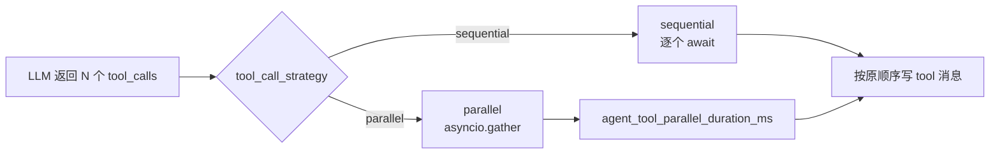

# Phase O — Agent 性能调优（O10 / #94）

> **状态**：✅ 并行工具 + Prometheus 指标 + 长上下文策略

## 原理



- **sequential**（默认）：与 Phase E 行为一致，适合有副作用顺序依赖的工具链。
- **parallel**：同一轮多个 tool_calls 仅 **执行 handler** 并行，quality gate / 截断 / reflect 仍按原顺序后处理。

## 配置

| 项 | 默认 | 说明 |
|----|------|------|
| `tool_call_strategy` | `sequential` | `config/agent.yaml` 或 `AGENT_TOOL_CALL_STRATEGY` |
| `context_token_budget` | 8000 | 会话 assembly token 上限 |
| `tool_result_max_chars` | 2000 | 工具结果字符截断 |

请求级可传 `tool_call_strategy` 覆盖（`/v1/agent/run` body，与 `reasoning_mode` 类似）。

## 长上下文与 RAG 分离

| 通道 | 机制 | 不计入 / 分离点 |
|------|------|----------------|
| 会话历史 | `assemble_llm_messages` | 摘要 pinned，超 budget 删最旧 |
| 工具结果 | `truncate_tool_messages` | 先字符截断再计 token |
| 长记忆 | `retrieve_and_inject_memory` | assembly **之后**，用 `budget_remaining` |
| RAG 引用 | `get_kb_snippet` 等 **tool** | 写入 tool 消息，不走记忆注入通道 |

响应 `_platform.context_strategy` 含上述策略摘要。

## Prometheus 指标

| 指标 | 类型 | 说明 |
|------|------|------|
| `agent_plan_steps_total{tenant_id}` | counter | Planner 执行步数累计 |
| `agent_cot_thinking_tokens{tenant_id}` | counter | CoT thinking token 估算累计 |
| `agent_tool_parallel_duration_ms{tenant_id,strategy}` | gauge | 并行 tool batch P95 墙钟时间 |

导出：`GET /metrics`（需 `METRICS_ENABLED=true`）。

## 验证

```bash
python -m unittest tests.test_agent_perf -q
python -m unittest discover -s tests -q
curl -s localhost:8000/metrics | rg agent_
```

## 10 条场景预期

| # | 输入 | 预期 |
|---|------|------|
| 1 | 单 tool_call | sequential/parallel 行为相同 |
| 2 | 2× slow tool + parallel | 墙钟 ≈ 1× slow |
| 3 | 2× slow tool + sequential | 墙钟 ≈ 2× slow |
| 4 | `tool_call_strategy=invalid` | `AGENT_INVALID_TOOL_CALL_STRATEGY` |
| 5 | CoT + thinking | `agent_cot_thinking_tokens` 增加 |
| 6 | execute_plan 3 步 | `agent_plan_steps_total` +3 |
| 7 | `/metrics` | 含三条 agent_* 指标 HELP |
| 8 | 超 budget 会话 | `truncated_messages` > 0 |
| 9 | 长 tool 结果 | `truncated_tool_results` > 0 |
| 10 | memory 注入开启 | `_platform.context_strategy.rag_references` 存在 |
