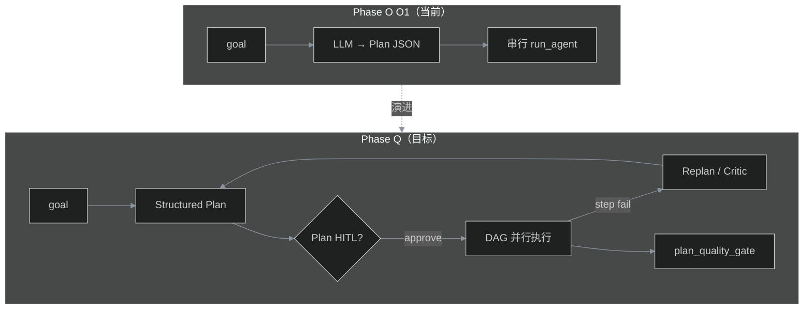

# Phase Q — 任务规划前沿对齐（Advanced Planning）

> **状态**：✅ **Q1～Q6 已交付** · Tag：`phase-q-advanced-planning`（`cb3ac2e`）
> **前置**：Phase O O1 Task Planner ✅（#87 / #99）  
> **Tag**（计划）：`phase-q-advanced-planning`  
> **门禁**（计划）：`python eval/plan_quality_gate.py run`

---

## 1. 动机

Phase O **O1** 已交付 JD2 所需的「任务规划 + 分解」**MVP**：

- 一次 LLM 调用 → Plan JSON
- 拓扑校验 + **串行**逐步 `run_agent`

与业界更前沿做法（Plan-and-Execute、LangGraph 状态机、失败重规划、DAG 并行、Plan 级 HITL、规划质量评测）仍有差距。  
**Phase Q 目标**：在不大改现有 ReAct Runtime 的前提下，把 Planner 从 **「能规划」** 升级到 **「可重规划、可并行、可门禁」**。

**非目标**：完整迁移 LangGraph；Tree-of-Thoughts 搜索；自研 workflow DSL 替代 Temporal。

---

## 2. 与 O1 的能力对比

| 维度 | O1（#87） | Phase Q 目标 |
|------|-----------|--------------|
| Plan 输出 | Prompt + JSON 解析 | Structured output / schema 强约束 |
| 执行 | 拓扑序 **串行** | 无依赖分支 **asyncio 并行** |
| 失败 | 中断或 pending_approval | **Replan** 局部修 step |
| 人机 | 工具级 HITL（Phase E） | 可选 **Plan 级**审批 |
| 编排 | Planner 与 Orchestrator 两套 | Plan → workflow **适配层**（MVP） |
| 评测 | 单测 + smoke | **规划质量** baseline + CI gate |

---

## 3. Issue 拆分（Wave）

| Wave | Issue | 标题 | 工期 | 说明 |
|------|-------|------|------|------|
| 0 | [#115](https://github.com/xingyun0812/ai-platform-lab/issues/115) Q0 | 规划文档 + milestone | 0.5d | 本文档 + backlog + roadmap |
| 1 | [#116](https://github.com/xingyun0812/ai-platform-lab/issues/116) Q1 | Structured Plan 输出 | 2～3d | `response_format` / json_schema；降级兼容现有解析 |
| 1 | [#117](https://github.com/xingyun0812/ai-platform-lab/issues/117) Q2 | DAG 并行 step 执行 | 3～4d | `execute_plan_with_agent` 按层并行 |
| 2 | [#118](https://github.com/xingyun0812/ai-platform-lab/issues/118) Q3 | 失败重规划 Critic | 3～4d | step 失败 → critic LLM → patch plan |
| 2 | [#119](https://github.com/xingyun0812/ai-platform-lab/issues/119) Q4 | Plan 级 HITL | 2～3d | `plan_approval_id`；Console 展示 Plan |
| 3 | [#120](https://github.com/xingyun0812/ai-platform-lab/issues/120) Q5 | Planner ↔ Orchestrator 桥接 | 3～5d | Plan 导出为 workflow YAML 或统一执行器 |
| 4 | [#121](https://github.com/xingyun0812/ai-platform-lab/issues/121) Q6 | 规划质量 eval + tag | 2～3d | `eval/plan_quality_gate.py` + baseline |

**建议总工期**：3～4 周（Wave 1～2 可面试演示；Wave 3～4 偏工程深度）。

---

## 4. 各 Issue 设计要点

### Q1 — Structured Plan 输出

- `generate_plan` 优先走 upstream `response_format: json_schema`（OpenAI 兼容）
- 保留 `extract_json_object` 作降级
- 验收：单测 mock 双路径；live 文档说明模型要求

### Q2 — DAG 并行 step 执行

- `topological_sort` → **按层分组**（layer 内 `asyncio.gather`）
- 黑板 / session 写入需定义并发策略（每 step 独立 sub-session 或锁）
- Prometheus：`agent_plan_parallel_steps_total`

### Q3 — 失败重规划（Critic）

- step `status=failed` 或 tool 全失败 → 调用 `replan_after_failure(plan, failed_step, context)`
- 限制 `max_replan_attempts`（默认 2）
- trace 记录 `plan_revisions[]`

### Q4 — Plan 级 HITL

- `auto_plan` + `require_plan_approval=true` → 返回 `pending_plan_approval`
- 复用 Phase E approval store；新 action `approve_plan`
- Console：Plan 步骤树 + 批准/拒绝

### Q5 — Planner ↔ Orchestrator 桥接

- `plan_to_workflow(plan) -> dict` 生成最小 workflow spec
- 或：`POST /v1/agent/plan/export` 下载 YAML
- 与 `config/workflows/*.yaml` 字段对齐文档

### Q6 — 规划质量 eval + tag

- `eval/plan_baseline.jsonl`：goal → 期望 step 数 / 必含 tool_hint
- `eval/plan_quality_gate.py` 接入 CI（mock LLM）
- 打 tag `phase-q-advanced-planning`

### Q7 — Graph Runtime（最小 LangGraph 等价物）

- `packages/agent/graph_runtime.py` — `execute_agent_graph` 统一入口
- `plan_approval_id` resume：`POST /v1/agent/run`
- Orchestrator checkpoint：`execution_id` + `POST /internal/orchestrator/executions/{id}/resume`
- 配置：`GRAPH_CHECKPOINT_ENABLED=true`（默认）；`REDIS_URL` 可达时 checkpoint 持久化到 Redis

---

## 5. 面试一句话

> O1 证明平台 **能产出结构化 Plan 并逐步执行**；Phase Q 补齐 **并行 DAG、失败重规划、Plan 审批与规划质量门禁** —— 对齐 Plan-and-Execute / LangGraph 的核心思想，仍保持自研 Runtime。

---

## 6. 是否现在开搞？

| 场景 | 建议 |
|------|------|
| 冲 JD2 面试、演示已有链路 | **可先不做** Q；O1 + vertical 已够讲 |
| 被追问「和 LangGraph 差在哪」 | 开 **Q1+Q2+Q6** 即可形成对比叙事 |
| 想做 portfolio 技术深度 | **全 Phase Q** 值得做 |
