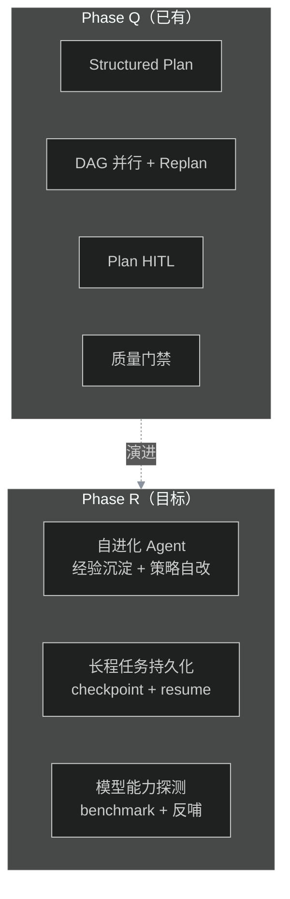
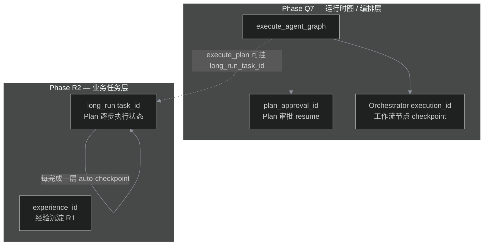

# Phase R — Agent Harness 前沿（Harness Frontier）

> **状态**：🔄 **Wave 1 已完成**（R1/R2 · PR #138）· R3/R4 待开发 · R0 ✅（#133）  
> **前置**：Phase Q ✅（含 Q7 Graph Runtime · tag `phase-q-graph-runtime`） · Phase F #31 长记忆 ✅ · Phase J #48 反馈飞轮 ✅  
> **Tag**（计划）：`phase-r-agent-harness`  
> **门禁**（计划）：`python eval/harness_capability_gate.py run`

---

## 1. 动机

Phase A～Q 已交付完整的「AI 中台骨架」：从模型网关、RAG、Agent 运行时到 Plan-and-Execute / 反馈飞轮。  
但对照 DeepSeek Harness 团队的 JD 与业界前沿，仍有 **三个核心缺口**：

1. **自进化 Agent** — 反馈飞轮只迭代 Prompt；Agent 不能自己改自己的 tool / plan 策略 / 经验库
2. **跨 session 长程任务** — Phase Q 的 Plan + Replan 有边界（max_replan_attempts=2）；不能跨天/跨 session 断点续跑
3. **Harness-side 模型能力探测** — Model Router 只做路由/降级；没有"测出某个模型在哪个 Harness 维度强/弱"的反哺机制

**Phase R 目标**：把这 3 个缺口补到「能跑 demo + 能讲清楚 + 有 eval 门禁」的深度，**对齐 Harness 工程研究方向**（见 [§7 业界定位](#7-业界定位与诚实边界非-sota-表述)）。

**非目标**：训练自己的模型；在线 RL；亿级在线推理；替换现有 ReAct Runtime；对外宣称学术/榜单 SOTA。

---

## 2. 与 Phase Q 的能力对比

| 维度 | Phase Q（#121） | Phase R 目标 |
|------|----------------|--------------|
| 迭代闭环 | 反馈飞轮迭代 Prompt | Agent **自进化**：经验库 + 策略自改 + 技能沉淀 |
| 任务长度 | 单次 Plan + ≤2 次 Replan | **跨 session 长程任务**：checkpoint/resume + 任务持久化 |
| 模型适配 | Model Router 路由/降级 | **能力探测**：自动测出模型在 context/memory/tool/planning 维度的强弱 |
| 评测 | plan_quality_gate | **harness_capability_gate** — 3 维度联合评测 |

### 2.1 Phase Q Q7 与 Phase R 边界（避免概念打架）

Phase Q **Q7 Graph Runtime**（tag `phase-q-graph-runtime`）与 Phase R **R2 长程任务**都涉及 checkpoint / resume，但 **层次与 ID 不同**，面试与联调时需分开讲：

| 概念 | 模块 | 主键 | 持久化 | 典型场景 |
|------|------|------|--------|----------|
| **Plan 审批挂起** | Q7 `graph_runtime` | `plan_approval_id` | 内存 `plan_approval` store | 生成 Plan 后等人批，再 `POST /v1/agent/run` resume |
| **工作流节点断点** | Q7 `graph_checkpoint` + Orchestrator | `execution_id` | 内存 / `REDIS_URL` | `data-analysis-vertical` 等 YAML 工作流节点级 resume |
| **长程 Plan 任务** | R2 `long_horizon` | `task_id` | Postgres + Redis 缓存 | 跨天、跨 session 的多步 Plan；管理员查进度 / 取消 |
| **自进化经验** | R1 `experience_store` | `experience_id` | 内存（规划：Postgres + embedding） | 相似 goal 复用历史 plan / lessons |

**分工原则（维护者约定）**：

1. **不要合并 ID**：`execution_id` ≠ `task_id` ≠ `plan_approval_id`；API 与 Console 字段名保持原样。
2. **Q7 管「怎么跑起来」**：统一入口、审批 interrupt、Orchestrator 图 checkpoint。
3. **R2 管「任务跑多久」**：Plan step 级状态机、跨 session、运维可见性。
4. **未来可选统一**：`AgentGraphState`（Q7）可 **引用** `long_run_task_id`，但不在 R2 中重复实现 Orchestrator 节点引擎。

**用户视角一句话**：

> 批 Plan 用 `plan_approval_id`；跑 YAML 工作流看 `execution_id`；跨天的大任务用 `task_id` 查长程列表。

详见 [phase-q-advanced-planning.md §Q7](./phase-q-advanced-planning.md#q7--graph-runtime最小-langgraph-等价物)。

### 2.2 Phase J 反馈飞轮 vs R1 自进化

| | Phase J 反馈飞轮 | Phase R1 自进化 |
|--|------------------|-----------------|
| 改什么 | 主要是 **Prompt 模板** | **经验库** + plan/tool **策略**（仍走 HITL） |
| 触发 | bad case / 低分回流 | 每次 run 结束 `trigger_self_evolve` |
| 检索 | 无任务级复用 | `retrieve_similar` / `retrieve_by_goal` 注入 Planner |

两者 **并存**：飞轮修模板，自进化修「这类任务上次怎么成功的」。

---

## 3. Issue 拆分（Wave）

| Wave | Issue | 标题 | 工期 | 说明 |
|------|-------|------|------|------|
| 0 | [#133](https://github.com/xingyun0812/ai-platform-lab/issues/133) R0 | 规划文档 + milestone | 0.5d | 本文档 + backlog + roadmap |
| 1 | [#134](https://github.com/xingyun0812/ai-platform-lab/issues/134) R1 | 自进化 Agent — 经验库 + 策略自改 | 5～7d | Agent 跑完任务后自动沉淀经验，下次复用 |
| 1 | [#135](https://github.com/xingyun0812/ai-platform-lab/issues/135) R2 | 跨 session 长程任务 — checkpoint + resume | 4～5d | 任务状态持久化 + 断点续跑 |
| 2 | [#136](https://github.com/xingyun0812/ai-platform-lab/issues/136) R3 | Harness-side 模型能力探测 | 4～5d | benchmark 4 维度 + 反哺报告 |
| 2 | [#137](https://github.com/xingyun0812/ai-platform-lab/issues/137) R4 | eval 门禁 + tag | 2～3d | `harness_capability_gate.py` + tag |

**建议总工期**：3～4 周（Wave 1 可面试演示自进化 + 长程；Wave 2 偏工程深度）。

---

## 4. 各 Issue 设计要点

### R1 — 自进化 Agent（经验库 + 策略自改）

**核心理念**：Agent 执行完任务后，不 only 把 bad case 回流到 Prompt（已有飞轮），还把**成功路径**沉淀为「经验」；下次遇到相似任务时优先复用。

- `packages/agent/experience_store.py` — 经验库（Postgres + Redis 热缓存）
  - `ExperienceRecord`: task_signature (embedding hash) + plan + tool_calls + outcome + lessons
  - `store_experience(record)` / `retrieve_similar_experiences(task, top_k=3)`
- `packages/agent/self_evolve.py` — 自进化主循环
  - `_reflect_on_run(plan, outcome)` → 生成 lessons（LLM 调用）
  - `_maybe_patch_strategy(lessons, current_strategy)` → 修改自己的 plan_prompt / tool_selection 策略
  - 限制：策略变更需 hitl（避免失控）
- Planner 集成：`generate_plan(goal, ...)` 先查经验库 → 有相似经验则注入到 plan_prompt
- Prometheus：`agent_self_evolve_experiences_total` / `agent_self_evolve_strategy_patches_total`

**验收**：
- 单测 ≥ 12（经验库 CRUD + 相似检索 + 策略 patch + 集成路径）
- `eval/self_evolve_smoke.py` — 跑同一类任务 2 次，第 2 次应复用经验
- 策略 patch 走 HITL（不能静默改）

**非目标**：Agent 自己改代码（只改 prompt / 策略）；在线 RL；模型 fine-tune。

### R2 — 跨 session 长程任务（checkpoint + resume）

**核心理念**：任务可以跨天、跨 session 运行；随时挂起，随时续跑；管理员能看到任务全貌。

- `packages/agent/long_horizon.py` — 长程任务管理
  - `LongRunTask`: task_id + plan + step_states[] + checkpoints[] + status
  - `create_long_run(plan, ...)` → 任务入库，返回 task_id
  - `checkpoint(task_id)` → 把当前 step_states + 中间产物（tool_calls / messages）持久化
  - `resume(task_id)` → 加载 checkpoint，从下一个未完成 step 继续
  - `cancel(task_id)` / `get_status(task_id)`
- 持久化：Postgres `long_run_tasks` 表 + Redis 进度缓存
- 集成：`execute_plan_parallel` 增 `long_run_task_id` 参数；每完成一层 → auto-checkpoint
- REST 路由：
  - `POST /v1/agent/long-run` — 创建长程任务
  - `GET /v1/agent/long-run/{task_id}` — 查询状态 + step 进度
  - `POST /v1/agent/long-run/{task_id}/resume` — 续跑
  - `POST /v1/agent/long-run/{task_id}/cancel` — 取消

**验收**：
- 单测 ≥ 10（CRUD + checkpoint/resume + 取消 + 并发安全）
- `eval/long_horizon_smoke.py` — 模拟跨 session 任务（断点续跑 2 次）
- Console 展示长程任务列表（最小）

**非目标**：分布式任务调度（单进程 + Postgres 即可）；亿级任务。

### R3 — Harness-side 模型能力探测

**核心理念**：Harness 不是被动的——它能主动测出某个模型在 context/memory/tool/planning 4 个维度的强弱，反哺 Model Router 的降级链与 Prompt 策略。

- `eval/harness_capability_benchmark.py` — 4 维度 benchmark
  - `context_mgmt`: 长上下文召回率（needle-in-haystack 变体）
  - `long_memory`: 跨 session 记忆检索准确率
  - `tool_use`: 工具调用成功率 + 参数 schema 准确率
  - `planning`: Plan 结构合理性 + 步骤数 / 依赖正确率
- `packages/agent/capability_profile.py` — 能力画像
  - `ModelCapabilityProfile`: model_id + 4 维度分数 + timestamp
  - `run_capability_profile(model_id)` → 跑全部 benchmark → 入库
  - `get_profile(model_id)` / `compare_profiles(m1, m2)`
- Model Router 集成：
  - 路由决策时查询 profile（"tool_use 弱的模型不走带工具的 plan"）
  - 降级链按"维度匹配度"排序而非静态配置
- 反哺报告：`POST /internal/harness/capability-report` → 生成 Markdown 报告供训练团队参考

**验收**：
- 单测 ≥ 10（4 维度 benchmark mock + profile CRUD + router 集成）
- `eval/harness_capability_benchmark.py run --model X` 可独立运行（mock LLM）
- 1 份样例报告 `docs/phase-r-capability-report-sample.md`

**非目标**：自动 fine-tune；训练数据生成；在线 A/B 路由（只做 offline profile）。

### R4 — eval 门禁 + tag

- `eval/harness_capability_gate.py` — 联合门禁
  - `run` — 跑 R1（自进化）+ R2（长程）+ R3（能力探测）的 smoke
  - `check` — 静态校验 baseline 文件
- `eval/harness_baseline.jsonl` — 最小 baseline（≥5 case）
- 文档：`demo-walkthrough.md` 增 Phase R 段
- 打 tag `phase-r-agent-harness`

---

## 7. 业界定位与诚实边界（非 SOTA 表述）

### 7.1 我们是什么、不是什么

| 表述 | 是否准确 |
|------|----------|
| 「对齐 DeepSeek Harness / 一线 Agent **平台工程**方向」 | ✅ 推荐 |
| 「Plan-and-Execute + 自进化 + 长程 + 能力画像 **portfolio 深度**」 | ✅ 推荐 |
| 「业界 **SOTA** / 超越 Voyager、HELM」 | ❌ 不准确，面试勿夸大 |

本仓库目标是 **可演示、可门禁、可讲清架构** 的 Harness 参考实现，不是论文复现或权威榜单。

### 7.2 与业界前沿的对照（诚实版）

| Phase R 能力 | 本仓库实现层级 | 更前沿的研究/产品（了解即可） |
|--------------|----------------|------------------------------|
| **R1 自进化** | 经验回放 + LLM reflect + 策略 patch（HITL） | Voyager 技能库、ExpeL/Reflexion、TextGrad/DSPy 自动优化 |
| **R1 相似检索** | 规划：embedding；当前：goal 签名 / 子串 | 向量库 + 任务 embedding 近邻（R1+ 待加强） |
| **R2 长程** | Postgres 任务表 + Plan 层 checkpoint | LangGraph Cloud、Temporal/Inngest 分布式 durable workflow |
| **R3 四维度** | 自建 `harness_capability_benchmark` | HELM、OpenCompass、BFCL、τ-bench、WebArena |
| **Router 反哺** | offline profile → 路由启发 | 在线 A/B、与训练闭环联动 |

### 7.3 对外 / 面试推荐话术

**可以说**：

> Phase R 把 Harness 从「被动跑 Agent」推进到「经验沉淀、长程可恢复、按能力选模型」——和 LangGraph checkpoint、平台级经验库、Router eval 反哺是同一类工程问题。

**建议主动说的限制**：

> 不做在线 RL 和模型训练；自进化改的是 prompt/策略而非代码；能力探测是内部 4 维 smoke，不是 HELM 级公开榜单；长程任务单进程 + Postgres，不是亿级调度。

### 7.4 R1 / R3 验收加强（相对原规划的增量）

| 项 | 原规划 | 建议验收加强 |
|----|--------|--------------|
| R1 第 2 次任务 | 「复用经验」 | 度量 **plan 步数或 tool 错误率下降**（smoke 硬指标） |
| R1 检索 | embedding 相似 | 至少 **embedding 近邻** 或明确文档写「MVP 为签名匹配」 |
| R3 benchmark | 4 维 mock 可跑 | 产出 **样例 capability report**，与 `plan_quality_gate` 并列演示 |

---

## 5. 面试一句话

> Phase Q 把 Planner 升级到 Plan-and-Execute；Phase R 进一步对齐 DeepSeek Harness **工程方向** —— **自进化 Agent**（经验库 + 策略自改 + HITL 守门）、**跨 session 长程任务**（checkpoint/resume + 任务持久化）、**Harness-side 模型能力探测**（4 维度 benchmark + 能力画像 + Router 反哺）。与 Q7 分工：Q7 管运行时图与编排 checkpoint，R2 管业务长程任务（见 [§2.1](#21-phase-q-q7-与-phase-r-边界避免概念打架)）。

---

## 6. 是否现在开搞？

| 场景 | 建议 |
|------|------|
| 冲 DeepSeek Harness 岗 / 被追问自进化 | **必做 R1**（自进化是核心叙事） |
| 想做长程任务 / AgentOps 深度 | **R2 优先**（checkpoint/resume 是工程硬通货） |
| 想做 Harness 与模型协同进化 | **R3 优先**（反哺报告是差异化亮点） |
| Portfolio 技术深度 | **全 Phase R** 值得做 |
