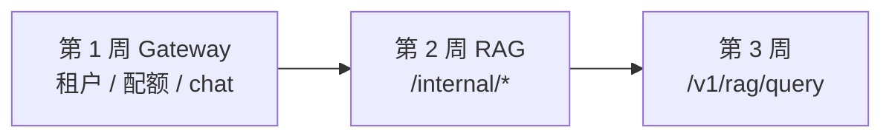
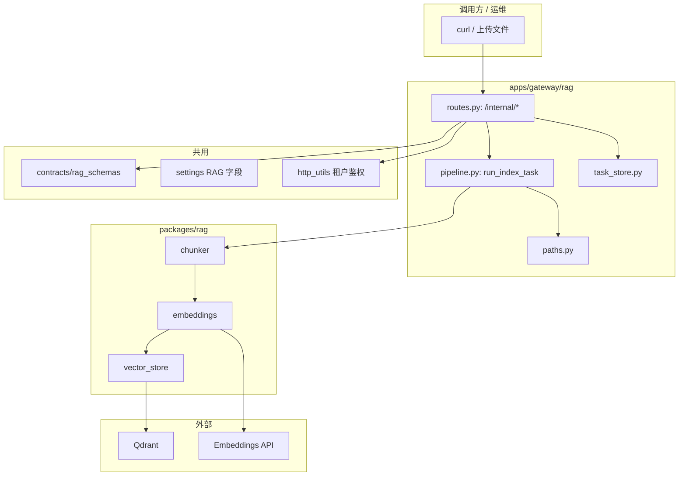
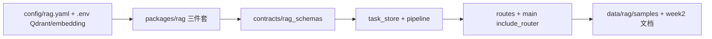
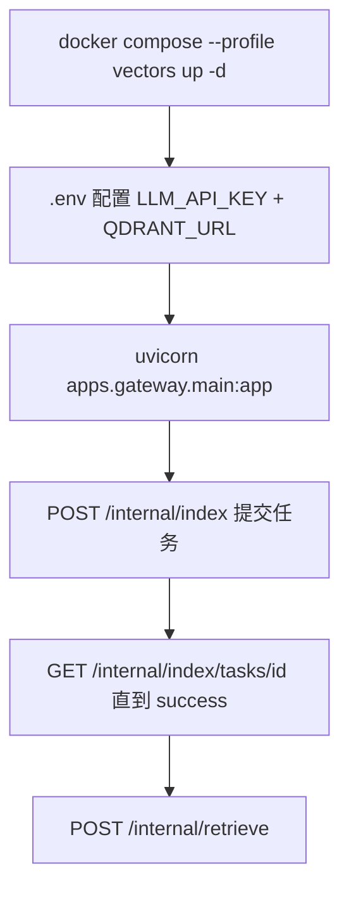
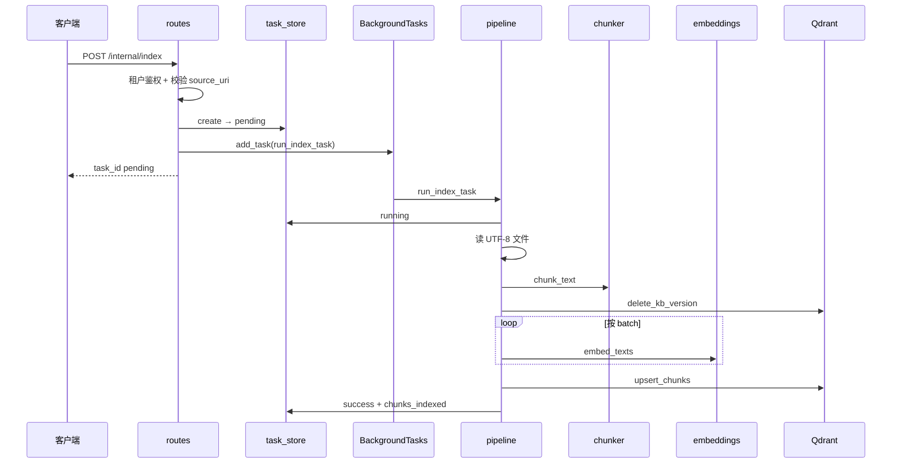
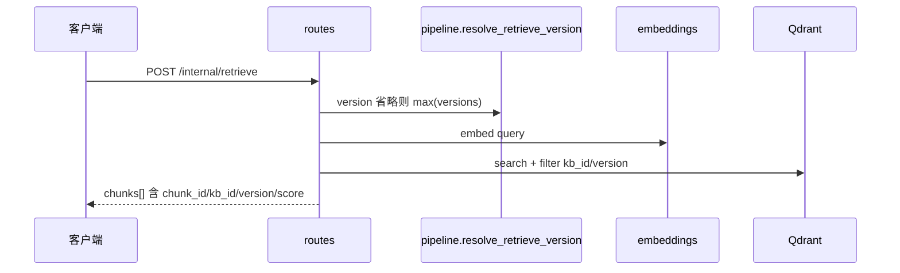
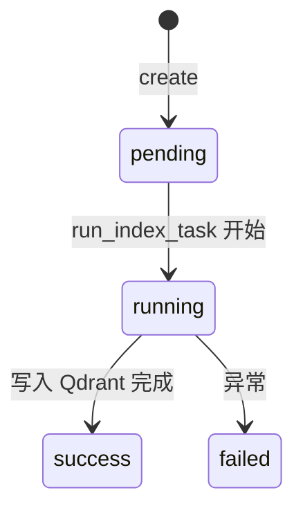
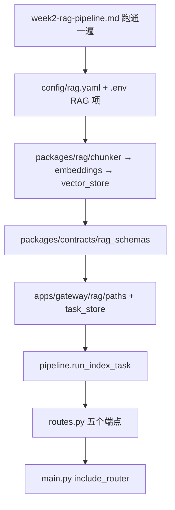

# RAG 数据管道：构建思路与代码导读

> 本文档供**自学回顾**或**给他人讲解**第 2 周实现使用。  
> 配套学习手册：[AI中台学习执行手册](./AI中台学习执行手册.md) 第 2 周。  
> API 与可复制演示命令见 [week2-rag-pipeline.md](./week2-rag-pipeline.md)。  
> 第 1 周 Gateway 见 [gateway-build-and-code-guide.md](./gateway-build-and-code-guide.md)。

---

## 目录

1. [与学习手册的对应关系](#1-与学习手册的对应关系)
2. [构建思路](#2-构建思路)
3. [使用链路](#3-使用链路)
4. [代码导读（按文件）](#4-代码导读按文件)
5. [错误码与分支决策表](#5-错误码与分支决策表)
6. [10 条自测用例（输入 / 预期）](#6-10-条自测用例输入--预期)
7. [读代码顺序建议](#7-读代码顺序建议)

---

## 1. 与学习手册的对应关系

### 1.1 第 2 周目标在仓库里的落点

| 手册要求 | 仓库实现 |
|----------|----------|
| `kb_id` + `version` | 索引/检索请求体；检索省略 `version` 时取 Qdrant 中该 kb 的 `max(version)` |
| 任务 `pending/running/success/failed` | `IndexTaskStore` + `GET /internal/index/tasks/{id}` |
| chunk + `source_uri`、`offset` | `packages/rag/chunker.py`，`chunk_id` 形如 `{kb_id}:{version}:{index}:{offset}` |
| Embedding 全仓库统一一种 | `packages/rag/embeddings.py` **直连** `/embeddings`（与 Gateway 共用 Key，不经 chat 接口） |
| `POST /internal/retrieve` | `apps/gateway/rag/routes.py`，返回带 `score` 的 `chunks[]` |
| 上传或指定路径 | `POST /internal/index` + `POST /internal/index/upload` |
| 向量库 Qdrant | `packages/rag/vector_store.py` + `docker compose --profile vectors` |
| 交付 `docs/week2-rag-pipeline.md` | ✅；本文档为**构建 + 代码导读**补充 |

### 1.2 与第 1 周的关系

- RAG 路由挂在**同一 FastAPI 应用**（`main.py` 里 `include_router(rag_router)`）。
- 鉴权复用第 1 周的 `http_utils.resolve_tenant`（`X-Tenant-Id` + Bearer）。
- Embedding 与对话共用 `.env` 里的 `LLM_API_KEY`，但 HTTP 路径不同（`/embeddings` vs `/chat/completions`）。

---

## 2. 构建思路

### 2.1 原则

- **平台能力优先**：索引是异步任务 + 可查询状态，而不是同步脚本一把梭。
- **版本显式**：同一 `kb_id` 可并存 v1、v2；重索引某版本时先删该版本向量再写入。
- **核心与 HTTP 分离**：`packages/rag` 不依赖 FastAPI，便于以后 worker 进程直接 import。
- **实验期可简化**：任务表、版本列表用内存/Qdrant scroll，进程重启任务记录丢失可接受。

### 2.2 分层：谁依赖谁

| 模块 | 职责 |
|------|------|
| `routes.py` | HTTP 入参校验、BackgroundTasks 投递、检索编排 |
| `pipeline.py` | 读文件 → chunk → embed → 写 Qdrant；更新任务状态 |
| `task_store.py` | 进程内任务生命周期 |
| `paths.py` | `source_uri` 安全解析，禁止 `..` 穿越 |
| `chunker.py` | 固定窗口切分，产出 `TextChunk` |
| `embeddings.py` | 批量调用上游 embedding |
| `vector_store.py` | 集合创建、按版本删除、upsert、向量检索、列版本 |
| `rag_schemas.py` | 请求/响应 Pydantic 模型 |

### 2.3 搭建顺序（心智模型）

先打通 **chunk → embed → Qdrant** 单链路，再包 **异步任务 + HTTP**，最后补文档与样例文件。

### 2.4 版本与向量存储策略

- **一个 Qdrant collection**（默认 `ai_platform_lab`），用 payload 区分 `kb_id`、`version`。
- **重索引同一 `kb_id` + `version`**：`delete_kb_version` 删掉该组合的旧点，再 `upsert` 新点；v1 与 v2 可并存。
- **chunk_id** 稳定可溯源；Qdrant point id 用 `uuid5(chunk_id)` 生成，避免重复 upsert 冲突。

---

## 3. 使用链路

### 3.1 运维与开发：环境到第一次检索

### 3.2 单次索引任务（进程内）

失败任一步 → `task_store.update(failed, error=...)`，客户端轮询可见。

### 3.3 单次检索

### 3.4 与第 1 周 Gateway 的衔接点

| 点 | 说明 |
|----|------|
| 挂载 | `create_app()` → `app.include_router(rag_router)`，`prefix=/internal` |
| 鉴权 | 与 chat 相同请求头；错误体同样走 `json_error` |
| 配置 | `settings.py` 扩展 Qdrant、embedding、chunk、`RAG_DATA_ROOT` |
| 密钥 | 索引/检索前检查 `LLM_API_KEY`，无 Key 返回 `UPSTREAM_NOT_CONFIGURED` |

---

## 4. 代码导读（按文件）

### 4.1 `apps/gateway/rag/routes.py`

- `APIRouter(prefix="/internal")`：对内 API，第 3 周再包装对外的 `/v1/rag/query`。
- `_require_tenant`：包装 `resolve_tenant`，失败返回统一 `UNAUTHORIZED`。
- **`POST /index`**：校验路径 → `task_store.create` → `background_tasks.add_task(run_index_task)`，**立即返回** `pending`。
- **`POST /index/upload`**：写入 `data/rag/uploads/{kb_id}/v{n}/` 再建任务。
- **`GET /index/tasks/{task_id}`**：查内存任务表。
- **`GET /kb/{kb_id}/versions`**：从 Qdrant scroll 聚合版本号。
- **`POST /retrieve`**：`resolve_retrieve_version` → `embed_texts([query])` → `VectorStore.retrieve`。

### 4.2 `apps/gateway/rag/pipeline.py`

全局 `task_store = IndexTaskStore()`，与路由共享同一实例。

`run_index_task(task_id)` 核心步骤：

1. `status → running`
2. `resolve_source_path` + 读文件 + **仅 UTF-8**
3. `chunk_text(...)` 
4. `delete_kb_version(kb_id, version)` — 同版本覆盖语义
5. 按 `embedding_batch_size` 分批 `embed_texts`
6. `upsert_chunks` → `success` + `chunks_indexed`

`resolve_retrieve_version`：显式 `version` 直接用；否则 `max(store.list_versions(kb_id))`，无版本抛 `ValueError` → 路由转 `KB_NOT_FOUND`。

### 4.3 `apps/gateway/rag/task_store.py`

- `IndexTaskRecord`：含 `created_at` / `updated_at`（UTC）。
- `threading.Lock`：create/get/update 线程安全。
- **局限**：仅当前进程可见；uvicorn 多 worker 时各进程各一份表。

### 4.4 `apps/gateway/rag/paths.py`

- 根目录 `settings.rag_data_root`（默认 `data/rag`）。
- 拒绝绝对路径与 `..`，`resolve()` 后必须仍在 root 下。

### 4.5 `packages/rag/chunker.py`

- 滑动窗口：`step = chunk_size - overlap`。
- `chunk_id = f"{kb_id}:{version}:{index}:{offset}"` — 满足手册「每条可溯源」。
- 全空白块跳过，可能导致「切分后无有效 chunk」失败。

### 4.6 `packages/rag/embeddings.py`

- `POST {LLM_BASE_URL}/embeddings`，`input` 可为数组（批量）。
- 响应按 `index` 排序后与输入对齐。
- 与 `llm_proxy` 一样用服务端 Key，**不经过** `/v1/chat/completions`。

### 4.7 `packages/rag/vector_store.py`

- `ensure_collection`：不存在则创建 COSINE 集合；维度与 `EMBEDDING_DIMENSIONS` 不一致则报错。
- `delete_kb_version`：Filter 删除指定 kb+version 的所有点。
- `upsert_chunks`：payload 存全文 `text` 与元数据，便于检索直接返回、第 3 周拼 prompt。
- `list_versions`：scroll 扫描，数据量大时慢（实验规模够用）。

### 4.8 `packages/contracts/rag_schemas.py`

- `TaskStatus` 四态与手册一致。
- `RetrieveRequest.version` 可选；`top_k` 默认 5，上限 50。
- `RetrievedChunk` 强制包含 `chunk_id`、`kb_id`、`version` 等字段。

### 4.9 `apps/gateway/settings.py`（RAG 相关）

| 字段 | 默认 | 含义 |
|------|------|------|
| `qdrant_url` | `http://127.0.0.1:6333` | Qdrant HTTP |
| `qdrant_collection` | `ai_platform_lab` | 集合名 |
| `embedding_model` | `text-embedding-3-small` | 上游模型名 |
| `embedding_dimensions` | `1536` | 须与模型一致 |
| `rag_data_root` | `data/rag` | 待索引文件根 |
| `chunk_size` / `chunk_overlap` | 512 / 64 | 可被 `config/rag.yaml` 注入 |
| `embedding_batch_size` | 32 | 每批 embedding 条数 |

### 4.10 `apps/worker/main.py`

- 第 2 周索引实际在 **gateway BackgroundTasks** 执行；worker 仅 `--info` 说明，便于以后拆队列。

---

## 5. 错误码与分支决策表

### 5.1 `POST /internal/index` 与 `/index/upload`

| 顺序 | 条件 | HTTP | error.code |
|------|------|------|------------|
| 1 | 租户鉴权失败 | 401 | `UNAUTHORIZED` |
| 2 | 无 `LLM_API_KEY` | 503 | `UPSTREAM_NOT_CONFIGURED` |
| 3 | `source_uri` 非法/穿越 | 400 | `BAD_REQUEST` |
| 4 | 成功创建任务 | 200 | （业务体，status=pending） |

后台失败不写 HTTP，见任务查询 `status=failed` + `error` 文案。

### 5.2 `GET /internal/index/tasks/{task_id}`

| 条件 | HTTP | error.code |
|------|------|------------|
| 鉴权失败 | 401 | `UNAUTHORIZED` |
| 未知 task_id | 404 | `NOT_FOUND` |
| 存在 | 200 | `IndexTaskView` |

### 5.3 `POST /internal/retrieve`

| 顺序 | 条件 | HTTP | error.code |
|------|------|------|------------|
| 1 | 鉴权失败 | 401 | `UNAUTHORIZED` |
| 2 | 无 `LLM_API_KEY` | 503 | `UPSTREAM_NOT_CONFIGURED` |
| 3 | kb 无已索引版本 | 404 | `KB_NOT_FOUND` |
| 4 | Qdrant/embedding 异常 | 503 | `RETRIEVE_ERROR` |
| 5 | 成功 | 200 | `RetrieveResponse` |

### 5.4 `GET /internal/kb/{kb_id}/versions`

| 条件 | HTTP | error.code |
|------|------|------------|
| Qdrant 不可用等 | 503 | `VECTOR_STORE_ERROR` |
| 成功 | 200 | `versions` + `latest` |

### 5.5 任务状态机

---

## 6. 10 条自测用例（输入 / 预期）

前提：Qdrant 已启动，`.env` 已配 `LLM_API_KEY`，网关已起，使用 `admin` 租户头。

| # | 输入要点 | 预期 |
|---|----------|------|
| 1 | `POST /internal/index` + `samples/hello.txt` v1 | 200，`status=pending`，返回 `task_id` |
| 2 | 轮询 `GET .../tasks/{id}` | 最终 `success`，`chunks_indexed > 0` |
| 3 | 再索引 `hello-v2.txt` v2 | 成功；`GET .../kb/lab-demo/versions` 含 `[1,2]` |
| 4 | `retrieve` 指定 `version:1` | `chunks[].version` 均为 1 |
| 5 | `retrieve` 省略 version | `version` 字段为 2（最新） |
| 6 | 索引 `samples/bad.bin`（非 UTF-8） | 任务 `failed`，`error` 含 UTF-8 |
| 7 | `source_uri` 含 `..` | 400 `BAD_REQUEST` |
| 8 | 无租户头调用 `/internal/retrieve` | 401 `UNAUTHORIZED` |
| 9 | 停掉 Qdrant 后 retrieve | 503 `RETRIEVE_ERROR` 或 `VECTOR_STORE_ERROR` |
| 10 | 每条 retrieve 结果 | 均含 `chunk_id`、`kb_id`、`version`、`score` |

完整 curl 见 [week2-rag-pipeline.md](./week2-rag-pipeline.md#演示命令可复制)。

---

## 7. 读代码顺序建议

给别人讲时建议顺序：

1. **为什么异步**：索引耗时长，先返 `task_id`。  
2. **版本模型**：同 kb 多 version 并存，重索引只覆盖某一 version。  
3. **走一遍 pipeline**：文件 → chunk → embed → Qdrant。  
4. **再走 retrieve**：query embed → 带 filter 的向量搜索。  
5. **对照手册验收三条**（v1/v2、损坏文件、chunk 元数据）。

---

## 附录：与第 3 周的边界

| 第 2 周（当前） | 第 3 周（未做） |
|-----------------|----------------|
| `POST /internal/retrieve` 返回 chunks | `POST /v1/rag/query` 检索 + LLM 生成 |
| 无 `min_score` 拒答 | 低分阈值、空检索拒答 |
| 无 prompt 模板 | `config` 或独立模板文件 |
| `eval/baseline.jsonl` 占位 | ≥30 条评测用例 + 行为可观测 |

---

## 相关文档

- [week2-rag-pipeline.md](./week2-rag-pipeline.md) — API、演示命令、验收表  
- [gateway-build-and-code-guide.md](./gateway-build-and-code-guide.md) — 第 1 周 Gateway  
- [AI中台学习执行手册.md](./AI中台学习执行手册.md) — 全路线  

---

*文档版本：v1 | 对应仓库第 2 周 RAG 数据管道实现。*
