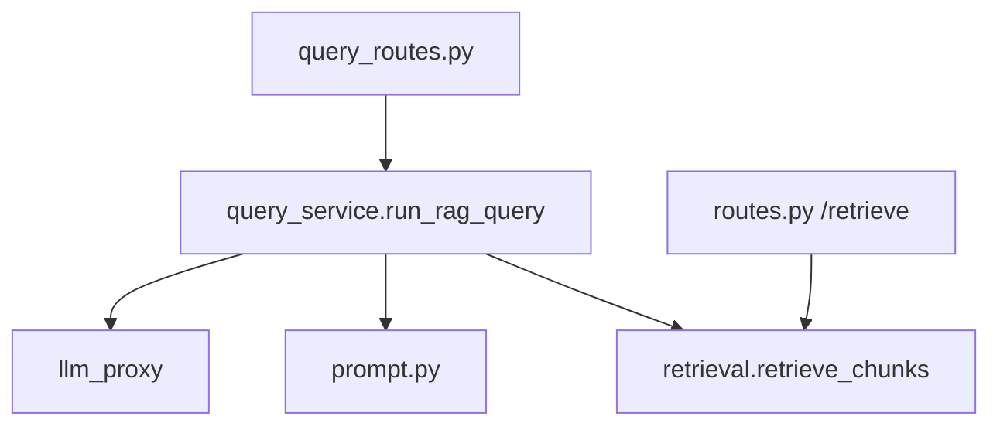
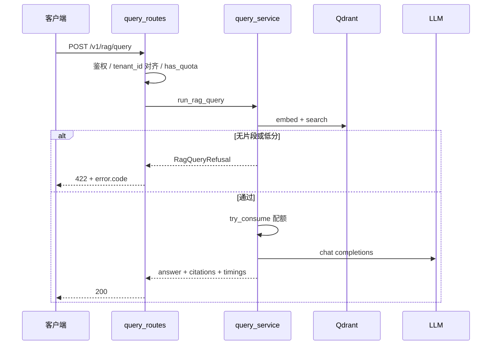

# RAG 问答服务：构建思路与代码导读（第 3 周）

> 供回顾与讲解。API 演示见 [week3-rag-query.md](./week3-rag-query.md)。  
> 索引与对内检索见 [rag-build-and-code-guide.md](./rag-build-and-code-guide.md)。

---

## 目录

1. [与手册的对应](#1-与手册的对应)
2. [构建思路](#2-构建思路)
3. [使用链路](#3-使用链路)
4. [代码导读](#4-代码导读)
5. [错误码决策表](#5-错误码决策表)
6. [10 条自测用例](#6-10-条自测用例)
7. [读代码顺序](#7-读代码顺序)

---

## 1. 与手册的对应

| 手册要求 | 实现 |
|----------|------|
| `POST /v1/rag/query` | `apps/gateway/rag/query_routes.py` |
| 请求体 tenant/kb/version/query/top_k | `RagQueryRequest` |
| `min_score` 拒答、业务错误码 | `RagQueryRefusal` → HTTP 422 + `error.code` |
| Prompt 模板独立文件 | `config/rag_prompt.txt` |
| 引用 chunk_id | 响应 `citations[]` |
| 混合检索 | TODO，仅向量 |
| `eval/baseline.jsonl` ≥30 条 | 35 条 |

---

## 2. 构建思路

### 2.1 原则

- **先检索质量、再生成**：无片段或低分不调 LLM，避免胡编。
- **业务码与 HTTP 分离**：拒答用 422 + `RAG_*` code；成功用 200 + 完整业务体。
- **复用第 2 周**：`packages/rag/retrieval.py` 抽共用检索，对内 `/internal/retrieve` 与对外问答一致。
- **配额与 chat 共享**：`get_quota_tracker()` 单例；仅在通过阈值、即将调 LLM 时 `try_consume`。

### 2.2 分层

---

## 3. 使用链路

---

## 4. 代码导读

### 4.1 `packages/rag/retrieval.py`

- 统一 `retrieve_chunks(..., resolve_version=resolve_retrieve_version)`。
- 返回 `(resolved_version, list[RetrievedChunk])`。

### 4.2 `packages/rag/prompt.py`

- `load_prompt_template` 读 `rag_prompt.txt`。
- `build_context_block` 把 chunk 编成带 `chunk_id` / `score` 的参考资料。
- `render_rag_prompt` 替换 `{context}`、`{query}`。

### 4.3 `apps/gateway/rag/query_service.py`

1. `retrieve_chunks`  
2. 无结果 → `RAG_NO_EVIDENCE`  
3. `filter_chunks_by_score` 后为空 → `RAG_LOW_CONFIDENCE`（detail 含 `max_score`）  
4. `try_consume` 后拼 prompt、调 `forward_chat_completions`  
5. 打日志 `rag_query` extra：`retrieve_ms` / `llm_ms` / `total_ms`

### 4.4 `apps/gateway/rag/query_routes.py`

- `prefix=/v1/rag`，`POST /query`。
- `tenant_id` 与头一致性校验。
- `RagQueryRefusal`：`QUOTA_EXCEEDED` → 429，其余 → 422。

### 4.5 `packages/contracts/rag_schemas.py`

- `RagQueryRequest` / `RagQueryResponse` / `RagCitation` / `RagQueryTimings`。

### 4.6 `apps/gateway/quota.py`

- 新增 `has_quota()`：拒答路径前快速 429，不误扣额度。
- `get_quota_tracker()`：与 `main.py` chat 共用计数。

### 4.7 配置

| 来源 | 项 |
|------|-----|
| `config/rag.yaml` | `min_score`, `prompt_path` |
| `.env` | `RAG_MIN_SCORE`, `RAG_PROMPT_PATH`, `RAG_QUERY_MODEL` |

---

## 5. 错误码决策表

| 阶段 | code | HTTP |
|------|------|------|
| 鉴权失败 | `UNAUTHORIZED` | 401 |
| tenant 不一致 | `TENANT_MISMATCH` / `TENANT_FORBIDDEN` | 400 / 403 |
| 无 Key | `UPSTREAM_NOT_CONFIGURED` | 503 |
| 模型不允许 | `MODEL_NOT_ALLOWED` | 403 |
| 配额（预检/扣减） | `QUOTA_EXCEEDED` | 429 |
| 无索引版本 | `RAG_KB_NOT_FOUND` | 422 |
| 检索 0 条 | `RAG_NO_EVIDENCE` | 422 |
| 分数全低于阈值 | `RAG_LOW_CONFIDENCE` | 422 |
| LLM/其它异常 | `RAG_QUERY_ERROR` | 503 |
| 成功 | — | 200 |

---

## 6. 10 条自测用例

| # | 输入 | 预期 |
|---|------|------|
| 1 | 已索引 kb + 库内问题 | 200，`answer` 非空，`citations` 有 `chunk_id` |
| 2 | 库外问题 | 422 `RAG_NO_EVIDENCE` 或 `RAG_LOW_CONFIDENCE` |
| 3 | `min_score=0.99` + 库内短 query | 422 `RAG_LOW_CONFIDENCE` |
| 4 | `tenant_id` 与头不一致 | 400 `TENANT_MISMATCH` |
| 5 | 未索引的 `kb_id` | 422 `RAG_KB_NOT_FOUND` |
| 6 | 响应含 `timings.retrieve_ms` / `llm_ms` | 均有正数 |
| 7 | 连打 10 次同一 query | 日志/响应 timings 可对比 |
| 8 | 改 `top_k` | `citations` 条数上限变化 |
| 9 | 拒答请求 | 不减少配额（相对调用前 `has_quota`） |
| 10 | 成功请求 | 配额减 1（与 chat 共用计数） |

---

## 7. 读代码顺序

1. `week3-rag-query.md` 跑通 curl  
2. `config/rag_prompt.txt`  
3. `packages/rag/retrieval.py` → `prompt.py`  
4. `query_service.py` → `query_routes.py`  
5. `main.py` 中 `include_router(rag_query_router)`  
6. `eval/baseline.jsonl` 看用例设计  

---

## 相关文档

- [week3-rag-query.md](./week3-rag-query.md)  
- [rag-build-and-code-guide.md](./rag-build-and-code-guide.md)  
- [AI中台学习执行手册.md](./AI中台学习执行手册.md)  

---

*文档版本：v1*
