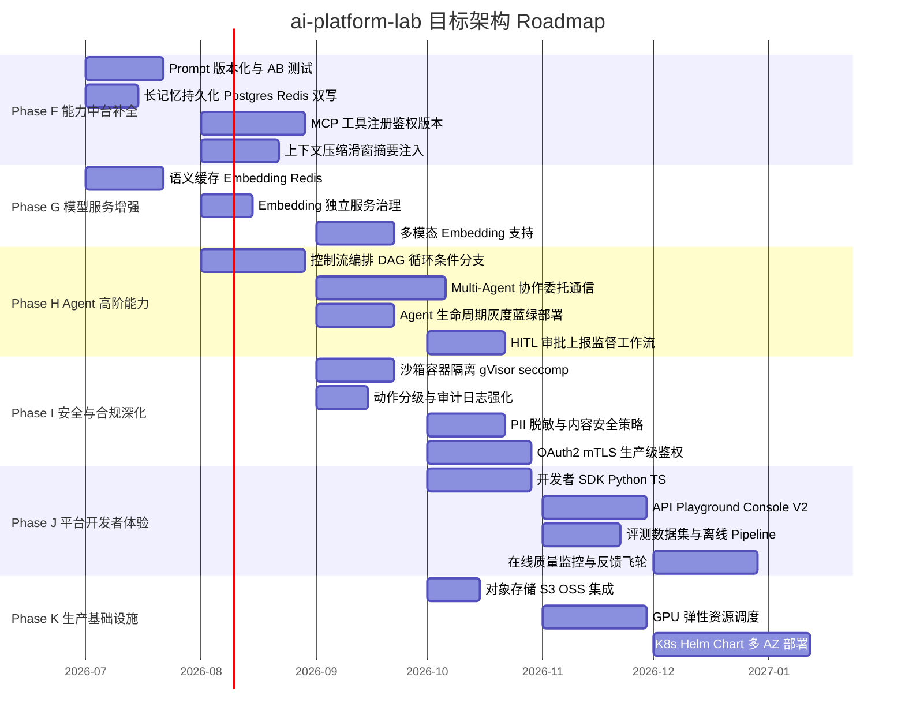

# Roadmap 甘特图 — ai-platform-lab

> Phase F ~ Phase K 演进计划（对标「Agent 平台架构全景」目标架构）

```mermaid
gantt
    title ai-platform-lab 目标架构 Roadmap
    dateFormat YYYY-MM-DD
    axisFormat %Y-%m

    section Phase F 能力中台补全
    Prompt 版本化与 AB 测试           :f1, 2026-07-01, 21d
    长记忆持久化 Postgres Redis 双写  :f2, 2026-07-01, 14d
    MCP 工具注册鉴权版本              :f3, 2026-08-01, 28d
    上下文压缩滑窗摘要注入            :f4, 2026-08-01, 21d

    section Phase G 模型服务增强
    语义缓存 Embedding Redis          :g1, 2026-07-01, 21d
    Embedding 独立服务治理            :g2, 2026-08-01, 14d
    多模态 Embedding 支持             :g3, 2026-09-01, 21d

    section Phase H Agent 高阶能力
    控制流编排 DAG 循环条件分支       :h1, 2026-08-01, 28d
    Multi-Agent 协作委托通信          :h2, 2026-09-01, 35d
    Agent 生命周期灰度蓝绿部署        :h3, 2026-09-01, 21d
    HITL 审批上报监督工作流           :h4, 2026-10-01, 21d

    section Phase I 安全与合规深化
    沙箱容器隔离 gVisor seccomp       :i1, 2026-09-01, 21d
    动作分级与审计日志强化            :i2, 2026-09-01, 14d
    PII 脱敏与内容安全策略            :i3, 2026-10-01, 21d
    OAuth2 mTLS 生产级鉴权            :i4, 2026-10-01, 28d

    section Phase J 平台开发者体验
    开发者 SDK Python TS              :j1, 2026-10-01, 28d
    API Playground Console V2         :j2, 2026-11-01, 28d
    评测数据集与离线 Pipeline           :j3, 2026-11-01, 21d
    在线质量监控与反馈飞轮            :j4, 2026-12-01, 28d

    section Phase K 生产基础设施
    对象存储 S3 OSS 集成              :k1, 2026-10-01, 14d
    GPU 弹性资源调度                  :k2, 2026-11-01, 28d
    K8s Helm Chart 多 AZ 部署         :k3, 2026-12-01, 42d
```
