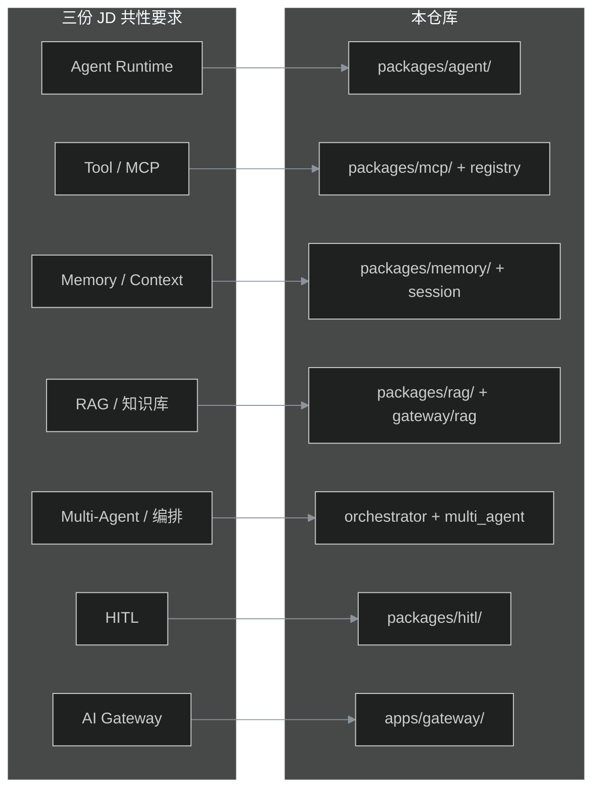

# JD 要求 vs ai-platform-lab 能力对照（临时研究稿）

> **用途**：投递前自查、面试准备、补叙事缺口。  
> **性质**：临时文档，研究完可删或合并进 `interview-narrative.md`。  
> **基准**：仓库 `main` Phase A～M + Phase N（PyPI SDK）+ **Phase O**（Agent JD2 对齐 · tag `phase-o-agent-jd2`）；对照三份真实 JD 原文。  
> **图例**：✅ 有且能讲 · ⚠️ 有但偏 lab/浅 · ❌ 无或不对口

---

## 1. 三份 JD 一句话定位

| # | 岗位侧重 | 核心关键词 | 与本仓库匹配度 |
|---|----------|------------|----------------|
| **JD1** | 元宝在线 **Agent 系统架构** | Runtime、Tool/Memory/Context、Multi-Agent、HITL、架构演进 | **~80%** |
| **JD2** | **智能体研发**（业务落地） | 任务规划、RAG、工具/MCP、CoT、LangChain 生态、RPA、PyTorch | **~85%～90%**（Phase O 后） |
| **JD3** | **云原生中间件 + AI 网关基础设施** | 分布式、注册中心、超大规模、Java/Go/C++、TCP 底层 | **~45%～55%** |

---

## 2. 总览：能力矩阵

| 能力域 | JD1 | JD2 | JD3 | 平台 | 评级 |
|--------|-----|-----|-----|------|------|
| Agent Runtime（ReAct / tool loop） | ● | ● | △ | ✅ | 强 |
| Tool 抽象 + 白名单 | ● | ● | — | ✅ | 强 |
| Memory 跨 Session | ● | ● | — | ✅ | 强 |
| Context 压缩 / Token 预算 | ● | ● | — | ✅ | 强 |
| RAG + 增量索引 | △ | ● | — | ✅ | 强 |
| Multi-Agent | ● | ● | △ | ✅ | Phase O 黑板 + 委托 |
| HITL | ● | △ | — | ✅ | 强 |
| Orchestrator / 任务规划 | ● | ● | △ | ✅ | Planner + DAG |
| MCP / 插件 / 外部 API | △ | ● | — | ✅ | MCP + plugins + web/sql |
| AI 网关 / 模型路由 | △ | △ | ● | ✅ | **最强** |
| 微服务 / 超大规模 | — | △ | ● | ⚠️ | Helm 模板级 |
| LangChain / LlamaIndex 生态 | △ | ● | — | ❌ | 自研，未绑框架 |
| PyTorch / 训推 | — | ● | — | ❌ | 外部 LLM API |
| RPA / 办公自动化场景 | — | ● | — | ❌ | 无 |
| Java/C++/内核级中间件 | — | — | ● | ❌ | Python 为主 |

---

## 3. JD1 逐条对照（元宝 Agent 架构）

### 3.1 岗位职责

| JD 原文要点 | 覆盖 | 关键文件 / API | 说明 |
|-------------|------|----------------|------|
| Agent 系统整体架构设计与演进 | ⚠️ | `docs/architecture.md`、`docs/roadmap.md`、Phase A～M | 有渐进架构叙事；非亿级在线产品演进 |
| **Agent Runtime** | ✅ | `packages/agent/runner.py` | ReAct 环：`max_steps`、tool trace、`POST /v1/agent/run` |
| **Tool 抽象** | ✅ | `packages/agent/registry.py`、`tool_router.py`、`tool_envelope.py` | 注册表 + JSON Schema + handler |
| **Memory 抽象** | ✅ | `packages/memory/`、`apps/gateway/memory_routes.py` | Postgres 持久化 + summarize API |
| **Context 抽象** | ✅ | `packages/agent/context_compress.py`、`context_budget.py` | LLM 摘要 + token 感知注入 |
| **Multi-Agent 协作** | ⚠️ | `packages/agent/multi_agent/delegation.py`、`registry.py` | 主从委托；**无共享黑板/双向通信** |
| **Human-in-the-loop** | ✅ | `packages/hitl/`、`apps/gateway/hitl_routes.py` | destructive → 202 → `approval_id` resume |
| 与算法/产品/业务合作做方案 | ❌ | — | 代码不能替代协作经历，需简历其他项目 |
| 研究引入新框架和 Agent 范式 | ⚠️ | 自研 + MCP；`docs/phase-h-*.md` | 懂 ReAct/DAG/HITL；**未集成 LangGraph/CrewAI** |

### 3.2 工作要求

| JD 要求 | 覆盖 | 证据 |
|---------|------|------|
| 扎实工程基础 | ✅ | 484+ 单测、Issue 驱动、CI |
| Python/TS/Go 熟练 | ✅ Python | `pyproject.toml`；Console 为 TS/React（`console-v2/`） |
| LLM 与 Agent 基本原理 | ✅ | `docs/week4-agent-runtime.md`、`enterprise-ai-platform-sop.md` |
| 产品 sense / 协作 | ❌ | 需口述其他经历 |

### 3.3 JD1 面试话术（30 秒）

> 我搭的是 **AI 中台参考实现**：Gateway 统一入口，Agent Runtime 走 OpenAI Function Calling 的 ReAct 环，Tool/Memory/Context 分层清晰；Multi-Agent 做委托，HITL 对 destructive 工具审批；RAG 有版本化、金丝雀和 Phase M 增量索引。边界是：Multi-Agent 还没共享黑板，规模是 lab 级不是元宝在线量级。

---

## 4. JD2 逐条对照（智能体设计与研发）

### 4.1 岗位职责

| JD 原文要点 | 覆盖 | 关键文件 / API | 说明 |
|-------------|------|----------------|------|
| **任务规划** | ✅ | `packages/agent/planner.py`、`POST /v1/agent/plan` | LLM 结构化 Plan + 逐步执行 |
| **工具调用** | ✅ | `packages/agent/runner.py`、`tool_strategy.py` | function calling + 并行/顺序策略 |
| **记忆管理** | ✅ | `packages/memory/`、`packages/agent/session.py`、`session_redis.py` | 短会话 + 长记忆 |
| **知识检索** | ✅ | `packages/rag/`、`apps/gateway/rag/pipeline.py` | 向量 + BM25 hybrid + rerank |
| **对话管理** | ✅ | `packages/agent/session_state.py` | Session append、滚动摘要 |
| **自动化任务分解** | ✅ | `planner.execute_plan_with_agent` | Plan → subtasks → Runner |
| **链式推理 CoT** | ✅ | `packages/agent/reasoning.py` | `reasoning_mode=cot` + thinking trace |
| **Multi-Agent 协作** | ✅ | `multi_agent/blackboard.py`、`delegation.py` | 黑板 + 委托完整 Runner |
| **API 调用** | ✅ | `tools/builtin.py`（httpbin）、MCP HTTP | — |
| **插件系统** | ✅ | `packages/agent/plugins/loader.py` | YAML manifest 注册 |
| **RPA** | ❌ | — | 无 UI 自动化 |
| **知识库** | ✅ | `kb_id` + `version`、`/internal/index` | Qdrant + BM25 |
| **搜索引擎** | ✅ | `packages/agent/tools/web_search.py` | mock/http 模式 |
| **数据库** | ✅ | `packages/agent/tools/sql_query.py` | 只读 SELECT + LIMIT |
| **办公/数据分析场景** | ✅ | `config/workflows/data_analysis.yaml`、`eval/data_analysis_vertical.sh` | web_search → sql → calc 演示链 |
| **性能调优** | ✅ | `perf_metrics.py`、`tool_call_strategy` | 并行工具 + Prometheus 指标 |
| 与产品推动落地 | ❌ | — | 经历项 |

### 4.2 任职要求

| JD 要求 | 覆盖 | 关键文件 | 说明 |
|---------|------|----------|------|
| Python 熟练 | ✅ | 全仓库 | — |
| PyTorch / TensorFlow | ❌ | — | 无训推；Embedding/Rerank 走 HTTP provider |
| Prompt Engineering | ✅ | `packages/prompt/`、`config/prompts.yaml` | 版本化 + A/B |
| RAG | ✅ | `packages/rag/`、`eval/run.py` | baseline + compare |
| 工具/函数调用 | ✅ | `runner.py` | OpenAI 兼容 |
| Agent 框架 | ⚠️ | 自研 | **未用** LangChain/LlamaIndex 作依赖 |
| LangChain / LlamaIndex / AutoGPT / ReAct | ⚠️ | `docs/week4-agent-runtime.md` | **ReAct 有**；其余为概念对齐 |
| OpenAI Function Calling | ✅ | `llm_proxy.py`、`runner.py` | — |
| API 设计 | ✅ | `apps/gateway/*_routes.py` | OpenAI 兼容 + internal API |
| 插件 / 微服务 | ⚠️ | MCP + Compose + Helm | 非完整微服务体系 |

### 4.3 JD2「性能调优」细项

| JD 子项 | 覆盖 | 文件 | 缺口 |
|---------|------|------|------|
| 推理效率 | ⚠️ | `packages/semantic_cache/` | 语义缓存降本；**无** vLLM/批推理 |
| 工具调用策略 | ✅ | `tool_strategy.py`、`config/agent.yaml` | sequential / parallel |
| 上下文管理 | ✅ | `context_compress.py`、`context_budget.py` | 记忆/RAG 引用分离 |
| 长文本处理 | ⚠️ | 压缩 + RAG 分块 + budget | **无** 128k 专项优化 |

### 4.4 JD2 ↔ LangChain 概念对照（面试防问）

| LangChain / 生态 | 本仓库对应 | 文件 |
|------------------|------------|------|
| AgentExecutor / ReAct | Agent runner 循环 | `packages/agent/runner.py` |
| Tools / StructuredTool | Tool registry + schema | `packages/agent/registry.py` |
| Retriever | `get_kb_snippet` + RAG query | `packages/rag/` |
| Memory (ChatMessageHistory) | Session + Memory Store | `session.py`、`packages/memory/` |
| LCEL / DAG Chain | Orchestrator workflow | `packages/agent/orchestrator/` |
| LangGraph 状态机 | 部分重叠 Orchestrator + HITL resume | `engine.py`、`hitl/` |
| LlamaIndex 索引 | 自研 index pipeline | `apps/gateway/rag/pipeline.py` |

### 4.5 JD2 面试话术（30 秒）

> 智能体侧我自研 ReAct Runtime，工具走 Function Calling + 租户白名单；**Phase O** 补齐 LLM Planner、显式 CoT、Multi-Agent 黑板、web_search/sql_query 与数据分析 vertical；RAG 是完整管道（hybrid + rerank + 金丝雀 + 增量索引）；并行工具与 Prometheus 指标覆盖性能调优。没绑 LangChain，但模块划分和生态概念一致；缺口是 RPA、PyTorch 训推和真实业务场景数据。

---

## 5. JD3 逐条对照（云原生中间件 + AI 基础设施）

### 5.1 岗位职责

| JD 原文要点 | 覆盖 | 关键文件 | 说明 |
|-------------|------|----------------|------|
| 分布式应用服务 | ⚠️ | `docker-compose.yml`、`deploy/helm/` | Gateway + Worker + Redis 队列 |
| 微服务注册配置中心 | ❌ | — | 无 Nacos/Consul/Etcd |
| 分布式事务 | ❌ | — | — |
| 分布式任务调度 | ⚠️ | `apps/worker/main.py`、Redis BLPOP | **仅** 索引进度队列 |
| **AI Agent 底层基础设施** | ⚠️ | `packages/agent/`、`orchestrator/` | Agent 层有；非 K8s Agent Scheduler |
| **AI 网关** | ✅ | `apps/gateway/main.py`、`model_router.py` | **最对口** |
| 高可靠 / 高可用 / 高弹性 | ⚠️ | `deploy/helm/values-multi-az.yaml` | **模板级**，文档自承未压测 |
| 超大规模集群 | ❌ | — | 单进程开发默认 |
| 全生命周期（评审→运维） | ⚠️ | Issue→PR→tag、Grafana | lab 流程完整，非大厂运维体量 |

### 5.2 岗位要求

| JD 要求 | 覆盖 | 证据 | 说明 |
|---------|------|------|------|
| Java/C/C++/Golang/Python | ⚠️ | Python | **仅 Python** 为主栈 |
| Agent 调度 / AI 流量网关 / LLM 转发 | ✅ | `model_router.py`、`llm_proxy.py`、`packages/router/circuit_breaker.py` | — |
| 网络编程 TCP/HTTP/连接池 | ⚠️ | `httpx` 上游、`rate_limit.py` | HTTP 层；无自研协议栈 |
| Linux / gdb / perf | ❌ | — | 非本仓库主题 |
| 微服务 / 云原生实战 | ⚠️ | Helm、Compose、Prometheus | 有模板，缺大规模实战叙事 |
| 开源中间件贡献 | ❌ | — | 个人履历项 |

### 5.3 JD3 面试话术（30 秒）

> 若投 AI 网关方向：多租户 Gateway、模型别名路由、熔断 fallback、令牌桶限流、token 计费、语义缓存，Helm 可 K8s 部署。若投通用中间件：诚实说本仓库是 Python AI 平台 lab，没有 Java 注册中心、分布式事务和超集群运维经验，需要其他项目补。

---

## 6. 按模块：文件索引（速查）

### 6.1 Agent 应用层

| 能力 | 路径 | 路由 / 配置 |
|------|------|-------------|
| Agent Runtime | `packages/agent/runner.py` | `POST /v1/agent/run` |
| 工具注册 | `packages/agent/registry.py`、`tools/builtin.py` | `config/agent.yaml` |
| 工具 ACL | `packages/agent/tool_router.py` | `config/tenants.yaml` → `allowed_tools` |
| Session | `packages/agent/session.py`、`session_redis.py` | Redis opt-in |
| 上下文 | `packages/agent/context_compress.py`、`context_budget.py` | settings |
| Multi-Agent | `packages/agent/multi_agent/` | `apps/gateway/multi_agent_routes.py` |
| Orchestrator | `packages/agent/orchestrator/` | `apps/gateway/orchestrator_routes.py` |
| 生命周期/灰度 | `packages/agent/lifecycle/` | `agent_lifecycle_routes.py` |
| HITL | `packages/hitl/` | `hitl_routes.py` |
| MCP | `packages/mcp/`、`packages/agent/mcp_stub.py` | `config/mcp_tools.json` |
| 演示链 | `eval/agent_vertical_smoke.py`、`eval/platform_demo.sh` | `--with-llm` |

### 6.2 能力中台（RAG / Prompt / Memory）

| 能力 | 路径 | 说明 |
|------|------|------|
| RAG 管道 | `apps/gateway/rag/pipeline.py` | 索引 + 查询 |
| 向量库 | `packages/rag/vector_store.py` | Qdrant |
| 增量索引 | `packages/rag/source_index.py`、`index_metrics.py` | Phase M |
| Hybrid / Rerank | `packages/rag/` | BM25 + rerank stub/api |
| Prompt | `packages/prompt/` | 版本 + A/B |
| 长记忆 | `packages/memory/` | Postgres |
| Embedding | `packages/embedding/` | 独立 provider |
| 语义缓存 | `packages/semantic_cache/` | opt-in |

### 6.3 模型服务层 / Gateway

| 能力 | 路径 | 说明 |
|------|------|------|
| 入口 | `apps/gateway/main.py` | FastAPI |
| LLM 转发 | `apps/gateway/llm_proxy.py` | OpenAI 兼容 |
| 模型路由 | `apps/gateway/model_router.py` | 别名 + fallback |
| 熔断 | `packages/router/circuit_breaker.py` | — |
| 限流 / 配额 | `rate_limit.py`、`quota.py` | 令牌桶 + 日配额 |
| 计费 | `packages/billing/`、`billing_routes.py` | token 预算 |
| 租户 | `apps/gateway/tenants.py` | `config/tenants.yaml` |
| 观测 | `packages/observability/` | OTel + `/metrics` |

### 6.4 AgentOps / 治理

| 能力 | 路径 |
|------|------|
| 审计 | `packages/audit/`、`audit_routes.py` |
| 分级动作 | `packages/audit/action_levels.py` |
| PII | `packages/pii/` |
| 沙箱 | `packages/sandbox/` |
| OAuth2/mTLS | `packages/auth/` |
| Eval | `eval/run.py`、`eval/pipeline.py`、`eval/baseline.jsonl` |
| 反馈飞轮 | `packages/feedback/`、`eval/feedback_loop_demo.py` |
| Console | `console-v2/`、`console_routes.py` |
| SDK | `sdk/python/`（Phase N PyPI 进行中） |

### 6.5 生产基础设施

| 能力 | 路径 | 诚实边界 |
|------|------|----------|
| Compose | `docker-compose.yml` | 本地一键 |
| Helm | `deploy/helm/ai-platform-lab/` | K8s 模板 |
| 多 AZ | `values-multi-az.yaml` | 未真实压测 |
| GPU | `values-gpu.yaml` | 模板级 |
| 对象存储 | `packages/storage/` | local/s3/oss |

---

## 7. 缺口汇总（按优先级）

### 7.1 三份 JD 都会问到的缺口

| 缺口 | 影响 JD | 怎么讲 |
|------|---------|--------|
| 非 LangChain 系依赖 | JD1/JD2 | 「自研 Runtime，概念与 LCEL/LangGraph 对齐」 |
| Multi-Agent 浅（无黑板） | JD1/JD2 | 主动引用 `phase-h-multi-agent.md` |
| 无真实业务场景 | JD1/JD2 | 用 vertical demo + eval 代替 |
| lab 规模非生产 | 全部 | `roadmap.md` §已知限制 |

### 7.2 JD2 特有缺口

| 缺口 | 建议补叙事 |
|------|------------|
| PyTorch/TensorFlow | 说明职责在平台工程，模型走 API |
| RPA | 承认无；MCP 可接外部 RPA 工具 |
| LangChain 项目经验 | 准备 §4.4 对照表 |
| 办公/数据分析 | 加一条 Orchestrator demo 故事 |

### 7.3 JD3 特有缺口

| 缺口 | 建议 |
|------|------|
| Java/Go/C++ | 别硬投通用中间件；投 AI Gateway 岗 |
| 注册中心/分布式事务 | 简历其他项目 |
| 超大规模 | 只讲 Helm 水平扩展设计，不讲虚假 QPS |

---

## 8. 投递建议速查

| 目标 | 推荐度 | 主打文件/故事 | 慎谈 |
|------|--------|---------------|------|
| JD1 元宝架构 | ⭐⭐⭐⭐ | Agent 全栈 + HITL + Phase 演进 | 产品体量 |
| JD2 智能体研发 | ⭐⭐⭐⭐⭐ | RAG SOP + ReAct + eval 飞轮 | LangChain 年限 |
| JD3 中间件 | ⭐⭐ | AI Gateway + 路由熔断 + 多租户 | 集群规模、Java |

---

## 9. 演示与验证（JD 面试前自检）

| 检查 | 命令 | 对应 JD 能力 |
|------|------|--------------|
| 平台冒烟 | `./eval/platform_demo.sh --no-llm` | Gateway + RAG API |
| Agent + LLM | `./eval/platform_demo.sh --with-llm` | Runtime + 工具 |
| Agent 垂直链 | `eval/agent_vertical_smoke.py` | Multi-Agent + HITL + RAG |
| 反馈飞轮 | `python eval/feedback_loop_demo.py --live` | AgentOps |
| SDK | `python eval/sdk_smoke.py` | 工程落地 |
| 叙事稿 | `docs/interview-narrative.md` | 10～15 分钟口述 |
| 动手 demo | `docs/demo-walkthrough.md` | Console + curl |

---

## 10. 相关文档

| 文档 | 用途 |
|------|------|
| [phase-o-agent-jd2-alignment.md](./phase-o-agent-jd2-alignment.md) | **Phase O 开发计划（JD2 §4.1）** |
| [issues-backlog-phase-o.md](./issues-backlog-phase-o.md) | Phase O Issue 粘贴正文 |
| [interview-narrative.md](./interview-narrative.md) | 正式面试叙事 |
| [demo-walkthrough.md](./demo-walkthrough.md) | 演示脚本 |
| [PROJECT_STATUS.md](./PROJECT_STATUS.md) | 一页纸完成度 |
| [roadmap.md](./roadmap.md) | 已知限制 |
| [phase-h-multi-agent.md](./phase-h-multi-agent.md) | Multi-Agent 诚实边界 |
| [phase-h-orchestrator.md](./phase-h-orchestrator.md) | 编排引擎 |
| [enterprise-ai-platform-sop.md](./enterprise-ai-platform-sop.md) | 大厂 SOP 对照 |

---

*临时稿 · 生成于 2026-06-09 · 研究完成后可删除或合并*
