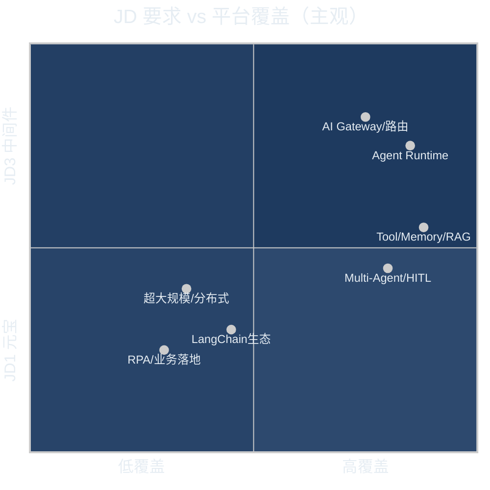

> ⚠️ **本文档可能滞后**。最新 JD 对齐与 Phase O/P 后评分见 [docs/tmp-jd-platform-comparison.md](docs/tmp-jd-platform-comparison.md)（JD2 约 **88%～92%**）。

三份 JD 侧重点不同，但都和 **Agent 平台工程** 相关。对照你的 `ai-platform-lab`，结论先说：

**JD1（元宝 Agent 架构）~85%；JD2（智能体研发）~88%～92%；JD3（云原生中间件）~45%～55%。**（Phase O/P 后，详见上方链接）

你的仓库不是「缺功能」，而是 **「有模块、有故事、部分仍是 lab 深度」** —— 面试要主动讲 **有什么 + 边界在哪**。

---

## 总览对照

| 维度 | JD1 元宝 | JD2 智能体 | JD3 中间件 | 你的平台 |
|------|----------|------------|------------|----------|
| Agent Runtime | ✅ 强 | ✅ 强 | △ 调度层有 | `packages/agent/runner.py` ReAct 环 |
| Tool 抽象 | ✅ 强 | ✅ 强 | △ | 白名单 + MCP + 工具市场 |
| Memory / Context | ✅ 强 | ✅ 强 | — | 长记忆 + 压缩 + Session(Redis) |
| Multi-Agent | ✅ 要求 | ✅ 要求 | △ | 委托/注册表，无共享黑板 |
| HITL | ✅ 要求 | △ | — | destructive → 202 审批 resume |
| RAG / 知识检索 | △ | ✅ 强 | — | 完整管道 + 增量索引 Phase M |
| AI 网关 / 流量转发 | △ | △ | ✅ 核心 | **最强项**：路由、熔断、限流、计费 |
| 微服务 / 超大规模 | — | △ | ✅ 核心 | Compose + Helm 模板，**未压测** |
| LangChain 等框架 | △ 研究引入 | ✅ 熟悉 | — | **自研循环**，概念对齐、未绑框架 |
| PyTorch / 训推 | — | ✅ 要求 | — | **无**，走外部 LLM API |
| RPA / 办公场景 | — | ✅ 要求 | — | **无** |
| Java/C++ 底层 | — | — | ✅ 要求 | **纯 Python** |

---

## JD1：元宝 Agent 系统架构

> Agent Runtime、Tool/Memory/Context、Multi-Agent、HITL、架构演进、新技术范式

### ✅ 基本都有（可拿来讲）

| JD 要求 | 平台对应 |
|---------|----------|
| Agent Runtime | `/v1/agent/run`，`max_steps` ReAct 环，tool trace 全链路 |
| Tool 抽象 | `packages/agent/registry.py` + 租户 `allowed_tools` ACL |
| Memory | `packages/memory/` 跨 Session 持久化（Postgres + Redis 热缓存） |
| Context | `context_compress.py`、`context_budget.py` |
| Multi-Agent | `packages/agent/multi_agent/` 委托模式 |
| HITL | `hitl.py`：destructive 工具 → pending → 带 `approval_id` resume |
| 架构演进叙事 | Phase A～M 渐进 + Orchestrator DAG vs Multi-Agent 分工 |

### ⚠️ 有但偏「lab 深度」

- **Multi-Agent**：文档写明委托 **未走完整 ReAct**，无双向通信/共享黑板（`phase-h-multi-agent.md`）
- **新技术范式**：实现是自研 + MCP/OpenAI 兼容，**不是** LangGraph/CrewAI 那种「框架选型故事」
- **产品协作 / 业务落地**：代码能讲架构，**不能**替代真实产品迭代经历

### ❌ 基本不在 JD 范围或很弱

- 元宝级 **在线产品体量**（亿级 QPS、A/B 全链路产品化）
- **算法侧**深度共建（你这边是工程平台，不是训模）

**JD1 匹配：约 80% 能力对齐，20% 是产品规模 + 框架生态 + 业务协作经历。**

---

## JD2：智能体设计与研发（最贴你的仓库）

> 任务规划、工具调用、记忆、RAG、对话、CoT、多 Agent、插件、RPA、性能调优、LangChain 生态

### ✅ 明确覆盖

| JD 要求 | 平台对应 |
|---------|----------|
| 工具调用 / Function Calling | OpenAI 兼容 `tool_calls` 循环 |
| 记忆管理 | Memory Store + Session 滚动摘要 |
| 知识检索 | RAG：向量 + BM25 hybrid、rerank、金丝雀、增量索引 |
| 对话管理 | Session 内存/Redis，`session_redis.py` |
| 多智能体协作 | Multi-Agent 委托 + Orchestrator workflow |
| API / 插件 | MCP 集成、`config/mcp_tools.json`、HTTP 工具 |
| 知识库 | kb_id + version 全管道 |
| Prompt / RAG / Agent 框架概念 | Prompt 版本化 + A/B；自研 Agent 环 |
| ReAct | 第 4 周文档 + `runner.py` 实现 |
| API 设计 / 微服务 | FastAPI Gateway + Worker 队列 + Helm |
| 性能相关 | 语义缓存、限流、熔断、上下文压缩、eval 门禁 |

### ⚠️ 部分覆盖（面试要说清）

| JD 要求 | 现状 |
|---------|------|
| **任务规划 / CoT** | Orchestrator DAG + ReAct 步进；**无**独立「Planner 模块 / 显式 CoT 模板」 |
| **插件系统** | MCP + 工具市场雏形；**不是** Chrome 插件级或完整 Plugin SDK |
| **搜索引擎 / 数据库工具** | BM25 内置；**无** Bing/Google/任意 SQL Agent 工具开箱 |
| **办公自动化 / 数据分析场景** | `agent-vertical-rag` 演示链；**无** Excel/BI/RPA 落地案例 |
| **推理效率调优** | 网关层降本（缓存、路由）；**无** vLLM/TensorRT/批推理优化 |
| **LangChain / LlamaIndex / AutoGPT** | **未作为依赖**；能力自研，概念可对照讲 |

### ❌ JD 写了但你没有

| JD 要求 | 说明 |
|---------|------|
| **PyTorch / TensorFlow** | 仓库无训推代码，Embedding/Rerank 走 HTTP provider |
| **RPA** | 无 UI 自动化、无 RPA 引擎 |
| **AutoGPT 式自主长任务** | 有 `max_steps` 上限，非开放式长期自治 Agent |

**JD2 匹配：约 75%～85%。** 核心 Agent/RAG/工具链齐全；缺口在 **深度学习框架、RPA、LangChain 项目经验、业务场景落地**。

---

## JD3：云原生中间件 + AI Agent 基础设施

> 分布式服务、注册配置中心、分布式事务、任务调度、AI 网关、超大规模集群、Java/Go/C++、网络底层

### ✅ 能对上（偏 AI 网关这一条）

| JD 要求 | 平台对应 |
|---------|----------|
| AI 流量网关 | `apps/gateway/` 多租户、鉴权、配额 |
| 大模型请求转发 | `model_router.py`、`llm_proxy.py`、fallback |
| 分布式任务 | Redis 索引 Worker 队列（`USE_INDEX_WORKER`） |
| 高可用叙事 | Helm、`values-multi-az.yaml`、熔断 |
| HTTP/连接 | httpx 上游、限流令牌桶 |
| Python 脚本自动化 | eval 脚本、CI、demo |

### ⚠️ 只有「平台工程浅层」

- **微服务注册/配置中心**（Nacos/Consul/Etcd）：无
- **分布式事务**：无
- **超大规模集群**：文档自承 **模板级、未真实压测**
- **Agent 调度基础设施**：Orchestrator 有，但不是 K8s 级 Agent Scheduler

### ❌ 基本不对口

- **Java/C/C++/Golang 为主**：你是 **Python FastAPI**
- **内核/gdb/perf 线上排障**：非本仓库主题
- **知名开源中间件贡献**：需个人履历，非代码能证
- **TCP 报文级、连接池深度**：网关层有 HTTP，无自研协议栈

**JD3 匹配：约 45%～55%。** 若投这条线，应 **主打 AI Gateway + 租户治理 + 可观测**，别硬拼「中间件老兵」人设。

---

## 按 JD 投递建议

| 目标 JD | 怎么讲这个平台 | 要主动补的叙事 |
|---------|----------------|--------------|
| **JD1 元宝架构** | 「中台视角的 Agent 全栈：Runtime + MCP + HITL + Multi-Agent + RAG SOP」 | Multi-Agent 边界、与产品/算法协作的 **真实项目**（若有） |
| **JD2 智能体研发** | 「自研 ReAct + RAG 金丝雀 + eval 飞轮，不是调 LangChain _demo」 | 承认未用 LangChain，但 **Function Calling / RAG / ReAct 原理一致**；补 1～2 个业务场景 story |
| **JD3 中间件** | **谨慎投**；若投则强调 Gateway/路由/熔断/多租户/Helm | 别夸大集群规模；Java/分布式中间件需别的项目背书 |

---

## 面试一句话（防穿帮）

> 这是一个 **AI 中台参考实现**：Agent Runtime、Tool/Memory/Context、Multi-Agent、HITL、RAG 增量索引、AI 网关和 AgentOps 链路都有；**不是** LangChain 套壳，也 **不是** 元宝/通义那种亿级在线产品 —— Multi-Agent 委托还没走完整 ReAct，RBAC 偏浅，无 RPA/PyTorch，超大规模是 Helm 模板级。

---

## 若专门冲 JD2，最值得补的 3 块（ROI 高）

1. **LangChain/LlamaIndex 对照表**（1 页）：你的 `runner` ↔ LCEL AgentExecutor，`get_kb_snippet` ↔ Retriever —— 证明「懂生态，选自研」  
2. **一个垂直场景 demo**（办公/数据分析）：Orchestrator 串 `RAG → calc → 出报告`，比泛泛 platform_demo 更像 JD2  
3. **Phase N PyPI SDK 收尾**：JD2 写「工程落地」，`pip install` 是好信号  

如果你愿意，我可以按 **JD1 / JD2 / JD3** 分别写一版 **简历项目描述 + 面试 30 秒开场**，直接贴 JD 关键词。